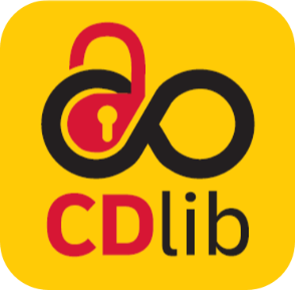

`CDlib` documentation is now provided via LCM Confluence because we want more interaction with you, which is encouraged with the comment and like features.

Find the new page [here](https://lcm.deutschepost.de/confluence1/display/SDM/CDlib-CLI).

Since it can be accessed anonymously more teams should be able to use it.

Furthermore it allows us to analyze usage of the tutorials.
