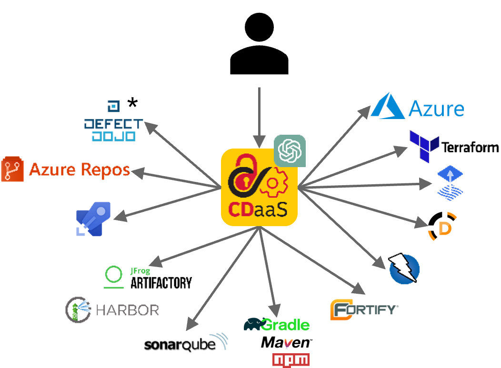
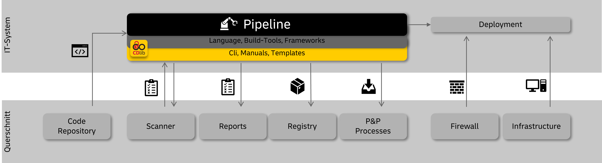
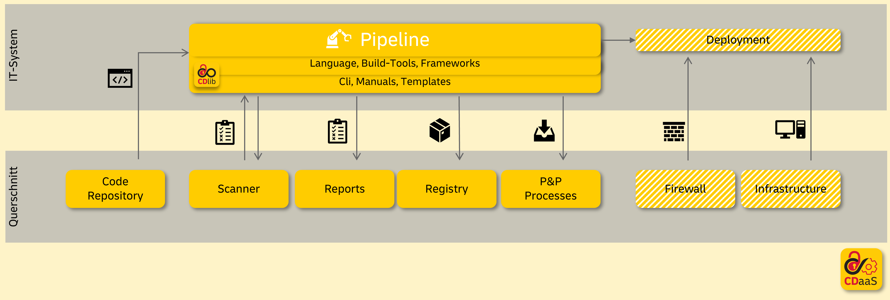
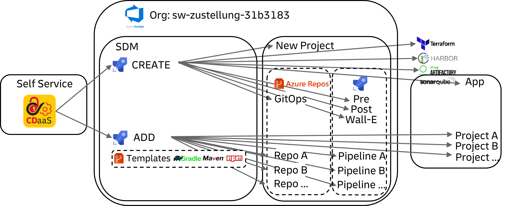

= CDaaS
:toc:
:keywords: latest

[IMPORTANT]
====
alpha feature in pilot, check our roadmap for the current status and updates: https://lcm.deutschepost.de/jira1/secure/RapidBoard.jspa?rapidView=2971&quickFilter=22677
====

CDaaS automates the setup and maintenance of your whole CI/CD pipeline, including the necessary tools and infrastructure as shown below.

> you are still in the driver seat and responsible to run it, but we do our best to help you

[NOTE]
====
* Defect Dojo is not provided yet
====

== Maintenance

We are working on an automated process, that propagates all template changes to your forked instances.
This will also include updates of the used tools and infrastructure.

Until then and during the pilot we will do that manually for you in regard to pipeline design changes, but not version bumps.

== FAQ

. *Can I customize the stack or use other tools?*
No, the automatic creation and maintenance only works for this specific stack. However, you can use CDaaS to deploy the initial base and then replace the parts with the things you need. Of course, those added things won't be maintained centrally.
. *Will there be other stacks in future?*
We plan to simplify our IT and cannot automate everything, therefore we focus on java and javascript.
. *Will updates of CDaaS break my pipeline?*
Most probably not. We are using new tags for breaking changes and the semi-automatic maintenance uses feature branches and pull requests, so your main pipeline will only be impacted in case we do something wrong, which can happen since we are humans.
. *I have multiple microservices, how can I get a pipeline for each?*
In future you can just add more repos/pipelines by clicking more in self-service, until then, just contact us - we can also provide you with the means to do it yourself if you like.
. *How can I change the name of the provided "service"?*
You can change the entry `serviceName` inside your vars.yaml. Renaming the Repository is not supported.
. *My pipeline is broken, how can I get help?*
You can https://lcm.deutschepost.de/jira1/secure/CreateIssue.jspa?pid=14900&issuetype=1[open a ticket] and we'll do our best to help as soon as we can.
. *Why do I have to bring my own AKS?*
We are planning to automate the whole infrastructure deployment, but until then you need to set up your own AKS clusters. Nevertheless we will help you with that and you can use https://git.dhl.com/CDLib/terraform_registry/tree/master/azure/aks[our terraform module] to set it up.
. *How can I access my key vault?*
You can tell us your `azure vnet`, so we can allow access to your dedicated key vault. After that you can use your service principal and `az-cli` to https://lcm.deutschepost.de/confluence1/display/SDM/Usage+of+secrets+via+Azure+Key+Vault#UsageofsecretsviaAzureKeyVault-_add_secret_to_azure_key_vaultAddsecrettoAzureKeyVault[access your key vault].
. *Is there a channel to interact with you and other users?*
We have a monthly CDaaS community session to share updates and feedback, just contact us to get invited.
. *Can I use a monorepo?*
Although we like monorepos, the are harder to maintain centrally and automatically, so currently no.
. *I have a modulith, how can I synchronise the deployment of a release?*
Out of the box you can't besides triggering/merging manually in the right order. However, you can build your own meta pipeline on top, to orchestrate the individual service pipelines. Remember that moduliths are a bad practice, since they combine the bad features of microservices and monoliths.

== Setup

In future we'll provide a self-service to create a new workspace via CDaaS and manage it.

Until then just https://lcm.deutschepost.de/jira1/secure/CreateIssue.jspa?pid=14900&issuetype=1[open a ticket] and state the ALM-ID of the IT-System.
If you are uncertain about it, just contact us.

User permissions will be granted to the ADM, the rest will be done by you.

By creating a new workspace with CDaaS the following will be set up based on the IT-AM-ID and short name of the IT-System:

. Azure DevOps Project
. Azure DevOps Repository forked from our https://dev.azure.com/sw-zustellung-31b3183/ICTO-3339_SDM/_git/cdaas_template_gitops[gitops template repository]
. 2 Azure DevOps Pipelines based on the GitOps template pipeline inside the linked repository
. CSS project and robot accounts in QHCR and THCR
. LCM Sonarqube application
. 2 LCM Artifactory repositories for reports of webapproval and release management
. IT-S Terraform Enterprise Workspaces for NPI and PROD
. Fastlane request to provide a new Azure "AB 2.0" subscription
. Renovate Repository and Pipeline
. 3 Entra ID groups with self-service permissions for the ADM:
.. MAIL: mail list to distribute info about Azure Managed Cloud
.. READER: read access to your Azure DevOps project
.. ADMIN: project admin access to your Azure DevOps project

> tell us, if you don't need any of the above

After that you can add multiple pipelines based on our templates (https://dev.azure.com/sw-zustellung-31b3183/ICTO-3339_SDM/_git/cdaas-template-npm[npm], https://dev.azure.com/sw-zustellung-31b3183/ICTO-3339_SDM/_git/cdaas-template-gradle[gradle], https://dev.azure.com/sw-zustellung-31b3183/ICTO-3339_SDM/_git/cdaas-template-maven[maven]), that will create:

. Azure DevOps Repository forked from our template
. LCM Sonarqube project template with Quality Gate TQS-1
. Azure DevOps Pipeline based on the `azure-pipelines.yaml` inside the linked repository
.. Integration of the https://dev.azure.com/sw-zustellung-31b3183/ICTO-3339_SDM/_git/cdaas?path=/ado/[centrally provided pipeline templates]
.. Unit test and sonarqube scan for TQS and reporting
.. OSLC scan and reporting
.. SAST (Fortify), SCA (Dependency-Check) and DAST (ZAP) with integration of web approval
.. change management process integration for LCM Jira
.. Container build with buildkit and CSS
.. Helm packaging and CSS
.. GitOps deployment with FluxCD to a centrally provided CDaaS AKS cluster within your own namespace

=== Prerequisites

In future this will be done automatically, until then you need to set this up yourself - we'll help you of course!

.	AKS: https://lcm.deutschepost.de/confluence1/display/CCCENTER/Private+AKS
..	based on 2 Managed Identities per Arbeitsbereich with roles for AKS (via ZR Managed Identities)
...	NAME-NPI-AKS-ManagedIdentity
...	NAME-NPI-AKS-ManagedKubeletIdentity
.	GitOps:
..	subscription features per Arbeitsbereich (via MMS via https://fastlaneprod.service-now.com/sp?id=sc_cat_item&sys_id=285537c11b864e102a08ddb6bb4bcb9b&sysparm_category=987e49d1db892510ec8b0bf5f3961967&catalog_id=-1)
...	az provider register --namespace Microsoft.Kubernetes
...	az provider register --namespace Microsoft.ContainerService
...	az provider register --namespace Microsoft.KubernetesConfiguration
..	service principal to access Key Vault from AKS via External Secrets Operator (via MMS via https://fastlaneprod.service-now.com/sp?id=sc_cat_item&sys_id=4732c8ab1bfbfd102a08ddb6bb4bcb67&sysparm_category=2ae855141ba461101bb3d8f99a4bcb8c&catalog_id=-1)
..	firewall-clearance from AKS to
...	https://*.dp.kubernetesconfiguration.azure.com (to configure AKS extensions)
...	https://dev.azure.com (for git checkout)
... CSS Harbor QHCR and THCR, request it via https://git.dhl.com/GB19-CCP/CSS-Registry/blob/main/tutorials/connection-firewall-clearance.md#firewall-clearance
..	setuop OIDC-Issuer on AKS: https://learn.microsoft.com/en-us/azure/aks/use-oidc-issuer#create-an-aks-cluster-with-oidc-issuer
..	Wildcard-SSL-Certificate for *.name-npi.test.azure.deutschepost.de and *.name.azure.deutschepost.de (for Weave GitOps Dashboard and Ingress)
..	Flux-Extension, ideally via terraform sample: https://dev.azure.com/sw-zustellung-31b3183/ICTO-3339_SDM/_git/cdaas-template-gitops?path=/terraform/flux-aks-extention.tf

Later on you'll need to set up your own production azure subscription.

=== Manual Steps

As we just started with CDaaS, at the beginning a few things must be done oldschool.
These steps will be performed by a Lieferheld for you, unless you have been cleared to do it yourself (only for adding new pipelines).

==== Create Workspace

. Azure
.. create service principal for team like "sp-prd-sdm-cdaas-ipnp" with lieferhelden as owner, via fastlane https://fastlaneprod.service-now.com/sp?id=sc_cat_item&sys_id=76676ca71b5ea9102a08ddb6bb4bcb4c&sysparm_category=1cd4ed751b3fd5501bb3d8f99a4bcbbe
.. create key vault inside SDM-PROD for team like "sdm-cdaas-athena"
... set write and read permissions similar to referenced key vault
... add all their vnets in networking section to allow access to team vnet (via jumphost and deploy agents) for their key vault
. Azure DevOps
.. pipeline environments
... fix permissions to environments UAT and PROD for [ITR-1337-ProjectName]\Contributors by changing role from reader to user
... set exclusive lock as check to environment UAT and PROD with timeout of 1h
.. service connections
... create azure resource manager (type manual!) for teams service principal like "Azure SDM-DICOS-KeyVault"
... if team wants to use octane, create octane service connection
.. gitops repo config for branch prod
.. in repo settings set policy require at least 1 approval for default branch (prod)
.. set build policy validation based on pre-prod pipeline for prs to prod
.. give pipeline user permission to contribute (for commits) and to bypass policies when pushing (for release workflow)
.. if team wants to use renovate bot, give project build service permission to manage and dismiss alerts, view alerts, Bypass policies when completing pull requests, Bypass policies when pushing, Contribute, Contribute to pull requests, Create branch, Create tag, Force push and Read in the repositories security settings
. CSS
.. add robot account Qhcr and thcr tokens, send to you (or steve) by email, as "cssQhcrRobot" and "cssThcrRobot" to teams key vault https://git.dhl.com/CDLib/CDlib/issues/1457
.. get user (from first bullet) oidc handles from email via https://dev.azure.com/sw-zustellung-31b3183/ITR-3719_CSS/_build/results?buildId=126231&view=logs&j=5379d232-1a3e-53f5-2cec-46389fd24e68&t=78db2542-c627-4140-8a7a-d06178fff4e4
... ONLY USE DEFAULT PERMISSIONS!
.. add qhcrDockerAuth and thcrDockerAuth to keyvault based on `echo -n "css_Xhcr_robot_dicos:token" | base64`
.. add cssQhcrRobotUserName to the keyVault `az keyvault secret set --vault-name "<vault-name>" --name "cssQhcrRobotUserName" --value "<robot-acount-user-name>"`
.. Add cosign keyvault service principal secret to keyvault as cosignAzureServicePrincipalSecret
.. generete cosign key and store it in teams key vault based on

sudo podman run --rm -it dpdhl.css-thcr-pi.azure.deutschepost.de/cdlib/helm
AZURE_TENANT_ID=<secret> AZURE_CLIENT_ID=<secret> AZURE_CLIENT_SECRET=<secret> cosign generate-key-pair --kms azurekms://<your-vault-name>.vault.azure.net/<key-name>

. LCM
.. Crowd
... create techn user like `cdaas-sdm-bot`
.... use a temporary email address from a new teams channel to set a new password
.... save password to teams key vault inside
.... use emmail from MAIL group
... grant tech user permissions and users (from first bullet) to groups
.... like DiCoS_PIPELINE_ONLY_STD
.... like DiCoS_SONARQUBE_EXEC_STD
.... like DiCoS_SONARQUBE_READ_STD
.... like DiCoS_Artifactory
.... artifactory1_access
.... sonar1_access
.... jira1_access
.... based on future ops supplier (like Micromata, Accenture, etc.) SMCHM_MICROMATA and SMCHMONB_Micromata
.. Jira
... if there is not already one, create workspace record within LCM-CONF project
... create app records within LCM-CONF project with URls
.... azure devops project
.... css qhcr repo
.... css thcr repo
.... artifactory immutable repo
.... sonarqube application
... create token for techuser and store it as "lcmJiraToken" in teams key vault
.. Artifactory
... create identity token and store it as "lcmArtifactoryIdentityToken" in teams key vault
.. Sonarqube
... create Sonar project analysis token and store it as "lcmSonarToken" in teams key vault
. IT-M
.. if IT-System is classified as relevant for webapproval
... create a webapproval configuration based on alm-id, no application and user srv_cdlib in https://itm.prg-dc.dhl.com/sites/it-sec/_layouts/15/start.aspx#/Lists/Pipeline%20Approval%20Configuration/AllItems.aspx
. GitOps-Setup (needs requirements from chapters above) - see gitops tutorial for details
.. ingress setup, by setting ingress IP, cert and subnet name within infrastrucutre/ingress-nginx/release.yaml

==== Add Pipeline

. inside `vars.yaml`
.. set `azureServicePrincipalIDCosign` with ID from teams service principal
.. set every azure value filled with `CHANGEME`
.. if webapproval is relevant for this pipeline, set `webapprovalApplicationID` based on configuration entry id within https://itm.prg-dc.dhl.com/sites/it-sec/_layouts/15/start.aspx#/Lists/Pipeline%20Approval%20Configuration/AllItems.aspx
.. if webapproval and/or acceptance tests are relevant for this pipeline set `UATTargetURL` like https://${CDLIB_EFFECTIVE_BRANCH_NAME::24}.paf.sdm-npi.test.azure.deutschepost.de/ and `PRODTargetURL` like https://phippyandfriends.deutschepost.de
.. set `commercialReference` based on BTO-ID that will be used to pay for ops team inside proIT as given from ADM - leave it empty if not known yet
.. if team uses octane, ask for params and set `octaneWorkspaceList`, `octaneSharedSpace` and `octaneClientId`
. inside `azure-pipelines.yaml`
.. if webapproval is NOT relevant for this pipeline, add --no-webapproval to change flags for change create and remove release folder
.. if oslc is NOT relevant for this pipeline, add --no-oslc to change flags for change create
.. if tqs is NOT relevant for this pipeline, add --no-tqs to change flags for change create
.. if webapproval, oslc and tqs is NOT relevant for this pipeline, remove build folder from change flags
.. if oslc is relevant for this pipeline, set either --no-distribution or --distribution to change flags according to ADM

== About
This section is here to provide more insights on the how and why of CDaaS.

=== Goal
The overall idea of CDlib is to simplify the build and maintenance of CI/CD pipelines so no one has to reinvent the wheel.
This leads to shorter initial setup times, more up-to-date pipelines and less cost.
However, during the last years in providing CDlib we have seen countless different ways on approaching CI/CD for various technologies and processes - despite our templates and manuals.
While this may be great in terms of flexibility and individual needs, it doesn't reach the full potential of cost reduction and setup times.

Another thing we have seen is, that the individual CI/CD constructs highly depend on the ones that build them.
Once the key designer(s) leave, teams struggle with understanding and maintaining it.
Furthermore, once the product is in a mature state, typically teams don't have enough resources to keep up with new trends (e.g. GitOps) and necessary updates (e.g. Change Management process) and are therefore incompliant or missing out on new opportunities.

Therefore, CDaaS is our try to provide teams with a turnkey CI/CD solution that works out-of-the-box within minutes, so teams can focus on their features and users.
It also provides a central update mechanism, so pipelines stay up-to-date.

=== Idea
As described the problem with the CDlib approach is, that teams still have to puzzle the individual manuals together, by copying our snippets and configuring them.
Also teams need to set up the proper tool configuration themselves and also have to discuss which tools and technologies to use in the first place.
Again, this may be nice when you have time and money, but if we want to be cost-efficient, it doesn't seem like a good strategy.

Our answer therefore is a small selection of default tech stacks (as can be seen at the top) within a singular tool stack.
It won't fit all teams and that is fine, but it hopefully will be good enough for the majority, at least as a starting point.
We want to provide a golden path, that you just can use from day 1, so there may be a more ideal stack, but the benefit of having a ready to use one outweighs the effort to set up and maintain an own.

This golden stack will not just initially help with starting, but gives us a chance to centrally maintain and update it.
Depending on the changes done by the teams, they can easily benefit from our central updates, so ideally they don't miss out on new things.
Lastly, since teams are using a standard CI/CD approach, there are multiple teams, beside us, that can help, in case the key resources are not available (anymore).

After all this should lead to extremely short setup times, ideally no costs and out-of-the-box updates of an overall standardized CI/CD landscape and therefore enabling even more teams to provide features and fix bugs and security vulnerabilities faster, safer and cheaper.

=== Concept
This chapter tries to explain the concept behind CDaaS, but we also don't want to duplicate the whole CDlib here, so the individual xref:Tutorials.adoc[tutorials] will always provide more in-depth information and this acts more as a overview connecting them.

==== CDlib vs. CDaaS
Without CDaaS teams would need to set up their CI/CD process completely on their own, ideally with the help of CDlib and with knowledge from other/prior projects.

With CDaaS we provide a standard configuration of all the necessary parts of a CI/CD pipeline with a click of a button.

> deployment, firewall and infrastructure are not yet implemented, therefore striped

It is important to understand that CDaaS itself doesn't manage all those things, but connects and configures them for the individual workspaces.

==== Setup Process

The setup is currently done by having 2 central CDaaS pipelines managed by us:

. The first creates the base workspace needed for the pipelines, like creating an Azure DevOps project (more can be seen at the top).
. The second pipeline adds individual services with a repository and a pipeline to this workspace, all based on the 3 stack templates we provide.

> This is just the initial setup, with time we plan to move to an actual developer portal like Backstage

> We are working on the self-service, until then we handle the creation and adding of new services - if you like you can also get access to add your own services, but not to create a new workspace

==== Repository Structure
As you can see above, every workspace has a repository to use GitOps.
Currently, this repository is only used to manage the teams kubernetes clusters via FluxCD, but soon we'll also use this to manage the Azure cloud via Terraform Cloud.
To learn more about its structure, checkout our xref:Tutorials/GitOps.adoc[GitOps tutorial].

Furthermore, for every individual deployable service, teams can add their own repository following a multi-repo approach.
Although we like monorepos, they are harder to maintain centrally and automated, so we picked this design.
Within every service repository you will find the various components needed, to build, scan, test and deploy and stage this service - including the orchestration of that with a pipeline.
Of course, the repository also contains the actual source code.
We provide you with a hello world, so everything is properly linked - that is your starting point to implement your own service.

==== Pipeline Structure
Your GitOps repository contains 3 pipelines, which we'll shortly explain now:

. Pre: this starts the change management process for non-service-deployment changes, e.g. adding another monitoring tool to the cluster
. Post: this closes the change management process, after the change was implemented
. Wall-E: used to clean up feature branches, after they are completed or abandoned

Each service repo contains its own pipeline definition.
This pipeline consists of multiple stages, that we explain now:

. BUILD: this stage builds the dockerfile and pushes it to your CSS harbor project within QHCR and fetches the Trivy report
. SCAN: this stage performs all the relevant scan steps like OSLC, TQS (with Unit tests), SAST and SCA
. NPI: this stage is used to deploy to your actual non-productive environments and acts as an end user test stage
. PROD: this stage is used to deploy to production, incl. the integrated change and release management as well as the webapproval

The pipeline relies heavily on centrally provided templates and merely acts as an orchestration layer.
You can easily adapt this definition yourself, by removing unneeded parts, or adding your own stages and jobs.
You can either use the repository directly to add your own templates or create your own central template repository, to use it for multiple services.

Your pipeline will initially run on our centrally provided agent pools.
For the deployment to your own infrastructure you need to set up your own agents, since we don't want to have access to that.
This will also be needed for certain test.
If you want to add new stuff to your pipeline and none of the centrally provided agents fits, then you need to deploy your own agent for this.

==== Branching, Deployments and Releases
We propose a minimalistic branching concept with the central master branch, that contains the current productive state and feature branches that contain the necessary changes per work item (e.g. jira issue).
For each feature branch the pipeline will perform BUILD, SCAN and NPI - so you'll have a feature branch environment to test and integrate and you'll get fast feedback for your changes in terms of the scans.
Only the master branch is deployed to production, after completing the previous stages.

> you should set up additionally needed infrastructure to be that flexible as well, like a database with an instance per branch

Of course, you can assign more static environments to certain branches if you like, like having an integration test environment or an environment for the manual tests or to test integration with external interfaces.

You can also use other branching methods, like trunk based development or GitFlow.

We expect you to either have a monolith or microservices, so a single pipeline can orchestrate a single deployment - there are no bundled releases.
Moduliths are not natively supported and either require an additional meta pipeline or you to manually keep branches in sync and orchestrating the pipeline runs.
Such a meta pipeline could centrally create a release name and trigger the service pipelines with that as a parameter.
To trigger other pipelines, you'll need to directly access the API or use the cli, since it cannot be done natively.
The selection of the individual services that need to be deployed, could be done with a parameter list of the meta pipeline.

> a meta pipeline that just deploy the services in the correct version is hard to set up, since you need to provide the scan reports for the web approval and release management

The pipelines do not directly interact with your cluster during deployment, instead they update the definition of the GitOps repository and FluxCD takes care of it.
Each deployment of each branch of the NPI stage is done within the npi branch of the GitOps repo.
The deployment to production within the PROD stage is done within the prod branch of the GitOps repo.
