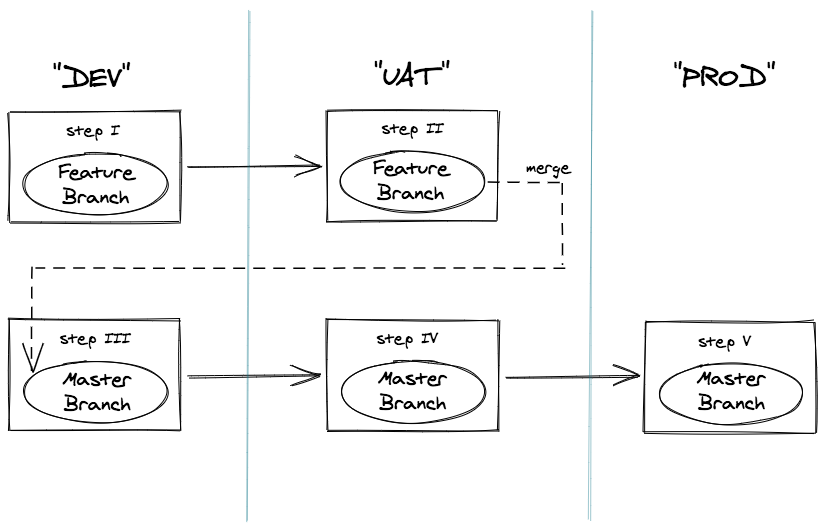
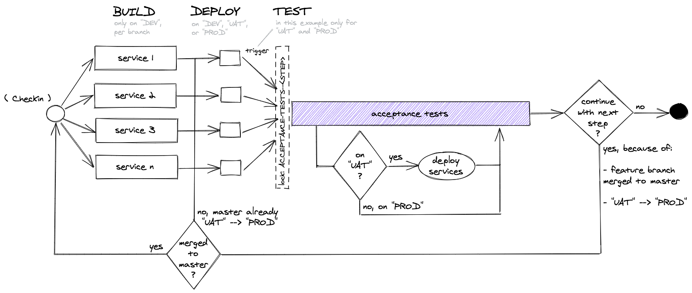

= Acceptance Tests With Selenium/Geb/Cucumber
:toc:
:keywords: latest

As explained in our xref:UnitTest.adoc[tutorial about Unit Tests], there are different levels of functional tests.
Acceptance Tests aim at the end user perspective and test the application like a user interacts with it (typically via GUI).
These tests give the team and especially the product owner more confidence to rollout a new version, because they are easier to understand than lower level tests and they can be defined in natural language.
It makes sense to automate them as a manual test execution is not repeatable, error prone and no fun for the tester.
In case you have no GUI, then your service probably provides an API, that must be tested (like with pact.io), but then this tutorial won't help you.

== Test Setup

In this tutorial we are using the https://lcm.deutschepost.de/confluence1/display/TOOL/Architekturen+und+Tools[test automation framework from P&P] in combination with the https://esharenew.dhl.com/sites/DPDHL_Forge/Tool/Lists/Tool/DispForm.aspx?ID=66&Source=https%3A%2F%2Fesharenew%2Edhl%2Ecom%2Fsites%2FDPDHL%5FForge%2FTool%2FLists%2FTool%2FOrdered%2520by%2520Category%2Easpx&ContentTypeId=0x010086F21FE0B9156A46BAF84C8317AF0DB200FED147EF8EF35448A36D6C3F55CC55A6[IT-S Selenium Grid].

It is based on the https://gebish.org[Geb - Groovy Browser Automation] framework.
Geb sits on top of Selenium WebDriver and helps together with Groovy, a jQuery-like content selection, and the utilization of the https://www.selenium.dev/documentation/en/guidelines_and_recommendations/page_object_models/[Page Object model] to automate the browser in an easier, more maintainable way.

The project uses also the https://cucumber.io/docs/installation/java/[Cucumber-JVM] testing framework.
Cucumber is a test automation tool following the principles of Behavioural Driven Design and living documentation.
Specifications are written in a concise human readable form and executed in continuous integration.

More details can be found https://lcm.deutschepost.de/confluence1/display/TOOL/Architekturen+und+Tools[here], but feel free to use another technology to define and execute your acceptance tests.

We have implemented the approach for our SockShop showcase application.
The code resides inside a separate https://git.dhl.com/SockShop/acceptance-test[repository] as SockShop uses a multi-repository layout.
Downside of this is, that there is no common versioning of the test code with the application.
So actually we recommend using a mono repository and store the code for the test-automation in a subfolder.

> *HINT*: more insights can be found in our xref:Repositories.adoc[comparison of different repository structures]

=== Test Orchestration

Gradle is used to orchestrate the tests.
The main configuration can be found in the https://git.dhl.com/SockShop/acceptance-test/tree/master/build.gradle[Gradle build file].

Tests are implemented by providing both Cucumber Features/Steps and Geb Pages:

1. Cucumber Features reside in https://git.dhl.com/SockShop/acceptance-test/tree/master/features[/features]
2. Custom Cucumber Steps reside in https://git.dhl.com/SockShop/acceptance-test/tree/master/src/test/groovy/glue[/src/test/groovy/glue]
3. Geb Pages reside in https://git.dhl.com/SockShop/acceptance-test/tree/master/src/test/groovy/pages[/src/test/groovy/pages]
4. Main Geb config resides in https://git.dhl.com/SockShop/acceptance-test/blob/master/src/test/resources/GebConfig.groovy[GebConfig.groovy]

=== Selenium WebDriver

To automatically download and cache OS-specific binary browser driver files needed by Selenium WebDriver the
https://github.com/erdi/webdriver-binaries-gradle-plugin[Gradle WebDriver Binaries Plugin] is used.

The binaries can be configured in the Gradle build file.
See https://github.com/erdi/webdriver-binaries-gradle-plugin/blob/master/README.md[this documentation] for details.

See https://github.com/webdriverextensions/webdriverextensions-maven-plugin-repository/blob/master/repository-3.0.json[this file]
for a list of browser drivers, versions, platforms, and architectures that are supported without the need for additional configuration.

=== Chrome Headless
For running tests via a headless chrome, you need to add it to your agent.yaml:

[source,yaml]
----
include::../../../acceptance-test/agent.yaml[tags=AT-chrome, indent=0]
----

Then you need to configure it in your gebconfig, for example like this:

[source,groovy]
----
include::../../../acceptance-test/src/test/resources/GebConfig.groovy[tags=AT-geb-config, indent=0]
----

=== Cucumber Report

Cucumber reports can be published on the Jenkins build server.
They are displayed in a form of pretty HTML documents with charts showing the results of Cucumber runs.

To enable this option you should add the https://github.com/SpacialCircumstances/gradle-cucumber-reporting[Gradle Cucumber Reporting] plugin.

The example configuration of the plugin can look like:

[source,groovy]
----
include::../../../acceptance-test/build.gradle[tags=AT-gradle-config, indent=0]
----

The plugin generates a pretty HTML file from Cucumber report JSON files.
You have to perform a `generateCucumberReports` task after running the `cucumber` gradle task.

== Acceptance Tests Pipeline

The acceptance tests are executed using a separate pipeline as those will be triggered from many different sources:

- deployment jobs of all your single services, after deploying to UAT environment and before deploying to PROD
- in case you want to run a flightcheck after deploying to PROD, maybe even as a trigger for a rollback
- in case you want to manually verify functionality of a specific app version

Let's look at an example of how such a pipeline could look like (simplified) when working with:

* Git feature branches,
* GitHub pull request (PR) gates before merging feature branches into the master branch, and
* three stages - DEV, UAT, and PROD.

Assuming these are the steps we are taking...

\...our pipeline conceptually could be implemented as:

Explanation:

1. On stage DEV our services are built per branch when a commit occurs (incl. when merging a feature branch into the master
branch).
2. Afterwards, the services get deployed on the current environment.
3. On the UAT and PROD stages, the acceptance tests are run.
a. To make sure the tests are run in serial order, a Jenkins lock with a unique name per step is being used.
b. All needed services will be (auto-)deployed, if necessary, before the acceptance tests are run on UAT. We do not want
to use this auto-deployment behavior on PROD.
4. After the acceptance tests have successfully passed, four things can happen:
* Being on PROD, the pipeline is finished.
* Being on UAT and on a feature branch that hasn't been merge into the master branch, the pipeline is finished.
* Being on UAT and on a feature branch that has just got merged into the master branch, the pipeline starts at the
beginning.
* Being on UAT and already on the master branch, the pipeline continues with the deployment/testing on PROD.

Getting more detailed, the pipeline is split into the following stages:

. Preparation phase,
. Test execution,
. Report generation.

We need to have two additional containers to be able to perform acceptance tests.

=== Agents
We use the `gradle` cli to perform the tests.

For this we use the xref:KubernetesAsJenkinsAgent.adoc[Kubernetes as Jenkins Agent] in our Jenkins pipeline.
The first thing you need is a configuration for a `java` container to your `agent.yaml`:
[source,groovy]
----
include::../../../acceptance-test/agent.yaml[tags=AT-java, indent=0]
----

We use the `helm` cli to perform the preparation.
You need a configuration for a `helm` container to your `agent.yaml`:

[source,groovy]
----
include::../../../acceptance-test/agent.yaml[tags=AT-helm, indent=0]
----

Then configure the agent in your `Jenkinsfile`:
[source,groovy]
----
include::../../../acceptance-test/Jenkinsfile[tags=AT-agent, indent=0]
----

The test execution will require some configuration that you should locate inside your `config.jenkins`:
[source,groovy]
----
include::../../../acceptance-test/config.jenkins[tags=AT-config, indent=0]
----

> **IMPORTANT**: the values of config maps `services`, `helm` and `openshift` need to be adapted by you according to your application

=== Preparation Phase

The preparation stage will make sure that the environment for a triggering test scope is ready.
All the services have to be deployed to be able to test the whole application.
It will check for all services whether there is a deployment with the correct branch as postfix.
If not it will use the HELM chart of the master branch and perform a deployment with branch as postfix.

The code to check all services of `Sock Shop` can be used as an example:

[source,groovy]
----
include::../../../acceptance-test/Jenkinsfile[tags=AT-preparation, indent=0]
----

=== Test Execution

In this stage the tests are executed by launching Cucumber via the chrome headless.
You need to pass the following paramters: `geb.env` and `geb.build.baseUrl`.
The following ones are optional and are useful to enrich the cucumber report with additional information.
`browserClassification`, `releaseClassification`, `buildNumber`, `projectName`, `branchClassification` and `jenkinsURLClassification`.

The code to execute the tests on `Sock Shop` can be used as an example:

[source,groovy]
----
include::../../../acceptance-test/Jenkinsfile[tags=AT-perform, indent=0]
----

=== Report Generation

To generate a report you need to add the report generation stage.

Actually we need to do this twice, once to display the results directly in Jenkins as a html report generated by Jenkins Cucumber plugin and once to archive the report as a .zip and to be able to propagate it back to the triggering job.

The code of report generation based on the tests on `Sock Shop` can be used as an example to generate both report styles:

[source,groovy]
----
include::../../../acceptance-test/Jenkinsfile[tags=AT-report-generation, indent=0]
----

As a result Jenkins will display Cucumber reports (on job, not build level) showing the test results.
Additionally a zip archive of the report is attached on build level.

== Integration of Acceptance Test Pipeline with other Jobs

To enable an integration between Jenkins jobs we use a concept of upstream/downstream jobs in Jenkins.

An `upstream job` is a configured project that triggers a project as part of its execution.

A `downstream job` is a configured project that is triggered as part of an execution of a pipeline.

Upstream and downstream jobs help you to configure the sequence of execution for different operations so you can orchestrate the flow of execution.

To integrate execution of the acceptance test pipeline after deployment to UAT for your service you can use this pipeline configuration from Sock Shop as an example:

[source,groovy]
----
include::../../../frontend/JenkinsfileDeploy[tags=AT-integration, indent=0]
----

The configuration for the above stage is in `config.jenkins` of the respective service:
[source,groovy]
----
include::../../../frontend/config.jenkins[tags=AT-integration, indent=0]
----

The Cucumber report is propagated from the downstream acceptance test job to the triggering job.
This allows you to archive this report as a Jenkins artifact.

Happy testing!
