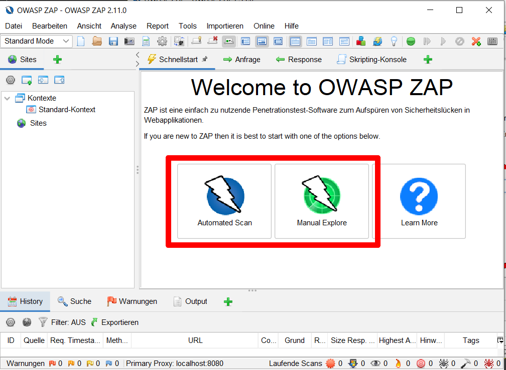
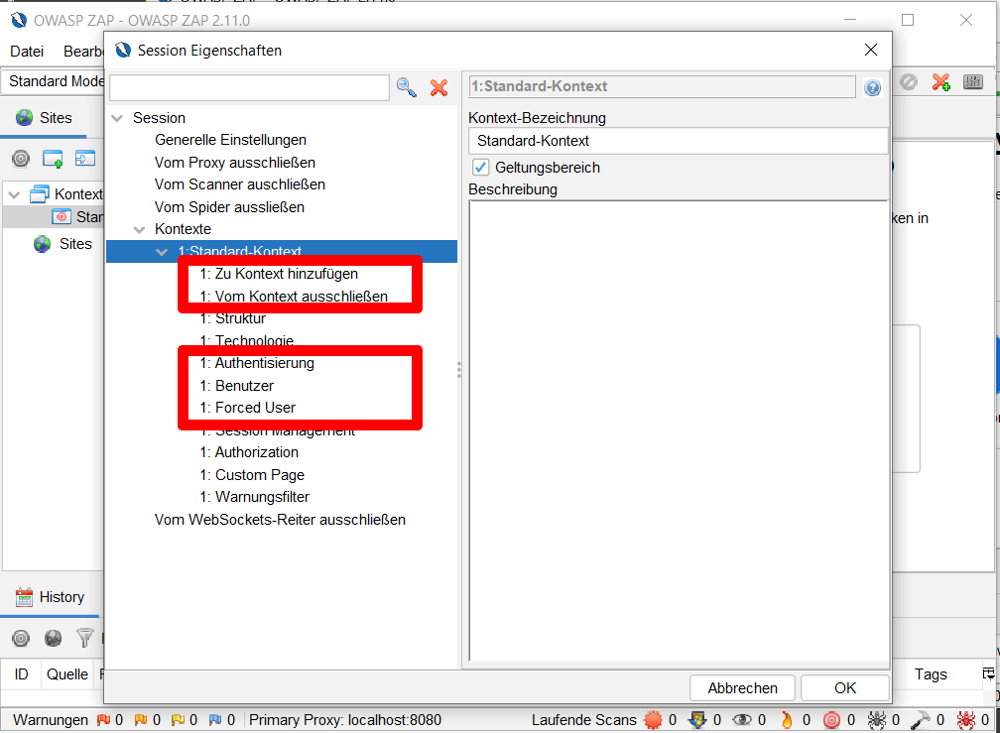
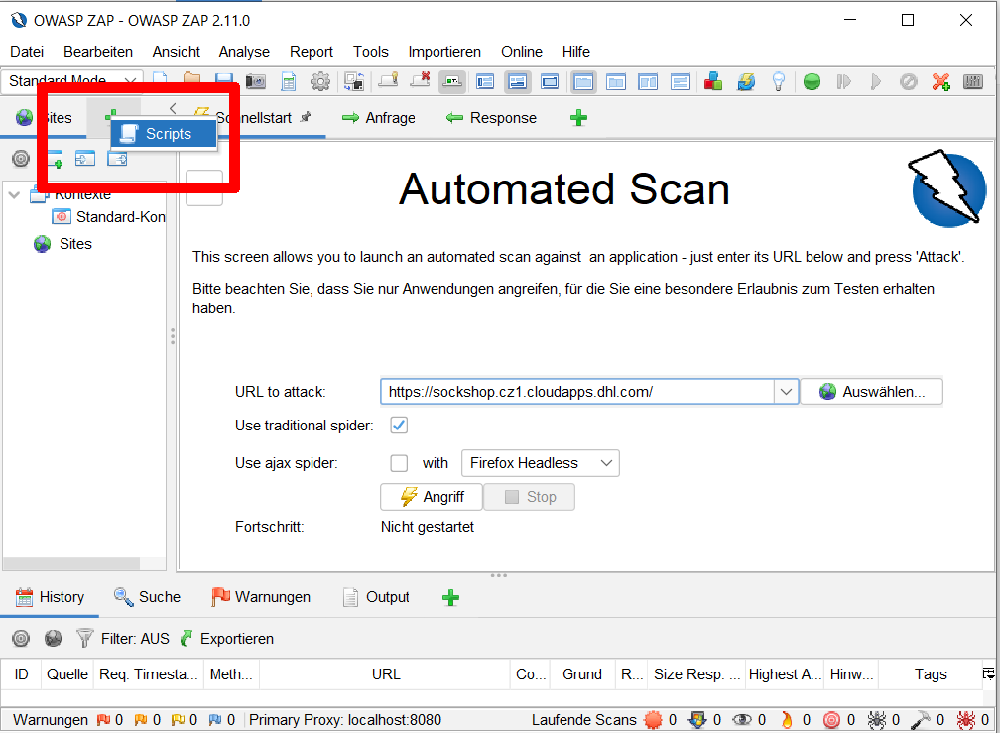
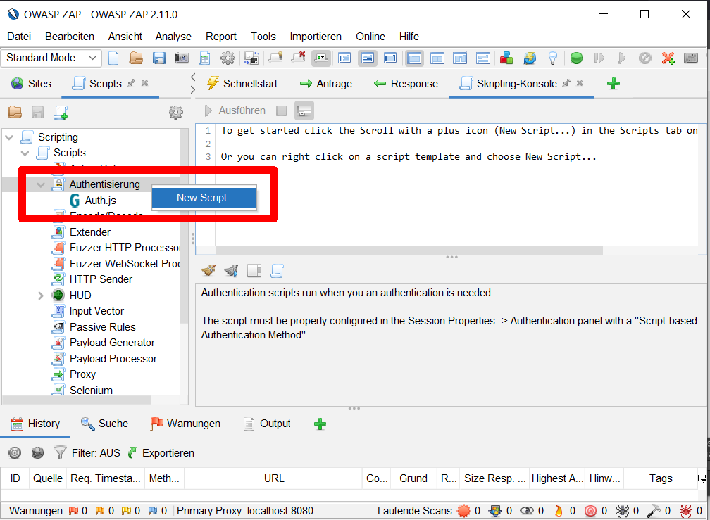

= Dynamic Application Security Test With ZAP
:toc:
:keywords: latest

== Background

The goal of penetration testing is uncovering vulnerabilities in a complex system by posing as a malicious attacker with a goal of either breaking into the system or stealing data.

The basic recipe for pentesting is as follows:

. Explore: find pages and vulnerable software
. Attack: try to attack the application
. Report: generate reports based on findings from Explore and Attack

The attack phase is the most important, since it focuses on active attacks instead of relying only on existing knowledge like CVEs, it is able to spot unknown vulnerabilities and false positives.
Comprehensive pentests are usually more accurate but also more expensive than static tests because of this.

Pentesters usually use software suites that automate parts of the attack while monitoring traffic and highlighting vulnerable parts.
This automated tooling can also run in the pipeline, enabling a baseline pentest that covers the most common and automatable tests.

== Zed Attack Proxy

https://www.zaproxy.org/getting-started/[Zed Attack Proxy (ZAP)] is a man-in-the-middle proxy designed specifically to attack web applications.

It is developed for manual testing, but it includes automated passive and active scan rules to analyze and attack an application, that can be integrated into pipelines.

A typical ZAP run consists of

. Crawling the application and monitoring using passive scan rules
  * this will expose e.g. talkative web servers or pages that should not be reachable
. Running active scans against the sites and software found in the explore step
  * this will inject random input and modify traffic
. Generating a report using the findings and a config file

> *IMPORTANT*: These active attacks *will* break your system

Keep in mind that the tests need to be configured correctly to give any useful results.
Most importantly you need to make sure that the scan performs a login to look at the whole application.
https://lcm.deutschepost.de/confluence1/pages/viewpage.action?pageId=103236179[More details about ZAP] are provided by our Tool Tribe Squad Security and Compliance.

> *NOTE*: Automated scans are no full replacement for a manual pentest, but as they can run in a pipeline, they can provide continuous and comparatively cheap assessment of the most common vulnerabilities.

== Basics

=== Stage

The ZAP scans require a deployment that they can attack, e.g. the UAT deployment.

Because of that, we recommend running the baseline ZAP scan in the deployment pipeline, parallel to the web acceptance checks. If your process includes a private staging environment, you might want to run manual tests against that version.

> *NOTE*: You should evaluate if you can provide an isolated environment for ZAP similar to a stress test environment since it can affect other tests.

=== Using the GUI

ZAP provides a https://www.zaproxy.org/docs/desktop/ui/[Desktop UI] which can be downloaded https://www.zaproxy.org/download/[here.] It provides access to two modes to familiarize yourself with ZAP and the interaction with your application.

> *HINT*: The *Automated Scan* can use information from *Manual Explore*. It might therefore be necessary to restart from an empty session if you want to check your parameters.

Further information regarding the GUI can be found in the videos below.

=== Contexts
A very important concept in ZAP are *contexts*.
A context is essentially a description of a web page combined with necessary information for the scanner.

A basic context might contain just the URL of the website ZAP should crawl and attack.
As you explore your application, you might notice that ZAP is crawling pages which are not interesting to you, such as the Google Fonts API or sites from other projects that are mentioned on your page.
To restrict ZAP to relevant pages you can define a scope for your context by declaring with sites should be included or ignored.

=== Authentication
Later in the exploration, you might need to log in to your page to scan parts that are not available to the public.

Authentication in ZAP requires three building blocks:

* An authentication method, such as basic auth
* A user with credentials
* A verification method

The *authentication method* can take a variety of forms.
The simplest form is basic auth, which requires just a username and password.
More complex examples, such as OAuth, may require an authentication script.
Further information on these scripts can be found below, in the scripting ZAP chapter.

The *user* is just a combination of username and password.
However, there are some requirements the user should fulfill:

* It should always exist in the ZAP environment
* It might need to be regenerated between scans because it might be deleted by ZAP
* If your users can have different capabilities you should scan for each meaningful capability set

The *verification method* helps ZAP tell apart authenticated messages.
There are four possible methods: `request`, `response`, `both` and `poll`.
The first three methods take two regexps, the logged_in and logged_out indicator.
These indicators should be present in every message, depending on your login status.
The `poll` method instead requests a polling URL to determine if the session has expired.

> *NOTE*: You will be able to set Forced User mode for scans in the GUI only if ZAP has enough (but not necessarily correct) information.

== Automation Framework

=== Basics
The https://www.zaproxy.org/docs/automate/automation-framework/[Automation Framework] is a ZAP Extension which provides a mixed "configuration/pipeline as code" approach.

The Automation Framework consumes an *automation plan*, a .yaml file which contains two main sections, the *environment* and the *jobs*.

> *NOTE*: You can create automation framework plans in the GUI. When you do, keep in mind that the plan contains a context snapshot from its time of creation, which will overwrite any existing contexts of the same name when the plan is executed.

=== Environment
The `env` object contains the description of your site.
It is used to generate the contexts you want to use in your automation plan, set global variables and pass parameters to the automation framework.

[source,yaml]
----
include::../../../frontend/zap/zap.yaml[tag=env,indent=0]
----

If you want to run authenticated scans, you need to define an `authentication.method` with its required parameters *and* a `verification.method`.
These values should reflect the configuration you use for authenticated scans in the GUI.

You also require at least one `user` with a `name` (for reference) and `credentials`.
It is possible to use environment variables or those defined in the `vars` block for this.

The environment also allows you to set `failOnError`, `failOnWarning`, and `progressToStdout`, which will affect the automation plan as a whole.

A comprehensive list of supported and required values can be found https://www.zaproxy.org/docs/desktop/addons/automation-framework/environment/[here].

=== Jobs
The `jobs` object contains definitions for single jobs which will be processed from top to bottom.

The most important jobs are `spider`/`spiderAjax` (the crawlers), `activeScan`, `passiveScan-config`/`passiveScan-wait` and `report`.
A more extensive list along with definitions for each job can be found https://www.zaproxy.org/docs/automate/automation-framework/[here].
Some AddOns might already provide extensions for the automation framework without being listed.

In general, you define a job by setting its `type`, `parameters` and `name`.
For example, to run a basic spider job with authentication you could define:

[source,yaml]
----
jobs:
include::../../../frontend/zap/zap.yaml[tag=spider-a,indent=2]
----

This will cause ZAP to spider the `context.urls` for a maximum of 15 minutes as eve.

==== Tests
Although the job definition above is correct, it provides no feedback before the plan is executed completely.
This is an issue, because some scans can take a very long time even if you cannot log in.
So, to make sure our scan is useful, we include https://www.zaproxy.org/docs/desktop/addons/automation-framework/tests/[Job Tests], to check conditions during execution.

There are currently three types of tests: statistics, alert and url presence tests.
We are at the moment only using statistics tests.

[source,yaml]
----
jobs:
include::../../../frontend/zap/zap.yaml[tag=spider,indent=2]
----

You can run simple comparisons on all statistics found in https://www.zaproxy.org/docs/internal-statistics/[ZAPs internal statistics].
Some addons might provide additional statistics.

> *NOTE*: There are two types of statistics, *global* statistics and *site* based statistics which require `site` to be set, otherwise they are considered zero (*not* null).

.Useful statistics for sanity checks and authentication
|===
| Statistic | Scope | Type | Desc
| automation.spider.urls.added | global | counter | URLs found by the automation spider job
| spiderAjax.urls.added | global | counter | URLs found by the AJAX spider job
| stats.auth.loggedin | local | counter | Messages that include the loggedin indicator
| stats.auth.loggedout | local | counter | Messages that include the loggedout indicator
| stats.auth.unknown | local | counter | Messages that include neither loggedin-/loggedout indicator
| stats.auth.success | local | counter | Successful login attempts
|===

==== Breaking the Build
You can break the build using tests, however this might not be feasible for the happy path.
Instead, use the https://git.dhl.com/CDLib/CDlib/tree/master/cli#report-check-check-your-reports-for-issues[`cdlib reports check` command from cdlib-cli].

==== False Positives

The ZAP Automation Framework uses a special job for the https://www.zaproxy.org/docs/desktop/addons/alert-filters/[Alert Filters Plugin] to set False Positives.

[source,yaml]]
----
jobs:
include::../../../frontend/zap/zap.yaml[tag=alert,indent=2]
----

As you can see, there are many possible parameters for this step.
Luckily, you can find most of them in the corresponding report.
Almost all of them are optional (including the url), yet it would be ideal to set the filter as tightly as possible.

> *NOTE*: Ensure that the filters are set before the job they should be applied to, that usually means before the first spider job.

== General workflow
. Attack your site in the GUI
.. Explore the page using manual explore
.. Identify necessary information for authentication
*** authentication method
*** verification method
*** if required write an authentication script
.. Ensure that ZAP can authenticate itself and run in forced user mode
. Create an automation plan template using `zap.sh -cmd -autogenmax` or by copying our example
. Fill the template with your site-specific information from 1.
. Import the template into the ZAP GUI and ensure it works
** You will probably need to delete scripts, the context and the site tree before re-running the automation plan
. Test whether the template works locally with `zap.sh -autorun`
. Replace any variable values with environment variables
** urls
** credentials
. Add a Jenkins job for `zap.sh -autorun` with the required environment variables

== Sample jobs

|======
| CI/CD Tool | Pipeline Definition | Agent Configuration

|image:img/jenkins.png[] Jenkins | https://git.dhl.com/SockShop/front-end/blob/master/JenkinsfileDeploy[Jenkinsfile] | https://git.dhl.com/SockShop/front-end/blob/master/agentdeploy.yaml[agentdeploy.yaml]
|image:img/azuredevops.png[] Azure DevOps | https://dev.azure.com/sw-zustellung-31b3183/ICTO-3339_SDM/_git/phippyandfriends?path=/parrot/parrot.yaml&version=GBmaster&_a=contents[Pipeline .yml] | -
|GitHub Actions | https://git.dhl.com/CDLib/cdaas-template-maven/blob/8b57829877c879b8754c7170252a74febfc0bfcd/.github/workflows/pipeline.yaml#L73 | -
|======

=== Jenkins

==== Agent

The ZAP image can be integrated into your xref:KubernetesAsJenkinsAgent.adoc[build agent]. It requires a volume mounted at `/zap/wrk` to export files.

[source,yaml]
----
include::../../../frontend/JenkinsfileDeploy[tags=DAST,indent=0]
----

> *NOTE*: As you can see below, you don't actually need to use that directory, but it has to exist.

==== Pipeline

In case you use OpenShift as your agent runtime, you need to set the PATH since it runs containers as a different user. 

[source,groovy]
----
include::../../../frontend/JenkinsfileDeploy[tags=DAST-scan,indent=0]
----

The ZAP image is able to use a proxy for scanning.
For this you have to define the proxy with additional config parameters.
Here is an example with the b2b proxy:

[source,groovy]
----
container('zaproxy') {
    sh "zap-baseline.py -t ${UATURL} -r ../..${env.WORKSPACE}/zap-report.html -c ../..${env.WORKSPACE}/zap-conf  -z '-config connection.proxyChain.enabled=true -config connection.proxyChain.hostName=b2b-http.dhl.com -config connection.proxyChain.port=8080' "
}
----

==== Automation Plan
The sockshop uses the following automation plan:

[source,yaml]
----
include::../../../frontend/zap/zap.yaml[]
----

=== Azure Pipelines

==== Container Agent

We use a https://dev.azure.com/sw-zustellung-31b3183/ICTO-3339_SDM/_git/Images?path=/README.md&_a=preview[modified version] of the zap2docker-live image and run it inside the xref:ManagedDevOpsPools.adoc[Managed DevOps Pools Agent].

You can then add the scan to your pipeline using our template file.
This should suffice with minimal changes (i.e. the target URL) for unauthenticated scans, however you will probably have to adapt it for authenticated scans.

[source,yaml]
----
include::../../../cdaas-template-maven/azure-pipelines.yaml[tags=zap,indent=0]
----

=== GitHub Actions

Within our template repository you can find a working example on how to perform a scan via ZAP automation framework against an UI.
Automation Plan: https://git.dhl.com/CDLib/cdaas-template-maven/blob/main/zap/zap.yaml
Pipeline: https://git.dhl.com/CDLib/cdaas-template-maven/blob/8b57829877c879b8754c7170252a74febfc0bfcd/.github/workflows/pipeline.yaml#L73
Workflow: https://git.dhl.com/CDLib/cdaas-workflows/blob/main/.github/workflows/zap.yaml

==== ZAP template

[source,yaml]
----
include::../../../cdaas/ado/container-job-templates/zap.yaml[indent=0]
----

== Advanced Topics
=== Scripting ZAP
ZAP provides a scripting interface for Jython (and Graal) to access the internals.
There are many possible script types, including standalone and authentication scripts.

To add an authentication script in the GUI, your first need to add the Scripts tab:

You can then add various different types of scripts to ZAP.

==== Authentication Scripts
Authentication scripts are one of the main authentication methods.
More complex authentication methods such as OAuth require these scripts.

The SockShop uses a small authentication script. The `authenticate` function will be called for every authentication attempt.
The various parameters can be set via the GUI or in the `authentication` section of your automation plan.
Check out https://git.dhl.com/SockShop/front-end/blob/master/zap/Auth.py[Auth.py] for the full interface.

[source,yaml]
----
#Environment Settings
include::../../../frontend/zap/zap.yaml[tag=authscript,indent=0]
----

[source,python]
----
include::../../../frontend/zap/Auth.py[indent=0]
----

The "meat" of the script is the `authenticate` function.
You can create and manipulate messages using the `helper` object.
Variables are passed to the script using the `paramsValues` and `credentials` objects.

The three other functions are used to define parameters the script might need.

> *NOTE*: We expect most ZAP Java classes (https://javadoc.io/doc/org.zaproxy/zap/latest/index.html[Javadoc]) to be available.

==== Standalone Scripts

Standalone scripts are scripts that can be called explicitly to access ZAPs internals.
For example, we use a standalone script to write internal alert map to stdout.

[source,python]
----
include::../../../frontend/zap/alerts.py[indent=0]
----

These scripts have no template, but can import and use ZAPs internals.

> *NOTE*: We can only provide superficial support for scripts, if you have any issues please check the https://github.com/zaproxy/community-scripts[ ZAP community scripts repo] and the xref:http://groups.google.com/group/zaproxy-scripts[ZAP scripts user group.]

=== ZAP Plugins
If you want to use a ZAP plugin that is provided via https://github.com/zaproxy/zap-extensions[GitHub] but not yet part of our ZAP distribution, please let us know, so we can decide whether we should include it.

If you would like to test the plugin first you can create your own ZAP image based on our container using Docker (https://dev.azure.com/sw-zustellung-31b3183/ICTO-3339_SDM/_git/Images?path=/README.md&_a=preview[compare our Dockerfile]).

> *NOTE*: We can only provide superficial support for additional plugins.

=== Legacy (with Hooks script)
> *NOTE*: These are some hints for legacy implementations of the ZAP process. Since we moved to the Automation Framework, we might not be able to help you if you decide to use these methods.

==== Hooks are not firing
If your hooks are not firing, make sure that they are actually called by the zap python script. 
For example, the `zap_access_target` hook, which we used in our script, is not fired by `zap-api-scan.py`
You can check on https://github.com/zaproxy/zaproxy/blob/main/docker/[their GitHub] if the script fires your hook.
Most hooks are defined in `zap_common.py` and fired in the python script you call from the command line.

== Further Resources

=== Videos
|=== 
| Link | Topic | Recommended for

| https://play.sonatype.com/watch/ttqKANDzJCAdBUkPrsz6Td?[Authentication Basics] | Authentication | Authenticated Scans
| https://play.sonatype.com/watch/7gR4qYzUZ686wEDMBfxGdf?[Scripting Basics] | Authentication, Scripting | Authenticated Scans with Scripting
| https://www.zaproxy.org/zap-in-ten/[ZAP in Ten] | Basics | Everyone
| https://www.zaproxy.org/videos-list/[All Videos on ZAP] | General | 
|===

=== Code, Documentation & More
|===
| Link | Type | Recommended for

| https://www.zaproxy.org/docs/api/#introduction[REST API] | Documentation | UI Stats
| https://javadoc.io/doc/org.zaproxy/zap/latest/index.html[Javadoc] | Documentation | Scripting
| https://github.com/zaproxy/community-scripts[ZAP community scripts] | Repository | Scripting
| https://groups.google.com/g/zaproxy-users/[ZAP User Group (Google)] | Mailing List | Troubleshooting
| xref:http://groups.google.com/group/zaproxy-scripts[ZAP scripts user group.] | Mailing List | Troubleshooting Scripts
|===
