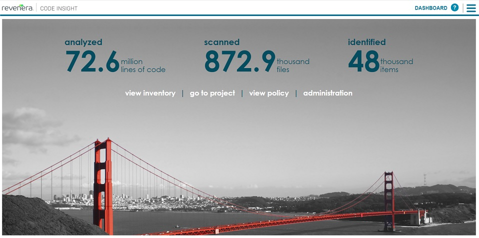
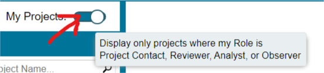
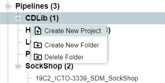
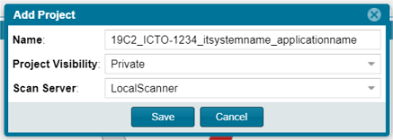

= FlexNet Code Insight
:toc:
:keywords: latest

To perform a xref:OpenSourceLicenseComplianceScan.adoc[Open Source License Scan] inside your pipeline, you can use
Revenera FlexNet Code Insight (FNCI) hosted by P&amp;P.

== Benefits

* installation &amp; maintenance done by P&amp;P 19C
* incident &amp; problem management and support included (on a best-effort base)
* no own infrastructure needed
* no own enterprise license needed
* firewall clearance to further IT-S DevOps tools taken care of (e.g. https://devsecops.dhl.com/services/build/jenkins-cloudbees/[IT-S Cloudbees Jenkins])

== Costs

In case you're working for P&amp;P we have great news - it is free for you (while supplies (user licenses) last)!

== Access

FNCI is accessible via https://fnci.deutschepost.de/codeinsight/ inside our corporate network, so external users will
need a firewall clearance. To get a user account, write an email
to xref:mailto:miroslaw.freitag@deutschepost.de (local users, no AD connectivity).

Once you have logged in, you can visit &#9776; &rarr; Preferences to change your password and create a JSON web token
(JWT) for API access.

== Projects

If your application consists of independent parts (e.g. micro services) being built and tested in separate pipeline
jobs, you can choose between single-project or multi-project layout. Using a single project for your application,
the independent parts will be differentiated by "scan alias" (some label you define for each pipeline / micro service /
application part), but the distributable HTML report will show the whole application bill-of-materials (BOM).
Using multiple projects, each application part will have its own project, approval space and report.
Comparison table:

|===
|Advantages using a single project |Advantages using multiple projects 

|only one project to create and manage in FNCI |FNCI report in pipeline job only shows pipeline scope 
|the same dependency occurring in different components must be approved only once |no side effects from other application parts 
|immediate "reportability" towards PO / "project management" / ISO / "Lizenzmanagement P&amp;P" |different responsibilities (if applicable) separated in reports 
|===

In general, the multi project "overhead" is recommended mainly for separated responsibilities (e.g. different teams, different vendors etc.). This way each team keeps an overview about the parts it is accountable for, and will not be affected by dependency issues beyond their control. 

To create a new project for pipeline-based scanning:
- log in
- click on "go to project"
- if you see no folders, disable the "My Projects:" filter

- locate the `Pipelines` folder
- if there is no folder for your application / team / department below `Pipelines` folder yet,
 create one (by right-clicking on the "Pipelines" folder and click on `Create New Folder`)
- right-click on your folder below `Pipelines` and click on `Create New Project`:

&rarr;

____

*HINT:* the https://lcm.deutschepost.de/confluence1/display/TOOL/FNCI+-+Nutzungskonzept#FNCINutzungskonzept-3.HinweiseundKonventionen[naming pattern] for projects is `&lt;Bereich=XXXX&gt;_&lt;ICTO-Nummer=ICTO-NNNN&gt;_&lt;IT-System-Name&gt;[_&lt;Applikation-Name]`, e.g. `19C2_ICTO-1422_SonarQube_sonar-tqs-plugin`

*NOTE:* before 02/2021 pipelines needed FNCI projects of type "Inventory Only". These are deprecated now, i.e. they cannot be created anymore, and cannot be used with new CI agents and plugins. To migrate existing "Inventory Only" project data, refer to https://community.flexera.com/t5/Code-Insight-Knowledge-Base/Code-Insight-2020-R3-Changes-to-Projects/ta-p/160059[this guide by Revenera/Flexera].

____

== API access

JSON web tokens and API access are needed for pipeline-based scans. Of course you can use the FNCI REST API for other
workflows, too – refer to
FNCI https://fnci.deutschepost.de/codeinsight/resources/swagger-ui/index.html[Swagger API documentation] for available
endpoints.

== Problems

In case of general questions, see also the
Tool Tribe https://lcm.deutschepost.de/confluence1/display/TOOL/FNCI+-+Nutzungskonzept[introduction and concepts page].

In case of any problems write an email to Miroslaw.Freitag@deutschepost.de.
