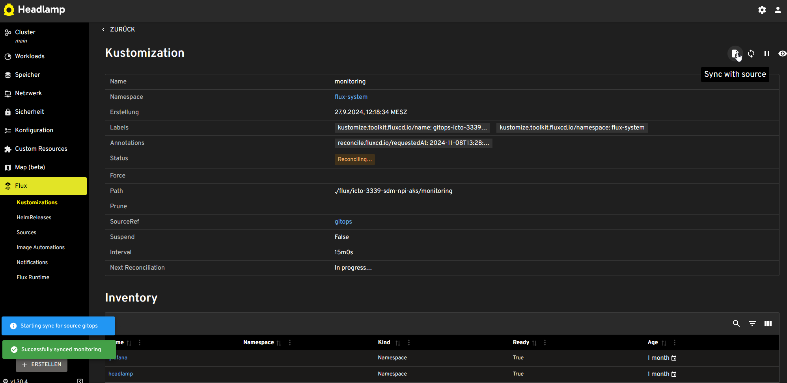

= GitOps
:toc:
:keywords: latest

Version control via git has become a no-brainer for every developer.
In contrast to that, operations nowadays still rely on unstructured means of communicating, executing and documenting their work.
GitOps tries to apply the developing workflows with commits, branches, and pull requests to operations as well.

== Why GitOps?

GitOps promises quite a few benefits over traditional deployment methods:

- Traceability: Everything that happens in production is transparent and documented, providing a perfect audit trail for ops ensured by Git version control
- Declarative: you can directly see in git state which version is installed where with which configuration and there is no need to script any configuration mechanisms as you just describe the desired state and the rest is handled by the GitOps tool
- Security: in theory, no direct access to production is needed anymore, as it uses a pull instead of push principle and changes are done via git and only after a peer-review (pull request) enforced by protected branches
- Speed: faster than typical CD approaches due to direct syncing without any agents
- Drift-Detection: since the desired state is described and the current state is monitored, GitOps tools can detect drift (deviation between desired and current state) and even autocorrect those.
- Recovery: in case of any incident that requires a restore of the application and infrastructure, GitOps can automatically perform the necessary actions based on the desired state definition and is therefore much faster and doesn't rely on manual operators (unless persistent data needs to be restored as well)

== Why FluxCD?

There are 2 main tools options for GitOps, each with their strengths and weaknesses.
https://fluxcd.io[FluxCD] was initially created by Weaveworks and https://argoproj.github.io/cd/[ArgoCD] initially created in 2018 both now donated to CNCF and mature since 2022.
We will compare both and explain our pick.

|===
|Criteria |FluxCD |ArgoCD

|*Setup*
|AKS-Extension or Terraform/CLI
|Terraform/Helm

|*Config File Generation*
|via CLI
|only manually

|GUI
|via Azure Portal Integration or Headlamp or Capacitor or Weave GitOps
|native

|RBAC
|based on K8s
|own

|Rollbacks (Helm)
|automated
|manually

|Dependencies
|yes
|no

|Orphan Handling
|no
|yes

|Canary Deployments
|via Flagger
|via Argo Rollouts

|Multi-Cluster-Management
|no
|built-in

|Staging
|no
|no

|Support
|no
|via Akuity and others
|===

Although we believe that ArgoCD has the better user interface, we have chosen FluxCD for our GitOps approach.
The main benefit is the deep integration into the Azure environment.
You can deploy FluxCD without cluster access as an extension, and you can see the status directly inside Azure Portal.
In case the Azure Portal integration is not good enough for you, you can also deploy Headlamp to gather more insights and soon also perform basic operations like triggering a reconciliation.
Furthermore, we'll use pipelines to automatically create the configuration entries, which can be easily done via flux-cli.
When we picked FluxCD, we were also convinced that dependencies and automatic rollbacks for Helm charts are important, but we came to the conclusion that this is not relevant anymore.

== Setup

In the following chapters, we will set up our git repository for GitOps, prepare our clusters, install Flux, set up the external secrets operator and optionally set up the headlamp dashboard.

=== GitOps Repository

The GitOps Repository setup we suggest is a mono repository approach with two branches: NPI (Non-Productive Infrastructure) and PROD (Production) where PROD is the default branch.
Both branches utilise a shared directory structure to ensure seamless promotion of changes from NPI to PROD using pull requests whilst avoiding any merge conflicts.
In addition, the PROD branch should utilise branch protection features for Github or branch policies for Azure Devops to prevent merges without pull requests (which always have to be approved by another team member).

We recommend using https://lcm.deutschepost.de/confluence1/pages/viewpage.action?pageId=72196138[an Azure Repos], but you can also use other offerings.

The repository structure heavily relies on your overall application, infrastructure and cluster configuration, and it needs to be customized to meet your particular needs.

==== Prepare Application Sync
We'll start with a simple structure and build on it:

[source]
----
└── flux
    └── <your-cluster-name> #e.g. icto-3339-sdm-npi-aks
        └── <project-name>
            ├── application1 (or service1)
            └── application2 (or service2)
----
The *flux* directory contains each cluster you want to manage by Flux CD.

Each *cluster* subfolder containing the resources and configuration Flux should synchronize.

In case your project has its own microservice applications, you would add individual folders for the services, e.g.: backend, frontend, carts, user, etc. under the folder *<project-name>*, see the above illustration.

The content of the application or service folders will be provided by our pipelines as we will explain in the latter part of this tutorial.

==== Prepare Third-Party Sync via Helm
To be able to deploy third party software like external secrets operator, loki, prometheus, nginx, etc. we'll need to provide sources from which Flux can pull the Helm charts from.

[source]
----
└── flux
    └── <your-cluster-name>
        └── sources
            └── helm-artifactory.yaml
----

The *sources* directory contains the HelmRepositories where to pull HelmReleases from.
For each repo you define a Flux resource of type `HelmRepository` like this:

[source,yaml]
----
include::../../../cdaas-template-gitops/flux/CLUSTER_NAME/sources/helm-artifactory.yaml[indent=0]

----

We'll add more folders later, depending on your needs, but now we'll focus on Flux itself first.

=== FluxCD for AKS

There are several ways to install Flux into your K8s Cluster.
We have chosen to install it via the https://learn.microsoft.com/en-us/azure/azure-arc/kubernetes/tutorial-use-gitops-flux2?WT.mc_id=Portal-Microsoft_Azure_ContainerService&tabs=azure-cli#for-azure-kubernetes-service-clusters[Flux AKS Extension] to avoid the need of cluster access.
Instead of manually installing it via https://learn.microsoft.com/en-us/cli/azure/k8s-configuration/flux?view=azure-cli-latest[az-cli], we use the https://registry.terraform.io/providers/hashicorp/azurerm/latest/docs/resources/kubernetes_flux_configuration[terraform module] to enable a GitOps approach for the infrastructure as well.

Alternatively, you could also install it via https://fluxcd.io/flux/cmd/flux_bootstrap/[flux-cli], which won't provide the integration with Azure Portal.

==== Preconditions

You'll need the following things to set up a complete GitOps workflow as described in the following chapters:

. git repository as explained before
. credentials with write access to the git repository (for Azure DevOps as a PAT of an actual user)
. firewall clearance from your azure VNETs to
.. https://*.dp.kubernetesconfiguration.azure.com (to configure AKS-Extensions)
.. access to git repo, like https://dev.azure.com
. if you want to access your headlamp dashboard via https (and/or use ingress) a valid wildcard TLS certificate for your Azure DNS zone(s) is needed. Find an explanation by CMC team, on how this can be ordered https://dpdhl.sharepoint.com/sites/IT-PKI-and-Cryptographic-Services/SitePages/de/Webserver-Certificate.aspx#6.wildcard-ssl-zertifikate[here]
. 2 Azure Subscriptions (one for NPI and one for PROD can be added later)
. Within Azure, you are going to need a few things, that you order via fastlane or create yourself
.. 2 managed identities (ManagedKubeletIdentity and ManagedIdentity) per subscription to set up a private AKS cluster, get the additional role to be able to create it yourself (SPN-based cluster won't work)
.. following providers activated for your 2 azure subscriptions via https://fastlaneprod.service-now.com/sp?id=sc_cat_item&sys_id=285537c11b864e102a08ddb6bb4bcb9b&referrer=popular_items[Fastlane]
... `az provider register --namespace Microsoft.Kubernetes`
... `az provider register --namespace Microsoft.ContainerService`
... `az provider register --namespace Microsoft.KubernetesConfiguration`
.. For the Grafana connection to "Azure-Entra ID" (former AAD) 1 service principal per subscription via https://fastlaneprod.service-now.com/sp?id=sc_cat_item&sys_id=4732c8ab1bfbfd102a08ddb6bb4bcb67&referrer=popular_items[Fastlane]

After that, you need to set up your AKS cluster(s).
Feel free to use our https://confluence1.lcm.deutschepost.de/confluence1/display/CCCENTER/Private+Azure+Kubernetes+Service+%28AKS%29+mit+Terraform[terraform template].

==== via Terraform (recommended)

The preferred way to install the Flux-AKS extension is to use Terraform.
Here are the Terraform Templates to install the Flux-AKS extension.

The flux-extension.tf looks like this
[source,yaml]
----
include::../../../cdaas-template-gitops/terraform/flux-extention.tf[indent=0]
----

The variables.tf looks like this
[source,yaml]
----
include::../../../cdaas-template-gitops/terraform/variables.tf[indent=0,tag=flux]
----

The .tfvars looks like this
[source,yaml]
----
include::../../../cdaas-template-gitops/terraform/tf.auto.tfvars[indent=0,tag=flux]
----

==== via Azure CLI

We provide and maintain the container image https://git.dhl.com/CDLib/image[docker.artifactory.dhl.com/cdlib/helm:latest] with all the necessary CLI tools such as Flux-CLI, kubectl, AZ-CLI, etc. that can be used for the following commands.

Flux can be installed like this:
[source,shell]
----
az k8s-configuration flux create
    --resource-group my-resource-group
    --cluster-name <mycluster-name>
    --cluster-type managedClusters
    --name gitops
    --scope cluster
    --namespace flux-system
    --kind git
    --url <git-url>
    --branch npi
    --https-user <user-name>
    --https-key <toke/password>
    --kustomization name=npi (or prod) path=applications/<your-application> prune=true
----

==== Disable the multi-tenancy feature
If you want to use Helm releases and store them in different namespaces, you need to disable the multi-tenancy feature.
Since we won't use Helm releases in this tutorial, you can usually skip this part.

[source,shell]
----
az k8s-extension update
    --configuration-settings multiTenancy.enforce=false
    --subscription  <your-sub>
    --resource-group my-resource-group
    -c <cluster-name>
    --cluster-type managedClusters
    -n flux
----

==== OIDC Issuer
Already done if you're using our Terraform template.
To be able to use the external secrets operator as we'll explain in the next chapter, enable the https://learn.microsoft.com/en-us/azure/aks/use-oidc-issuer[OIDC-Issuer URL] for the cluster.

[#_external_secrets_operator]
=== External Secrets Operator

The primary concern with secrets and sensitive information in GitOps is that they cannot be described and stored declarative, such as application manifests, due to security risks.
To be able to pull third party and your own images and also to provide other secrets (interfaces, database, etc.) to your cluster, we need to find a mechanism that syncs them from a trusted source.
The trusted source inside Azure is your key vault, and the mechanism is provided by a tool called https://external-secrets.io/latest/[External Secrets Operator].

image::img/external-secrets.png[External-Secrets]

The External Secrets Operator extends Kubernetes with custom API resources, including ExternalSecret, SecretStore, and ClusterSecretStore which define where secrets live and how to synchronize them.

==== Setup External Secrets Operator via Flux

We'll use GitOps to set up the external secrets operator, get used to it :)

The target folder structure looks like this:

[source]
----
├── flux
    └── <Cluster-Name> (same for prod)
        ├── external-secrets-operator
        |        ├── namespace.yaml
        |        ├── repository.yaml
        |        └── release.yaml
        └── external-secrets-operator.yaml #Flux-Kustomization pointing to folder management
----

To add the external secrets operator, we first need to add the deployment to (all) our cluster folder(s) on branch `npi` and `prod` with a Flux-Kustomization that looks like this:

[source,yaml]
----
include::../../../cdaas-template-gitops/flux/CLUSTER_NAME/external-secrets-operator.yaml[indent=0]
----

Even if we currently only have one cluster per branch, we'll add the actual manifests to deploy the ESO under the cluster folder in a subfolder `external-secrets-operator`.

First, add the namespace.yaml, where we want it to be deployed:

[source,yaml]
----
include::../../../cdaas-template-gitops/flux/CLUSTER_NAME/external-secrets-operator/namespace.yaml[indent=0]
----

Then add the repository.yaml, where we want to pull it from:
[source,yaml]
----
include::../../../cdaas-template-gitops/flux/CLUSTER_NAME/external-secrets-operator/external-secrets-helm-repository.yaml[indent=0]
----

Now add the release.yaml configuring the actual deployment:
[source,yaml]
----
include::../../../cdaas-template-gitops/flux/CLUSTER_NAME/external-secrets-operator/external-secrets-helm-release.yaml[indent=0]
----

==== Using the External-Secrets-Operator

To use the External-Secrets-Operator(ESO) with Azure KeyVault we'll first need to prepare the connection.

In order to connect the ESO with the Azure-KeyVault,
we need to create a Managed-Identity (MI) with https://learn.microsoft.com/en-us/graph/api/resources/federatedidentitycredentials-overview?view=graph-rest-1.0[Federated-Credentials]
and add the MI to the KeyVault-Reader-Group or KeyVault-Admin-Group.

[#_terraform_template]
Terraform can be used to create the MI with Federated-Credential, and add the MI to the  Azure-KeyVault-Group.

[source,yaml]
----
include::../../../cdaas-template-gitops/terraform/external-secrets-operator.tf[indent=0]
----
Now we can start setting up our Gitops repository to sync the secrets to our cluster using the ESO Custom-Resource (CR) `Cluster Secret Store`.

===== Cluster Secret Store

The Custom-Resource(CR) https://external-secrets.io/latest/api/clustersecretstore/[ClusterSecretStore] grants access to Azure-Keyvault and enables cluster-wide access to it.

image::https://external-secrets.io/latest/pictures/diagrams-high-level-cluster-detail.png[]

In order to use the `Cluster-Secret-Store` CR we'll set up the Gitops repository like this:
[source]
----
├── flux
    └── <Cluster-Name> (same for prod)
        ├── secrets
        |    └── secret-stores
        |        ├── external-secrets-operator-service-account.yaml
        |        └── clusterStore-azure-keyvault.yaml
        └── secrets.yaml #Flux-Kustomization pointing to folder secrets

----
First, add folder `secrets` under your cluster folder which we'll use to sync the actual secrets as described in the following

Next, create a subfolder `secret-stores` under secrets and add the Kubernetes ServiceAccount to the GitOps Repo and replace the "Client-ID " with the `Client-ID` of the Managed-Identity you have recreated recently:
[source,yaml]
----
include::../../../cdaas-template-gitops/flux/CLUSTER_NAME/secrets/secret-stores/external-secrets-operator-service-account.yaml[indent=0]
----

> our <<_terraform_template,Terraform-Temples>> outputs the Client-ID and Service-Account-Name

Next, add the ClusterSecreteStore and replace the *vaultURL* with the URL of your AzureKeyVault and *ServiceAccount Ref Name* with the name of the SA from above.
[source,yaml]
----
include::../../../cdaas-template-gitops/flux/CLUSTER_NAME/secrets/secret-stores/clusterStore-azure-keyvault.yaml[indent=0]
----

To tell Flux to synchronize the secrets described in the secret folder, we'll add a Flux-Kustomization to our cluster folder(s) on branch `npi` and `prod` that looks like this:
[source,yaml]
----
include::../../../cdaas-template-gitops/flux/CLUSTER_NAME/secrets.yaml[indent=0]
----

[#_syncing_secrets]
===== Syncing secrets

Finally, we are able to actually sync the secrets.
We'll explain two different scenarios to sync secrets to your cluster in the next chapters.

===== Cluster External Secrets

The ClusterExternalSecret Custom-Resource(CR) deploys Kubernetes Secrets cluster wide in every Namespace based on the specified namespaceselector.

image::https://external-secrets.io/latest/pictures/diagrams-cluster-external-secrets.png[]

To create a clean secret directory structure, it is recommended to bundle the secrets for every application/purpose in a subdirectory like this.
[source]
----
├── flux
    └── <Cluster-Name> (same for prod)
        └── secrets
            └── pull-secrets
                └── container-registry-dockerconfig.yaml
----

Here is a template how we deploy our pull secret in every namespace that Flux manages:
[source,yaml]
----
include::../../../cdaas-template-gitops/flux/CLUSTER_NAME/secrets/pull-secrets/container-registry-dockerconfig.yaml[indent=0]
----

[#_external_secret]
===== External Secret

Some secrets are only needed in certain namespaces, so here is an example of how we use the CR ExternalSecret to deploy our ingress cert only to our nginx-ingress namespace:
[source]
----
├── flux
    └── <Cluster-Name> (same for prod)
        └── secrets
            └── ingress
                ├── namespace.yaml
                └── ingress-cert.yaml
----
Add the namespace.yaml
[source,yaml]
----
include::../../../cdaas-template-gitops/flux/CLUSTER_NAME/secrets/ingress-nginx/namespace.yaml[indent=0]
----
Then add the ingress-cert.yaml
[source,yaml]
----
include::../../../cdaas-template-gitops/flux/CLUSTER_NAME/secrets/ingress-nginx/ingress-cert.yaml[indent=0]
----

[#_ingress_controller]
=== Ingress-Controller
In this chapter, we explain how to deploy an Ingress-controller with Flux based on https://www.nginx.com/[NGINX].We'll also configure the LoadBalancer IP, allowing Ingress to be reachable from outside the cluster.

==== Preconditions

To set up the NGINX, the following configurations are required:

.. <<_external_secrets_operator>>
.. <<_syncing_secrets>>
.. <<Prepare Third-Party Sync via Helm>>

==== installation

We start by setting up the GitOps repository.
[source]
----
├── flux
    └── <Cluster-Name> (same for prod)
        ├── infrastructure
        |    └── ingress-nginx
        |        ├── namespace.yaml
        |        ├── kustomization.yaml
        |        └── ingress-nginx.yaml
        └── infrastructure.yaml #Flux-Kustomization pointing to folder infrastructure
----

First, add the namespace and Flux-HelmRelease of the ingress-nginx controller under the directory infrastructure/ingress-nginx
The HelmRelease contains the version and values for the ingress-nginx Helm deployment.

Here is the template for the HelmRelease ingress-nginx.yaml:
[[nginx-helmRelease]]
[source,yaml]
----
include::../../../cdaas-template-gitops/flux/CLUSTER_NAME/infrastructure/ingress-nginx/ingress-nginx.yaml[indent=0]
----
Here is the template for the namespace.yaml:
[source,yaml]
----
include::../../../cdaas-template-gitops/flux/CLUSTER_NAME/infrastructure/ingress-nginx/namespace.yaml[indent=0]
----

Here is the template for the kustomization.yaml:
[source,yaml]
----
include::../../../cdaas-template-gitops/flux/CLUSTER_NAME/infrastructure/ingress-nginx/kustomization.yaml[indent=0]
----

In the end, add the Flux-Kustomization "infrastructure" to the directory cluster.
The Flux-Kustomization includes patches to ensure consistent Helm installation, upgrade, and rollback behavior for your futrue infrastructure services.

[source,yaml]
----
include::../../../cdaas-template-gitops/flux/CLUSTER_NAME/infrastructure.yaml[indent=0]
----

==== LoadBalancer

To set the correct IP address for the LoadBalancer in the Ingress deployment, you have to assign a free IP address from an Azure "Subnet" of a "Virtual-Network" to the LoadBalancer-Service in the <<nginx-helmRelease,Ingress HelmRelease>>.

To do that, first you have to find out the IP-Address range of the  Subnet of your Azure Virtual-Network.

Go to AzureAD->Virtual-Network->your-network->Subnets->select a subnet.

Now you should see

image::img/azure-subet-view.png[]

In the example image above, you can see the Subnet "Pub01" of the Virtual-Network "npi_euw_SDM-NPI_dev_vnet01" has the following IP address range "10.187.90.32–10.187.90.47"

Next, you have to find out which IP addresses are already used.
Go to `Connected devices` in your "Virtual Network". Filter 'your subnetwork', and you should now see a list of devices that have already been assigned an IP address.

At least choose an IP address that has NOT already been assigned to a device.

- Hint, select an IP address from the end of the address range.

Update/add the IP and 'SubNet' to the Loadbalancer value of the HelmRelease like this.

[source,yaml]
----
include::../../../cdaas-template-gitops/flux/CLUSTER_NAME/infrastructure/ingress-nginx/ingress-nginx.yaml[tags=loadBalancer,indent=0]
----

Commit and push your changes to the GitOps repository. Upon successful deployment, you will see a new device named "kubernetes-internal" in the list of connected devices belonging to your subnet, with the IP you have chosen.

==== Wildcard-Certificate

The ingress controller enables us to expose multiple FQDNs.
We need a wildcard certificate to allow dynamic FQDN creation with https.

. request the wildcard certificate as https://dpdhl.sharepoint.com/sites/IT-PKI-and-Cryptographic-Services/SitePages/de/Webserver-Certificate.aspx#6.wildcard-ssl-zertifikate[explained here by CMC team]

. Add the tls.key and tls.crt (chain of issuer!! important it might be the pem) to AZ-KeyVault

. Create a directory ingress-nginx under secrets.
+

[source]
----
├── flux
    └── <Cluster-Name> (same for prod)
        └── secrets
               └── ingress-nginx
                    ├── ingress-cert.yaml
                    └── namespace.yaml
----
. Add the <<_external_secret>> "ingress-cert"
+
[source,yaml]
----
include::../../../cdaas-template-gitops/flux/CLUSTER_NAME/secrets/ingress-nginx/ingress-cert.yaml[indent=0]
----

. the namespace to the directory.
+
[source,yaml]
----
include::../../../cdaas-template-gitops/flux/CLUSTER_NAME/secrets/ingress-nginx/namespace.yaml[indent=0]
----

. Add secret reference to the ingress deployment if it has not been done yet.
+
[source,yaml]
----
include::../../../cdaas-template-gitops/flux/CLUSTER_NAME/infrastructure/ingress-nginx/ingress-nginx.yaml[tag=cert,indent=0]
----

===== Troubleshooting

. check if the ingress-cert secret is deployed properly
.. check if the "External-Secret" ingress-cert deployment status is "ture"
. the secret has to contain the data "tls.key" and "tls.crt"
. check if the args `--default-ssl-certificate` in the nginx-controller deployment is set properly.
+
[source,yaml]
----
conatiner:
    args:
    - ..
    - '--default-ssl-certificate=ingress-nginx/<cert-secret-name>'
----
. restart the pod nginx-controller pod by deleting the pod

== Dashboards

If everything works, you won't need any dashboard.
In case something doesn't work as expected, it may be nicer to get an overview of the current Flux status instead of calling Flux and kubectl cli commands.
There are two options that you can combine to get such a dashboard.

=== Azure Portal

When setting up Flux as an aks extension as described above, you automatically get a simple integration within Azure Portal.
Open your aks resource and click on the `GitOps` settings entry.
There you will see every Flux configuration deployed—usually we only have one, but there could be more.
Clicking on this, you can see the state of the synced repo/branch/revision.

Clicking on the configuration objects, you can see all the kustomizations as placed in the gitops repo folder `clusters/npi` (or other folders).

image::img/gitops-db-azureportal-objects.png[Kustomizations]

=== Headlamp Flux-Plugin

Headlamp is a Kubernetes dashboard
that provides a visual representation of all resources in your cluster.
Plugins are a key feature of Headlamp, enabling customizable information display and various use cases.

Therefore,
the Headlamp community builds a https://github.com/headlamp-k8s/plugins/tree/main/flux[Flux-Plugin]
to visualize and manage Flux resources.

To install Headlamp with the Flux plugin, you can follow the instructions in chapter <<Headlamp>>.

== Notifications
For true GitOps, we need two kinds of notifications:

- inform Flux about changes in the Git repository via a Webhook Receiver
- update the Git commit status with the result of the Flux reconciliation via a Alert

Setting these up, allows us to integrate Flux into our CI/CD pipeline without accessing our clusters with admin permissions, which is a tremendous security win — plus it is blazingly fast.
To see how this is used, check the next section about our workflows.

Before we can set up the actual notifications,
we need to create a new subfolder `notifications` under your cluster folder,
storing the notification resources.

The final result of this chapter should look like this:
[source]
----
└── flux
    └── <Cluster-Name> (same for prod)
        ├──  notifications
        |    ├── ado-receiver.yaml
        |    ├── azure-devops-gitops.yaml
        |    ├── es-azuredevops-token.yaml
        |    ├── gitops-kustomization-alert.yaml
        |    ├── webhook-receiver-ingress.yaml
        |    └── webhook-receiver-token.yaml
        └── notifications.yaml
----
Then add Flux-Kustomization to the cluster folder to deploy the notification resources like this:

[source,yaml]
----
include::../../../cdaas-template-gitops/flux/CLUSTER_NAME/notifications.yaml[indent=0]
----

=== Webhook Receiver
The Webhook Receiver allows us to send a notification to the Flux controller when a new commit is pushed to the Git repository.
In theory, we could also use a built-in webhook, but this would require the repository to be able to connect to the webhook, thus exposing it to the internet. However, this is not a viable option as it would not be secure.
Instead we send a simple web request from inside our pipeline just after pushing the change, since our agent should be able to reach the internally exposed webhook.
As our pipeline doesn't necessarily run inside our cluster, we'll set up an ingress to reach it.
The following details are based on the https://fluxcd.io/flux/guides/webhook-receivers/[original tutorial from Flux].

==== Provide Token as Secret
First we need to provide a token as a secret, that the Webhook Receiver can use to verify the incoming request.
We won't use it, but it is required and needed for the URL deviation.
Pick any string and store it inside your Azure Key-Vault like this `az keyvault secret set --name flux-webhook-receiver-token --vault-name XYZ --value 'secret'`.
Then add it via external secret controller to your namespace, by adding the following YAML to your notifications folder inside your Gitops repository:

[source,yaml]
----
include::../../../cdaas-template-gitops/flux/CLUSTER_NAME/notifications/webhook-receiver-token.yaml[indent=0]
----

==== Setup the webhook receiver
Now we can set up the Webhook Receiver with the following yaml:

[source,yaml]
----
include::../../../cdaas-template-gitops/flux/CLUSTER_NAME/notifications/webhook-receiver.yaml[indent=0]
----

> make sure that you adapt the name of your Gitops repository resource

Then go to your cluster and get the generated webhook path like this:

==== Expose The Webhook Receiver via Ingress
Lastly, to reach the Webhook Receiver from outside the cluster, we need to expose it via Ingress like this:

[source,yaml]
----
include::../../../cdaas-template-gitops/flux/CLUSTER_NAME/notifications/webhook-receiver-ingress.yaml[indent=0]
----

> make sure that you adapt the host to your Ingress controller

Now you can add the Ingress host combined with your webhook path to your pipeline configuration like:

[source,yaml]
----
include::../../../phippyandfriends/pipeline-templates/vars.yaml[tag=gitOpsVars,indent=0]
----

=== Alert
The Alert allows us to set a Git commit status based on the Flux reconcilation result for the synced revision.
The following details are based on the https://fluxcd.io/flux/monitoring/alerts/#git-commit-status[original tutorial from Flux].

==== Provide Token as Secret
First of all we need to provide a token as a secret, so Flux has permissions to set the commit status.
Since we cannot use SPs or MI to create PATs and don't have service accounts within our Azure DevOps tenant, we need to use a real user.
Of course this user needs to have access to repositories you want to set the commit status for.
Give the token permissions on `code` for `read` and `status` and store it inside your key vault like `az keyvault secret set --name ado-commit-status-token --vault-name XYZ --value 'secret'`.
Then add it via external secret controller to your namespace, by adding the following yaml to your notifications folder inside your gitops repository:

[source,yaml]
----
include::../../../cdaas-template-gitops/flux/CLUSTER_NAME/notifications/ado-commit-status-token.yaml[indent=0]
----

==== Setup the alert provider
Now we can set up the Alert Provider, defining which target should be notified with which secret:

[source,yaml]
----
include::../../../cdaas-template-gitops/flux/CLUSTER_NAME/notifications/ado-alert-provider.yaml[indent=0]
----

> make sure that you adapt the address according to your project and repo

==== Setup the commit status alert
Finally, we can set up the actual alert that will set the commit status:

[source,yaml]
----
include::../../../cdaas-template-gitops/flux/CLUSTER_NAME/notifications/ado-commit-status-alert.yaml[indent=0]
----

== Workflows

We differentiate between 2 types of workflows.
The `release` workflow is for your own application releases, typically done with Helm charts - in case you want to use `feature branches`, we'll explain this as well.
The `infrastructure` workflow is for everything that is not an application release like adding a new monitoring tool or updating the ingress configuration.

=== Release

The release workflow is quite similar to our previous CI/CD approach.
We use 1 pipeline to control the whole application delivery process.
Instead of scripting the deployment with `helm install`, we render the final Kubernetes manifests with `helm template`, push them to git and check the commit status set by Flux.
Changes to production are staged to UAT first and only done for branch `master`, which should be protected by a PR mechanism.

plantuml::puml/gitops-release.puml[format=png, target=img/gitops-release]

Below, you can find a sample to add the PROD block to your pipeline.
The UAT block is the same as described below for the Feature Branches.

[source,yaml]
----
include::../../../cdaas-template-maven/azure-pipelines.yaml[tags=flux-release, indent=0]
----

We are using a single template to perform the actual deployment with Flux.

First we check out your Helm chart and your Gitops repository.
Then it creates a Flux Kustomization and renders the Kubernetes manifests with `helm template`.
Before we push the manifests to git, we add the namespace based on the branch name.

> you could also push a Flux Helm release and deploy the Helm chart directly, but this adds an unnecessary abstraction layer to Gitops. This doesn't allow you to see the actual defined state and changes to it, only the chart version.

Instead of connecting to the cluster and checking its internal state, which requires us to have acces to the kube API, we let Flux set the Git commit status based on the result of the reconciliation, by triggering the reconcilation via webhook.

For stage PROD we push straight on branch `prod` of the gitops repository, therefore, your pipeline user needs permission to bypass PR policies (used for the `infrastructure` workflow) - this can be done here for Azure Repos:

[source,yaml]
----
include::../../../cdaas/ado/container-job-templates/fluxconfigreconcile.yaml[indent=0]
----

=== Feature Branches

Feature branches will be deployed to a separate namespace in your npi-cluster, and won't proceed to production.

plantuml::puml/gitops-feature.puml[format=png, target=img/gitops-feature]

Below you can find a sample to add this to your pipeline, which is quite similar to the PROD workflow:

[source,yaml]
----
include::../../../cdaas-template-maven/azure-pipelines.yaml[tags=flux-feature, indent=0]
----

=== Infrastructure
Changes to the infrastructure itself don't need the same process as an application release, as they don't change any code or dependencies.
Nevertheless, we need to create a change ticket prior reconciliation, and we need to close the change afterward.
Teams are highly encouraged to also use a PR mechanism to protect the `prod` branch.
If you want to test your changes, you can either change the `npi` branch, which could impact your development work or create a completely new one and set up a separate cluster or namespace for testing.
To merge the change using `npi` as a base is not recommended as with time it might have many differences to `prod` and some parts need to be different, like the Flux config itself, which might be overseen during review and/or merge.
Therefore, you should create a feature branch and only merge that diff.

plantuml::puml/gitops-infra.puml[format=png, target=img/gitops-infra]

==== Pre-Prod Pipeline

This should be running for every PR and ensure that the change is approved prior merge.
Thus, we need to set this as a build validation pipeline.
This can be done within Azure Repos as shown below:

The pipeline itself can look like this:

[source,yaml]
----
include::../../../gitops/pipelines/pre-prod-deploy-pipeline.yaml[indent=0]
----

The only gitops related template is used to set the PR ready and looks like this:

[source,yaml]
----
include::../../../cdaas/ado/pipeline-templates/set-pr-ready.yaml[indent=0]
----

==== Post-Prod Pipeline

This will trigger the reconciliation, querying the result and close the change as well as reporting the metrics.

The pipeline itself can look like this:

[source,yaml]
----
include::../../../gitops/pipelines/post-prod-deploy-pipeline.yaml[indent=0]
----

=== Cleanup Feature Branches

The workflows mentioned above create new environments for each feature branch.
However, these environments are not removed, even after the branch has been merged or abandoned.
This can result in numerous unnecessary and outdated deployments, leading to increased costs.
This chapter presents a solution to this problem by introducing Wall-E,
a pipeline designed to clean up the GitOps repository.

In order for Wall-E to clean up properly, we need to give him access to all the repositories in the project.
Go to *Azure-DevOps* -> *Project* -> *Project-Settings* -> *Piplines* -> *Settings* -> *disable* "Protect access to repositories in YAML pipelines"

The pipeline takes place within the GitOps repository, located at:
[source]
----
└── pipelines
        └── wall-e.yaml
----

Wall-E looks like this:
[source,yaml]
----
include::../../../cdaas-template-gitops/pipelines/wall-e.yaml[indent=0]
----

==== How does Wall-E work?
Wall-E has one input parameter, the `gitopsConfigPath` containing the path to the application folders. E.g.: all applications are under "flux/cluster/projectshortname"

To clean up the GitOps repository, Wall-E first gathers all branch names of every repoistory in your project.
Next, Wall-E deletes all feature branch files that does not match any of the branch names.

[source,yaml]
----
include::../../../cdaas/ado/pipeline-templates/gitops-wall-e.yaml[indent=0,tag=delete]
----

At the end, Wall-E reconstructs the Kustomizations files for each application folder that contains the remaining resources, that Flux should deploy.

[source,yaml]
----
include::../../../cdaas/ado/pipeline-templates/gitops-wall-e.yaml[indent=0,tag=kustomization]
----

That's it, Wall-E has saved the world again!

You can adjust these lines if you want to schedule Wall-E to clean up the GitOps repository:
[source,yaml]
----
include::../../../cdaas-template-gitops/pipelines/wall-e.yaml[indent=0,tag=schedule]
----

== Monitoring

Monitoring is essential for maintaining system health, playing a crucial role in early detection of anomalies and minimizing downtime in software development environments.
It provides valuable insights for resource planning.
GitOps offers a dependable, automated method to deploy these monitoring tools.
Furthermore, with GitOps direct access to the cluster is not needed to configure it, so it shouldn't be needed to see what is happening inside.

Therefore, we recommend the following application stack to monitor the cluster:

- https://headlamp.dev/[Headlamp]: a Kubernetes dashboard to see all deployed ressources, to see logs and even connect to container terminals
- https://prometheus.io/[Prometheus]: to gather, store and query overall cluster metric data. This includes metrics for the Cluster, the Nodes, the Networking and for the deployed Workloads (e.g., Deployment, Pods, Containers)
- https://github.com/grafana/loki[Loki]: to gather, store and query application logs. Like Prometheus but for your application!
- https://grafana.com/[Grafana]: to visualize & query data, that are gathered and stored by Prometheus, Loki or other monitoring tools.
- https://lcm.deutschepost.de/confluence1/display/CCCENTER/Palo+Alto+Prisma+CWPP[Palo Alto Prisma Cloud Workload Protection Platform] to report container vulnerabilities to infosec

[#_monitor_preconditions]
=== Preconditions

To set up the monitoring tools, the following configurations are required:

.. <<_external_secrets_operator>>
.. <<_syncing_secrets>>
.. <<Prepare Third-Party Sync via Helm>>
.. <<_setup_retained_storage>> as described below

==== Prepare the GitOps repo

To configure Flux to deploy our monitoring applications, we need to add a Flux-Kustomization.
The Kustomization tells Flux where to find the new applications.

[source]
----
├── flux
    └── <Cluster-Name> (same for prod)
        ├── monitoring
        └── monitoring.yaml
----

. create a new folder "monitoring" in the GitOps Repo.

. Create the Flux-Kustomization monitoring.yaml under the cluster directory. Here is the template:
[source,yaml]
include::../../../cdaas-template-gitops/flux/CLUSTER_NAME/monitoring.yaml[indent=0]

[#_setup_retained_storage]
==== Setup Retained Storage

To ensure that the data stored in https://learn.microsoft.com/en-us/azure/aks/concepts-storage#storage-classes[Persistent-Volumes] will be preserved, in case a pod is terminated, we have to create a new https://learn.microsoft.com/en-us/azure/aks/concepts-storage#storage-classes[Kubernetes Storage-Class] of type https://learn.microsoft.com/en-us/azure/aks/concepts-storage#storage-classes[managed-csi-premium] with `reclaimPolicy: Retain`.

[source]
----
├── flux
    └── <Cluster-Name> (same for prod)
            └── monitoring
                   └── storage-classes
                            └── azure-disk-managed-premium-retain.yaml
----

. Create a management directory and a subdirectory storage-classes
. Add the new storage class like this:
+
[source,yaml]
----
include::../../../cdaas-template-gitops/flux/CLUSTER_NAME/monitoring/storage-classes/azure-disk-managed-premium-retain.yaml[indent=0]
----

[#_headlamp]
=== Headlamp
We use https://headlamp.dev/[Headlamp], a Kubernetes dashboard, to see all deployed resources, to see logs and even connect to container terminals.

==== Setup
The GitOps structure should look like this after you have set up Headlamp:
[source]
----
└── flux
    └── <Cluster-Name> (same for prod)
            └── monitoring
                   └── headlamp
                        ├── namespace.yaml
                        ├── headlamp.yaml
                        └── readonly-crb.yaml
----
Before we can deploy headlamp, we create a namespace for it, with:

[source,yaml]
----
include::../../../cdaas-template-gitops/flux/CLUSTER_NAME/monitoring/headlamp/namespace.yaml[indent=0]
----

Then we can deploy headlamp via helm chart like this:

[source,yaml]
----
include::../../../cdaas-template-gitops/flux/CLUSTER_NAME/monitoring/headlamp/headlamp.yaml[indent=0]
----

> make sure to adapt the host path of the ingress to match your ingress controller

==== Readonly Access
To avoid having to use kubeconfig and with Entra ID based authentication currently not working, we decided to use a Cluster-Role/bind with a Service Account for the Headlamp dashboard. This Cluster-Role has read access to all cluster resources, and can be used by everyone with access to the token.

*Attention: read access to all cluster resources, includes also sensitive data like secrets and configmaps!!*

You can set it up like this:

[source, yaml]
----
include::../../../cdaas-template-gitops/flux/CLUSTER_NAME/monitoring/headlamp/readonly-crb.yaml[indent=0]
----

> this will create a secret with a token you can fetch from headlamp namespace via kubectl like this
[bash]
----
kubectl get secret headlamp-reader-token --namespace headlamp --template=\{\{.data.token\}\} | base64 --decode
----
[#_prometheus]
=== Prometheus

We use https://prometheus.io/[Prometheus] to gather, store and query overall cluster metric data.
We use the https://github.com/prometheus-community/helm-charts/tree/main/charts/kube-prometheus-stack[Kube-Prometheus-Stack] version to install it.
It provides all the necessary configurations and subcharts required to run Prometheus for, and on, a Kubernetes cluster.

> Hint, make sure you have set up all <<_monitor_preconditions>>

==== Installation
Let's start setting up the GitOps Repo to deploy Prometheus in our Cluster.

[source]
----
├── flux
    └── <Cluster-Name> (same for prod)
        └── monitoring
            └── prometheus
                 ├── namespace.yaml
                 └── kube-prometheus-stack.yaml

----

. create a subdirectory "prometheus" under "monitoring".
. Add the Prometheus namespace.yaml to the directory like this:
+
[source,yaml]
----
include::../../../cdaas-template-gitops/flux/CLUSTER_NAME/monitoring/prometheus/namespace.yaml[indent=0]
----

. Add the Helm-Release kube-prometheus-stack.yaml to the directory.
+
[source,yaml]
----
include::../../../cdaas-template-gitops/flux/CLUSTER_NAME/monitoring/prometheus/kube-prometheus-stack.yaml[indent=0]
----
. At last, commit and push the changes of the GitOps repo and wait until Prometheus is deployed

You can check if the deployment was successful using kubectl
[bash]
----
kubectl get helmreleases.helm.toolkit.fluxcd.io -n prometheus
kubectl get all -n prometheus
----
=== Loki

To gather application logs, we are using https://github.com/grafana/loki[Loki] and https://grafana.com/docs/loki/latest/send-data/promtail/[Promtail].

Loki is the main server, responsible for storing logs and processing queries.
We are using https://grafana.com/docs/loki/latest/get-started/deployment-modes/#microservices-mode[Loki in Microservice Mode] allowing to configure the individual components.

Promtail is the agent, responsible for gathering logs and sending them to Loki.

> Hint, ensure you have already set up <<_monitor_preconditions>>

==== Set Up Azure Storage
To store the data generated by Loki, we're going to use BlobStorage-Container of an `Azure-Storage-Account`.

. Set up an https://learn.microsoft.com/en-us/azure/storage/common/storage-account-create?tabs=azure-portal[Azure-Storage-Account], if you have not already.
. Add the access key to the Storage Account to your Azure-KeyVault.
You find the Access Key under Azure-Portal -> Storage-Account -> Your-Storage-Account -> Access Keys
+
[source,bash]
----
az keyvault secret set --vault-name "your-keyvault" --name "storage-account-name" --value "your-acces-key-value"
----
. Create a https://learn.microsoft.com/en-us/azure/storage/blobs/storage-quickstart-blobs-portal#create-a-container[Container] called 'loki' in your Storage-Account

==== Installation Loki and Promtail
Let's start setting up the GitOps Repo to deploy Loki, Promtail and the <<_external_secret>> to access the Azure Storage-Account

[source]
----
├── flux
    └── <Cluster-Name> (same for prod)
        ├── monitoring
        |    ├── loki
        |    |     ├── namespace.yaml
        |    |     └── loki-distributed.yaml
        |    └── promtail
        |          ├── namespace.yaml
        |          └── promtail.yaml
        └── secrets
                └── loki
                    ├── azure-storage-account-creds.yaml
                    └── namespace.yaml
----

===== Loki

. First, we provide the secret to the azure storage account, so create the directory "secrets" and the subdirectory "loki".
. Next, create the namespace at which the Secret should be deployed. Here is the template:
+
[source,yaml]
----
include::../../../cdaas-template-gitops/flux/CLUSTER_NAME/secrets/loki/namespace.yaml[indent=0]
----

. Add the External-Secret and replace the TODOs with your data, here is the template:
+
[source,yaml]
----
include::../../../cdaas-template-gitops/flux/CLUSTER_NAME/secrets/loki/azure-storage-account-creds.yaml[indent=0]
----
. After this, we can add Loki by creating a "monitoring" directory and a subdirectory "loki".
+
[source]
----
├── flux
    └── <Cluster-Name> (same for prod)
        └── monitoring
               └── loki
----
. Add and create the namespace.yaml to the Loki dir:
+
[source,yaml]
----
include::../../../cdaas-template-gitops/flux/CLUSTER_NAME/monitoring/loki/namespace.yaml[indent=0]
----

. Next, add and create the Helm-Release loki-distributed.yaml like this:
+
[source,yaml]
----
include::../../../cdaas-template-gitops/flux/CLUSTER_NAME/monitoring/loki/loki-distributed.yaml[indent=0]
----
. At last, commit and push the changes of GitOps repo and wait until Loki is deployed

. If you want to monitor Loki with Prometheus, first ensure <<_prometheus>> is already installed and then enable the following lines of the template above:
+
[source,yaml]
----
include::../../../cdaas-template-gitops/flux/CLUSTER_NAME/monitoring/loki/loki-distributed.yaml[tags=prometheus-monitoring, indent=0]
----

===== Promtail

. Create a subdirectory Promtail under monitoring
+
[source]
----
├── flux
    └── <Cluster-Name> (same for prod)
        └── monitoring
                ├── loki
                └── promtail
----
. Add and create the promtail.yaml:
[source,yaml]
include::../../../cdaas-template-gitops/flux/CLUSTER_NAME/monitoring/promtail/namespace.yaml[indent=0]
. Add and create the namespace.yaml
[source,yaml]
include::../../../cdaas-template-gitops/flux/CLUSTER_NAME/monitoring/promtail/promtail.yaml[indent=0]

=== Grafana

We use https://grafana.com/[Grafana] to visualize & query data, that are gathered and stored by Prometheus and Loki.
We are using the standard https://github.com/grafana/helm-charts/tree/main/charts/grafana[Grafana Helm Chart]

> Hint, make sure you have set up all <<_monitor_preconditions>>

[#_grafana_az_oidc]
==== Authentication via OIDC
We recommend using Grafana with OIDC authentication via MS Entra ID, which requires:

- a running <<_ingress_controller,ingress-controller>> to access Grafana from outside the cluster.
- a Service-Principal with owner rights

In order to enable OIDC, you have to add the Grafana URL as redirection URL to a Service-Principal/Application.

Go to the Azure Portal -> Azure Entra ID ->Service-Principal/Application -> Authentication -> Add a platform -> Web

. Add https://`<your-grafana-url>`
. Add https://`<your-grafana-url>`/login/azuread

The result should look like this:

Next, you have to create a Client-Secret for the  Service-Principal/Application with the name "grafana-oidc".
Go to "Certificates & Secrets" -> Client-Secrets -> New client secret

Subsequently, you have to add the Client-Secret to your AZ-KeyVault under the key: grafana-oidc-client-secret.

Lastly, you have to enable "Group" Claims for the OIDC token issued by SP.
To do that, click on: "Token Configuration" -> "add Group Claims" -> "all Groups" -> add.

After you have set up the Azure Service Principal, you need to add and configure the oidc-secret for Grafana in the GitOps Repository.
We will use the <<_external_secrets_operator>> and add the oidc-secret in the GitOps Repository like this:
[source]
----
├── flux
    └── <Cluster-Name> (same for prod)
            └──  secrets
                └── grafana
                    ├── az-oidc.yaml
                    └── namespace.yaml
----
Here is a template for the az-oidc.yaml:
Replace the `TODO` with your configuration.

[source,yaml]
----
include::../../../cdaas-template-gitops/flux/CLUSTER_NAME/secrets/grafana/az-oidc.yaml[indent=0]
----

The secret should be deployed before Grafana, so you have to add the namespace.yaml too:
[source,yaml]
----
include::../../../cdaas-template-gitops/flux/CLUSTER_NAME/secrets/grafana/namespace.yaml[indent=0]
----

==== Installation

[source]
----
├── flux
    └── <Cluster-Name> (same for prod)
        └── monitoring
               └── grafana
                    ├── namespace.yaml
                    └── grafana.yaml
----

Let's set up the Gitops Repository for deploying Grafana with Flux.

. Create a subdirectory "grafana" under "monitoring"
. Next, create the namespace.yaml in which Grafana will be deployed, like this:
+
[source,yaml]
----
include::../../../cdaas-template-gitops/flux/CLUSTER_NAME/monitoring/grafana/namespace.yaml[indent=0]
----
. Add the Grafana Helm-Relese grafana.yaml to the directory. Replace the "TODOs" with "your data". Here is the template:
+
[source,yaml]
----
include::../../../cdaas-template-gitops/flux/CLUSTER_NAME/monitoring/grafana/grafana.yaml[indent=0]
----
.. If you do not use OIDC, remove the following section of the template:
+
[source,yaml]
----
include::../../../cdaas-template-gitops/flux/CLUSTER_NAME/monitoring/grafana/grafana.yaml[tag=oidc-secret, indent=0]
----
+
[source,yaml]
----
include::../../../cdaas-template-gitops/flux/CLUSTER_NAME/monitoring/grafana/grafana.yaml[tag=oidc, indent=0]
----
. At last, commit and push the changes of the GitOps repo and wait until Grafana is deployed.

After the deployment was successful, open your Grafana-URL, and you should see something like this:

==== User-Management

After the first installation of Grafana, the *only* user that exists is the "Admin" user. You can add new Users manually or login via OIDC, which automatically adds the User to Grafana. The new OIDC User has only "viewer" rights.

To manually create Users and give new Users edit or Grafana-Admin permission login with your admin account and follow the instruction in the section <<_grafana_user_managment>>.

Login with the admin account:

.. Admin-Username is "admin" if you haven't changed the "admin_user" in the installation template from above
.. Here is the kubectl command to get the password:
[source,bash]
kubectl get secret grafana -n grafana -o jsonpath="{.data.admin-password}" | base64 -d

.. The password is automatically gernerated at the installation and will be changed if you reinstall Grafana in the cluster.

Now you should see

[#_grafana_user_managment]
[reftext="User Management"]
User-Management

Follow the instraction of the official https://grafana.com/docs/grafana/latest/[Grafana Documentation] here are some links:

. https://grafana.com/docs/grafana/latest/administration/user-management/server-user-management/[User-Management-Overview]
. https://grafana.com/docs/grafana/latest/administration/user-management/server-user-management/assign-remove-server-admin-privileges/[Grafana Admin Privileges]
. https://grafana.com/docs/grafana/latest/administration/user-management/server-user-management/grant-editor-admin-permissions/[Grant editors administrator permissions]

=== Palo Alto Prisma CWPP

We use https://lcm.deutschepost.de/confluence1/display/CCCENTER/Palo+Alto+Prisma+CWPP[Palo Alto Prisma Cloud Workload Protection Platform] to report container vulnerabilities to infosec.

First prepare the folder structure:

[source]
----
├── flux
    └── <Cluster-Name> (same for prod)
        └── monitoring
               └── prisma
                    ├── namespace.yaml
                    ├── kustomization.yaml
                    └── prisma.yaml
----

Then add the `kustomization.yaml`:

[source,yaml]
----
include::../../../cdaas-template-gitops/flux/CLUSTER_NAME/monitoring/prisma/kustomization.yaml[indent=0]
----

Finally, add the `prisma.yaml`:

[source,yaml]
----
include::../../../cdaas-template-gitops/flux/CLUSTER_NAME/monitoring/prisma/prisma.yaml[indent=0]
----

> we are aware about the content of the manifest, it is publicly provided by infosec originally (see link above) and copied as-is
