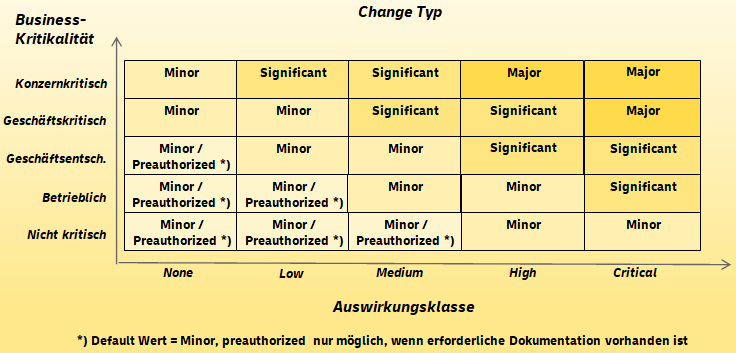
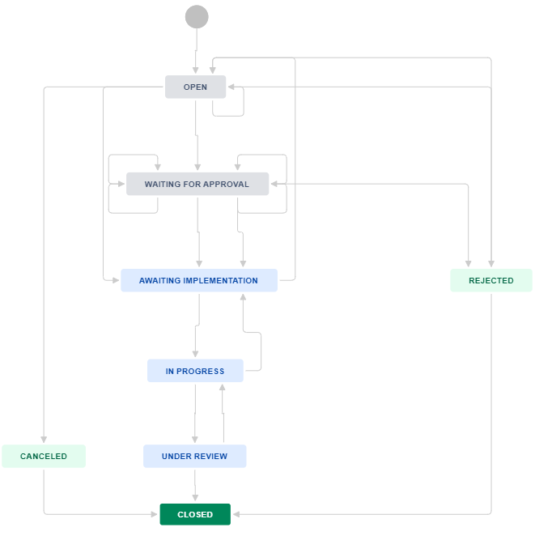

= Integrated Change Management
:toc:
:keywords: latest

Change enablement is a very critical service management practice within https://www.axelos.com/certifications/itil-service-management[ITIL].
The purpose of the change enablement practice is to maximize the number of successful IT changes by ensuring that risks have been properly assessed, authorizing changes to proceed, and managing the change schedule.

A change is defined as the addition, modification, or removal of anything that could have a direct or indirect effect on services.

This would typically include changes to IT infrastructure, applications, documentation, processes, supplier relationships, and any other critical components of the service - in P&P we focus on infrastructure and software changes primarily.

The requirements of a valid change management process are defined in our https://lcm.deutschepost.de/confluence1/display/ITP/Regelung+Change+Management[Change Management Policy] and translated into a https://lcm.deutschepost.de/confluence1/display/ITP/Change+Management[change management process description].

The following tutorial will explain how to use the integrated change management.

> There is also an integration for xref:ItsGSN.adoc[IT-S specific change management via GSN], which should be obsolete when working for P&P.

== Pre-Authorization

When we look at the https://lcm.deutschepost.de/confluence1/pages/viewpageattachments.action?pageId=103250819&metadataLink=true&preview=/103250819/182061371/ChangeTypMatrix.png[change management decision matrix], we can see that 2 factors are relevant to determine whether your changes can be processed completely automated or require manual approvals.

`Kritikalität` describes the impact of your service (mainly of an outage) to the organization and `Auswirkungsklasse` describes the impact of your change to this service.
The `Kritikalität` is defined in IT-AM and determined by business, whereas `Auswirkungsklasse` is determined by you and depends on individual characteristics.

Luckily the change management team provides https://lcm.deutschepost.de/confluence1/display/ITP/Change+Management#ChangeManagement-Auswirkungsklasse[examples for the various types of `Auswirkungsklasse`].
There we can see that the `Auswirkungsklasse` can be considered `none` in case we use an automated approach to perform the deployment (and fallback).

As you can see, as long as your service is not of `Kritikalität` `konzernkritisch` or `geschäftskritisch` your pipeline can use the pre-authorization mechanism.

To benefit from this please add a documentation section to your operating manual which lists the pipelines that are pre-authorized.

=== Change Freezes

During periods of change freezes (e.g. Frozen Zone) pre-authorization is suspended and instead every change is treated as `major`, which requires multiple manual approvals.
However, the duration of the change freeze is much shorter for users of our integrated Change Management.

== Workflow

This is a very brief description of the workflow used by change management.

To create a change for your service, use the `cdlib change create` command and provide the commercial reference and user token.
This change will be assigned to your pipeline (not the pipeline run!) via the Jira field ExternalReference2.
It's important to note that only one change can be performed per pipeline at a time, and all pending changes will be closed.
After creating the change, cdlib change create will check the `Kritikalität` and `Auswirkungsklasse` of your service to determine if it can be pre-authorized (see above).

=== Custom Change Details
In addition, the cdlib change create command allows you to customize various details when creating a change by using the respective parameters; most are free text fields:

|===
|Option | Default | Details

a| `--start` | now a|
* Use bash to generate ISO8601 format: date --iso-8601=s (2023-03-16T10:24:47+01:00)
* Must be before the date defined in `--end`
* Will be ignored in Starkverkehr

a|`--end` | now + 4h (during frozen zone 4d) a|
* Use bash to generate ISO8601 format: date --iso-8601=s -d '+4 hours' (2023-03-16T14:24:47+01:00)
* Cannot be more than 24 hours in the past
* Will be ignored in Starkverkehr

a|`--category` | ROLLOUT a|
* Must be one of the following:
** ROLLOUT (i.e. "Rollout")
** NO_ROLLOUT (i.e. "Kein Rollout")
** AUTHORIZATIONS (i.e. "Berechtigungen")
** DATA_MAINTENANCE (i.e. "Datenpflege")
** TECHNICAL_REQUIREMENTS (i.e. "Fachliche Anforderungen")
** LEGAL_OR_CONTRACTUAL_REQUIREMENTS (i.e. "Gesetzliche oder vertragliche Anforderungen")
** HOUSEKEEPING (i.e. "Housekeeping")
** CAPACITY_ADJUSTMENTS (i.e. "Kapazitätsanpassungen")
** SECURITY (i.e. "Sicherheit")
** TROUBLESHOOTING (i.e. "Störungsbehebung")
** OTHER (i.e. "Sonstiges")

a|`--summary` | CDLIB_RELEASE_NAME_UNIQUE a|

* Environment variable from cdlib names create.
* This is the title of your change in Jira

a|`--description` | CDLIB_JOB_URL (environment variable from `cdlib names create`) |

a|`--impact-class` | NONE a|

* Must be one of the following:
** CRITICAL
** HIGH
** LOW
** MEDIUM
** NONE

a|`--impact` | "Keine Auswirkung durch Nutzung CI/CD-Pipeline." |

a|`--target` | "Bereitstellung neuer Funktionalität/Konfiguration/Fehlerbehebung." |

a|`--fallback` | "Rollback auf vorherige Version oder Fix-Forward je nach Fehlerbild." |

a|`--implementation-risk` | "Beeinträchtigung Produktion" |

a|`--omission-risk` | "Neue Funktionalität/Konfiguration/Fehlerbehebung kann nicht genutzt werden." |

a|`--urgency` | LOW a|
* Must be one of the following:
** NONE
** LOW
** MEDIUM
** HIGH
** URGENT
** EMERGENCY

|===

Furthermore, you can add custom comments to a change on both - create and close subcommands - using the `--comment` functionality like so: --comment 'This is a test comment.'

Now that all details are customised and comments added, your pipeline performs the deployment to production and depending on the result the following will happen:

- In case your deployment is successful `cdlib change close` will set the status of the change that is assigned to your pipeline (jira field ExternalReference2) to `under review`.
- In case there are multiple open changes for your pipeline (or none), this will fail and require you to manually close the open ones.
- In case your deployment fails, `cdlib change close` will keep the change open and only perform reporting.
This gives you the chance to resume the change with `cdlib change create --resume true` to avoid re-authorization, which is especially handy for critical systems and during frozen zone.
In case you won't resume the change it will be closed with the next `cdlib change create` and a new one will be created.
- In case you have a GitOps deployment style you can use the `--gitops` flag for `cdlib change create` and `cdlib change close`.
This will use the `CDLIB_PM_GIT_ORIGIN` environment variable to identify the associated change in Jira.

Finally, your ADM closes the change manually or jira will close it after 2 weeks automatically.

== Pre-Conditions

Before you can set up the integrated change management within your pipeline tool, you need to:

. Ask your ADM under which commercial reference (aka `Leistungsschein` or `BTOID`) the service is run - this may be different for individual services or even application and infrastructure - maybe the ADM even needs to create a new one

> there must be at least 1 order for the commercial reference for it to be available inside the change management tool

. Get a xref:ToolAuthentication.adoc[technical user able to access LCM-Jira-CHM with the correct role for your company]
. Get a xref:ToolAuthentication.adoc[token for LCM Jira] for the technical user and xref:ToolAuthentication.adoc[store it safely]
. Determine pre-authorization usage and document it per pipeline
. Request firewall clearance to
.. https://lcm.deutschepost.de via helpdeskbrief@deutschepost.de
.. CDLib Dashboard - request by stating the source IP(s) and mentioning the rule ID 22391 https://lcm.deutschepost.de/jira1/secure/CreateIssue.jspa?pid=14900&issuetype=1[here]
.. Outbound-Webproxy: https://graph.microsoft.com
. Integrate `names create` of our xref:../CLI.adoc[cli] into your pipeline to provide necessary environment variables

Now you can follow the tool specific guide to integrate it into your pipeline.

== Jenkins

You can find a sample integration https://git.dhl.com/SockShop/front-end/blob/master/JenkinsfileDeploy[in our showcase service SockShop Frontend pipeline] that uses xref:KubernetesAsJenkinsAgent.adoc[Kubernetes Agents].

> IMPORTANT: We will use the flag `--test`, since our showcases are no real services, you can use the flags during implementation and testing as well, but it is not valid for actual changes.

Add the change creation via xref:../CLI.adoc[cli] as a substage to the production stage prior the actual deployment stage.

[source,groovy]
----
include::../../../frontend/JenkinsfileDeploy[tags=change-webapproval,indent=0]
----

If you want to be able to resume changes after a failed deployment or when the approval wasn't given timely, you need to add the flag `--resume` with a parameter that you can manually switch to `true` in case you need it (default is `false`).

This can be done like this:
[source,groovy]

----
include::../../../frontend/JenkinsfileDeploy[tags=params,indent=0]
----

Then add the change closure via our xref:../CLI.adoc[cli] as post-block to the production deployment stage.

[source,groovy]
----
include::../../../frontend/JenkinsfileDeploy[tags=CHM-close,indent=0]
----

Lastly you need to provide the necessary parameters, that you can store in a separate configuration file and xref:JenkinsPipelineConfig.adoc[load at the beginning of your pipeline]:

[source,groovy]
----
include::../../../frontend/config.jenkins[tags=CHM,indent=0]
----

Not all parameters used for the described command are listed here, since they belong to the webapproval process.
In case you don't need to perform a webapproval or you handle it manually (why would you wanna do that?), you can just leave it out.
Otherwise check out our xref:IntegratedWebApproval.adoc[webapproval tutorial].

== Azure Pipelines

> IMPORTANT: We will use the flag `--test`, since our showcases are no real services, you can use the flags during implementation and testing as well, but it is not valid for actual changes

Add the change creation via our xref:../CLI.adoc[cli] to a dedicated approval stage and let the production stage depend on its success.

[source,yaml]
----
include::../../../phippyandfriends/nodebrady/nodebrady.yaml[tags=change-webapproval,indent=0]
----

It calls a template that should contain this:

[source,yaml]
----
include::../../../cdaas/ado/container-job-templates/change-creation.yaml[indent=0]
----

If you want to be able to resume changes after a failed deployment or when the approval wasn't given timely, you need to add the flag `--resume` with a parameter that you can manually switch to `true` in case you need it (default is `false`).

This can be done like this:
[source,yaml]

----
include::../../../cdaas-template-maven/azure-pipelines.yaml[tags=resume,indent=0]
----

Then add the change closure via our xref:../CLI.adoc[cli] as a job to the production stage depending on the deployment job itself.
Make sure to set this job to run always and fetch the deployment status.

[source,yaml]
----
include::../../../cdaas-template-maven/azure-pipelines.yaml[tags=change-close,indent=0]
----

It calls a template that should contain this:

[source,yaml]
----
include::../../../cdaas/ado/container-job-templates/change-closure.yaml[indent=0]
----

For this to work, your production deployment job, must provide a variable deploymentStatus, which can be done like this:

[source,yaml]
----
include::../../../cdaas/ado/pipeline-templates/helmdeploy2aks.yaml[tags=chm,indent=0]
----

If you like you can move the commercial reference to a separate variables file to avoid redundancy in case you have multiple pipelines:

[source,yaml]
----
include::../../../phippyandfriends/pipeline-templates/vars.yaml[tags=chm,indent=0]
----

=== GitHub Actions

Within our template repository you can find a working example on how to use the integrated Change Management.

==== Creation
Pipeline: https://git.dhl.com/CDLib/cdaas-template-maven/blob/8b57829877c879b8754c7170252a74febfc0bfcd/.github/workflows/pipeline.yaml#L107
Workflow: https://git.dhl.com/CDLib/cdaas-workflows/blob/main/.github/workflows/changecreate.yaml

==== Closure
Pipeline: https://git.dhl.com/CDLib/cdaas-template-maven/blob/8b57829877c879b8754c7170252a74febfc0bfcd/.github/workflows/pipeline.yaml#L82
Workflow: https://git.dhl.com/CDLib/cdaas-workflows/blob/main/.github/workflows/changeclose.yaml
