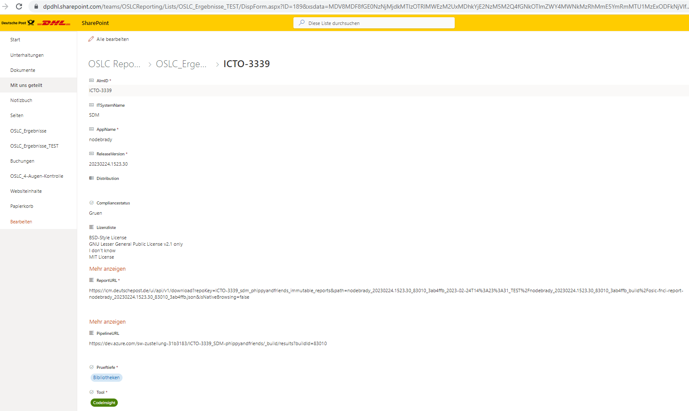

= Integrated Open Source License Compliance Verification
:toc:
:keywords: latest

This process is used for:

. Central archiving of all test reports within Artifactory.
. Validation of releases based on the provided reports.
. Communicating performed releases to stakeholders via their provided channels.

In the following chapters we will explain the process to use this functionality per policy.

> in case there is an urgent deployment needed and OSLC and/or TQS blocks the release, disable it temporarily and fix the problem afterwards

== Pre-Conditions

Before you can set up the Open Source License Compliance Verification within your pipeline tool, you need to:

. Request firewall clearance to
.. Outbound-Webproxy:
... https://graph.microsoft.com
... https://login.microsoftonline.com
.. Classic:
... artifactory.dhl.com 165.72.95.99 https/tcp/443
. Integrate xref:../CLI.adoc[cdlib names create] into your pipeline to provide necessary environment variables
. Artifactory repos and access
.. https://devsecops.dhl.com/services/build/artifactory/get-started[release repository] to continuously upload reports for release candidates
.. https://devsecops.dhl.com/services/build/artifactory/get-started[immutable repository] where every report is copied to during change creation
.. xref:ToolAuthentication.adoc[Identity Token] of the technical user

> when using TCB proxy, make sure that you set `JAVA_TOOL_OPTIONS="-Dhttps.proxyHost=proxy.tcb.deutschepost.de -Dhttps.proxyPort=8080"`

> You don't need any credentials for OSLC sharepoint as this is handled centrally via a hard to get GraphAPI token.

Now you can follow the tool specific guide to integrate it into your pipeline.

== OSLC

xref:OpenSourceLicenseComplianceScan.adoc[OSLC (Open Source License Compliance)] is validated by our License Management.
Part of our validation is the number of licenses and whether any of those conflicts with the denylist issued by legal.

> Currently CDLib supports FNCI and OSLC-Maven-Plugin as report provider and gradle- and npm-plugins for an integrated oslc compliance validation.

See: xref:OpenSourceLicenseComplianceScan.adoc[Open Source License Compliance Scan]

=== Archiving

You can validate and archive your report with our cli command `report upload` - see below samples for the various CI/CD tools.

==== Jenkins

===== FNCI with Jenkins

[source,groovy]
----
include::../../../frontend/JenkinsfileBuild[tags=oslc,indent=0]
----

Check the following tutorial to learn how we have integrated this scan to the pipeline:
xref:OpenSourceLicenseComplianceScan.adoc[Open Source License Compliance Scan]

===== OSLC-Maven-Plugin with Jenkins

[source,groovy]
----
include::../../../carts/JenkinsfileBuild[tags=oslc,indent=0]
----

Check the following tutorial to learn how we have integrated this scan to the pipeline:
xref:OpenSourceLicenseComplianceScan.adoc[Open Source License Compliance Scan]

===== OSLC-Gradle-Plugin with Jenkins

[source,groovy]
----
include::../../../shipping/JenkinsfileBuild[tags=oslc,indent=0]
----

Check the following tutorial to learn how we have integrated this scan to the pipeline:
xref:OpenSourceLicenseComplianceScan.adoc[Open Source License Compliance Scan]

===== OSLC-NPM-Plugin with Azure  Pipelines

[source,groovy]
----
include::../../../phippyandfriends/nodebrady/nodebrady.yaml[tags=oslc-scan,indent=0]
----

Check the following tutorial to learn how we have integrated this scan to the pipeline:
xref:OpenSourceLicenseComplianceScan.adoc[Open Source License Compliance Scan]

==== Azure Pipelines

We upload the report by using a template:

[source,yaml]
----
include::../../../phippyandfriends/nodebrady/nodebrady.yaml[tags=oslc-scan,indent=0]
----

This template looks like this:

[source,yaml]
----
include::../../../cdaas/ado/container-job-templates/report-upload-its.yaml[indent=0]
----

Check the following tutorial to learn how we have integrated this scan to the pipeline:
xref:OpenSourceLicenseComplianceScan.adoc[Open Source License Compliance Scan]

==== GitHub Actions

Since we are working on a complete overhaul of this process, we currently only provide a sample to check your OSLC report, but not to upload or communicate it.
Pipeline: https://git.dhl.com/CDLib/cdaas-template-maven/blob/9a4670ea12f3fa2f3e2b84f3c39b372051d33d04/.github/workflows/pipeline.yaml#L56
Workflow: https://git.dhl.com/CDLib/cdaas-workflows/blob/main/.github/workflows/reportcheck.yaml

=== Communicating

Final validation prior release and communication to License Management is performed via our cli command `change create --oslc` - see below samples for the various CI/CD tools.
Furthermore, you need to add a flag that tells CDlib whether your application is distributed outside our control (`--distribution`, e.g. a mobile app) or remains on our hardware (`--no-distribution`) - as different scan profiles and rules apply to each.
The FNCI scan will be performed with one of those profiles (distribution or non-distribution).
Whereas the OSLC-Maven-Plugin only has one profile (P&P OSLC Profile).
The distribution flag is still mandatory, when using the OSLC-Maven-Plugin.
The integrated oslc compliance validation (e.g. for OSLC-Gradle-Plugin) will also apply different rules based on this flag.
As a result an entry will be added to https://dpdhl.sharepoint.com/teams/OSLCReporting/Lists/OSLC_Ergebnisse/AllItems.aspx[OSLC-Sharepoint inside Teams], providing the base for OSLC-Reporting.

==== Jenkins

[source,groovy]
----
include::../../../frontend/JenkinsfileDeploy[tags=change-webapproval,indent=0]
----

Check the xref:IntegratedChangeManagement.adoc[Integrated Change Management tutorial] to learn more about the other parts of the command.

==== Azure Pipelines

We log the release by using a template:

[source,yaml]
----
include::../../../phippyandfriends/nodebrady/nodebrady.yaml[tags=change-webapproval,indent=0]
----

This template looks like this:

[source,yaml]
----
include::../../../cdaas/ado/container-job-templates/change-creation.yaml[indent=0]
----

Check the xref:IntegratedChangeManagement.adoc[Integrated Change Management tutorial] to learn more about the other parts of the command.

==== GitHub Actions

Since we are working on a complete overhaul of this process, we currently only provide a sample to check your OSLC report, but not to upload or communicate it.
Pipeline: https://git.dhl.com/CDLib/cdaas-template-maven/blob/9a4670ea12f3fa2f3e2b84f3c39b372051d33d04/.github/workflows/pipeline.yaml#L56
Workflow: https://git.dhl.com/CDLib/cdaas-workflows/blob/main/.github/workflows/reportcheck.yaml
