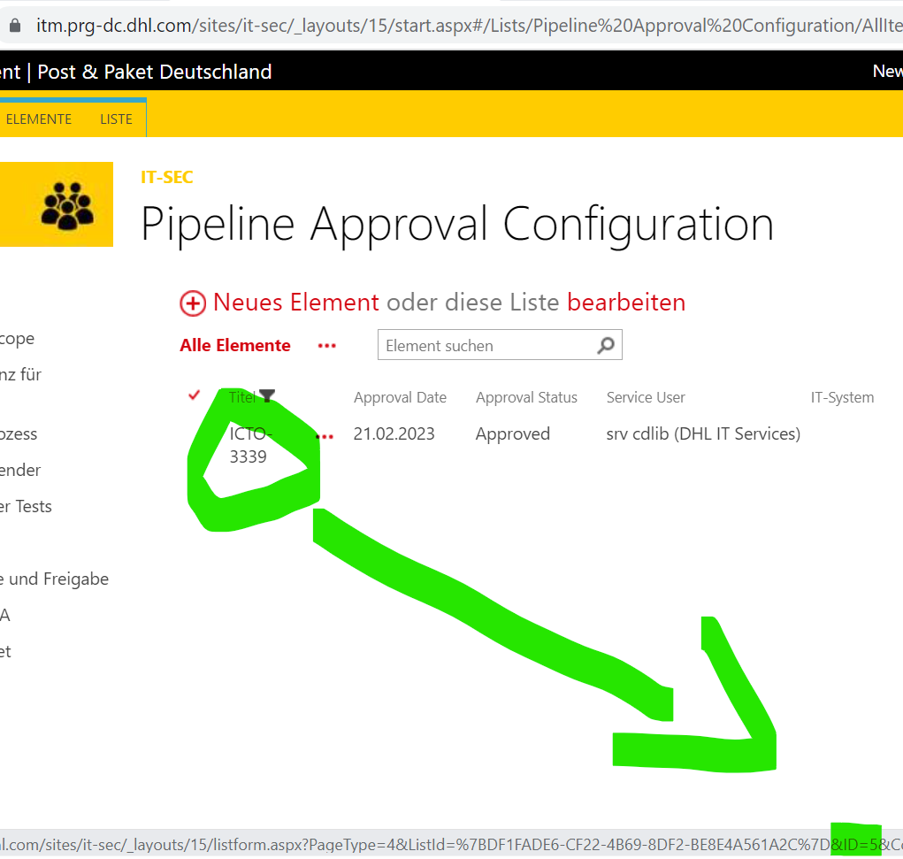
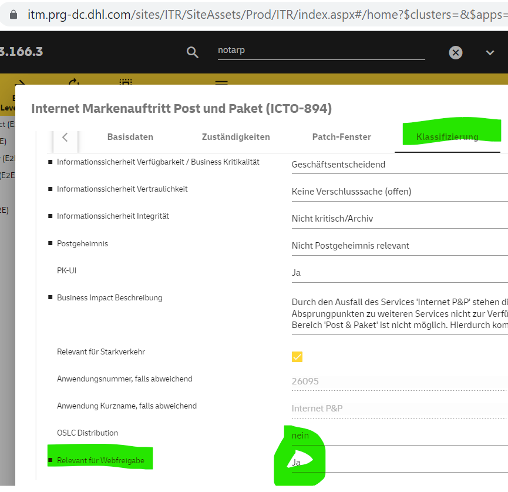

= Integrated Web Approval
:toc:
:keywords: latest

According to our https://servicenow.dhl.com/mygov?id=mygov_document&doc_sys_id=1baa3bc3db1fb010cd9b65fbd3961939&permalink=75941711db1109501ff01c7505961917[Information Security Target Model, DHL GROUP INFORMATION SECURITY SPECIFICATION 14.2.1.SP], every change to a productive web application must be approved by the Chief Information Security Officer - this is called Web Approval.
More details for P&P can be found https://itm.prg-dc.dhl.com/sites/it-sec/_layouts/15/start.aspx#/[here].
In short the full Web Approval is mandatory for external facing applications, but also for internal facing applications (L3/premium) that either have confidential data or are critical for the whole DPDHL group.

> Internal applications of a lower level only need to perform a DAST (Dynamic Application Security Test) and still can use the integrated web approval

The Web Approval is usually performed manually and based on the following information:

* report of Static Application Security Test, e.g. from Fortify
* report of Dynamic Application Security Test, e.g. from ZAP by Checkmarx
* report of Software Composition Analysis, e.g. from OWASP Dependency-Check
* optionally report of Container Composition Analysis (in case containers are used)
* at least once per year:
** manual Penetration Test report, e.g. done by Test Factory
** https://servicenow.dhl.com/mygov?id=mygov_document&doc_sys_id=8faad682dbd1459054f865fbd396195d[ASVS] statement

Security will check this information and may perform additional tests leading to an approval or denial.
Since this is hard for DevOps teams to accommodate with their fast cycle times, CDlib offers an integrated approach for this.
After initial approval this approach allows the team to automatically ensure the security level and thus gaining web approval instantly.

> in case there is an urgent deployment needed and webapproval blocks the release, disable it temporarily and fix the problem afterwards, in case you are confident that the issue that is addressed with the deployment is more important than any possible security problem that may arise from the deployment

== Prerequisites

The integrated approach is based on the following aspects:

* for every build of a web application, that will be deployed to production later (exact code version, not just similar build), the following tests are performed automatically inside a pipeline
** xref:ItsFortify.adoc[Static Application Security Test with Fortify]
** xref:SoftwareCompositionAnalysis.adoc[Software Composition Analysis with OWASP Dependency Check]
** xref:ContainerCompositionAnalysis.adoc[Container Composition Analysis with Trivy] (optional and only in case containers are used)
* for every release (might be comprised out of multiple builds), that will be deployed to production later, a *full scan* of xref:DynamicApplicationSecurityTestWithZAP.adoc[Dynamic Application Security Test with ZAP by Checkmarx] is automatically performed inside a pipeline
* all mentioned tests adhere to the following configuration
** the scope of the test is correct, not neglecting relevant parts of the source code or web application (endpoints/URLs/parts behind RBAC)
** there is a build breaker in case the test results in `high` or `critical` findings
** findings that are actually false-positives are marked inside a filter/suppression list and a written explanation is documented
** findings that are not false-positives, but cannot be remediated and therefore are accepted risks, must be managed via https://dpdhl.sharepoint.com/sites/Post-und-Paket-IT-Security-Compliance/SitePages/Informationssicherheits-Risikomanagement---Operative-Schritte.aspx[Risk Management Process] documented
* all reports and logs are uploaded to Artifactory xref:../CLI.adoc[via our cli] with the correct naming scheme
* prior production deployment a web approval is recorded via our xref:../CLI.adoc[cli] leading to an immutable copy of the reports and a log entry inside security's Sharepoint
* classic firewall clearance to
** itm.prg-dc.dhl.com 165.72.81.69 https:/tcp/443
** artifactory.dhl.com 165.72.95.99 https/tcp/443
* xref:ToolAuthentication.adoc#_it_s_toolsIT-STools[IT-S tools technical user account to access Sharepoint]

There are a couple of checks that are performed by the Integrated Web Approval:

* find, parse and analyze reports in the `--folder-name` folders - failing if:
** There is no ZAP report in the release folder.
** The ODC or Fortify report is missing from any build folder.
** The report format is not understood by the parser.
*** .json for ZAP, CCA (Trivy) and ODC
*** .fpr for Fortify
** There are reports with `HIGH` or `CRITICAL` findings.
** A report is older than 1 month.
** A tool has a parseable version and is outdated.
** The external report has an unexpected hash value.
* The Approval Configuration is not in status `approved` (if it was before, maybe you are missing a recent penetration test)

In the following chapter you will find samples for Jenkins and Azure Pipelines on how to add the integrated webapproval to your pipeline.

== Implementation Samples
Independent on the used CI/CD tool you will need some configuration values, that we explain first:

|===
| Config Key | Description

| artifactory.repoName
| The https://devsecops.dhl.com/services/build/artifactory/get-started[ITS-Artifactory] repository where every report is uploaded to prior web approval via our xref:../CLI.adoc[cli]

| artifactory.immutableRepoName
| The https://devsecops.dhl.com/services/build/artifactory/get-started[ITS-Artifactory] repository where every report is copied to during web approval via our xref:../CLI.adoc[cli]

| webapproval.applicationId
| Your web application id inside Sharepoint IT-M, that you can look up in the https://itm.prg-dc.dhl.com/sites/it-sec/_layouts/15/start.aspx#/Lists/Pipeline%20Approval%20Configuration/AllItems.aspx[Sharepoint IT-M Pipeline Approval Configuration].

In case you cannot find your IT-system in the list, make sure that the field `Relevant für Webfreigabe` in https://itm.prg-dc.dhl.com/sites/ITR/SiteAssets/Prod/ITR/index.aspx#/home[IT-AM] tab `Klassifizierung` is set to `ja`.

| identitytoken.credentialsId
| The Jenkins credentialsId of the xref:ToolAuthentication.adoc[Artifactory Identity Token] of the technical user. For Azure Pipelines we use xref:SecretsAzureKeyVault.adoc[key vault secrets].

| webapproval.credentialsId
| The Jenkins credentialsId of the username/password of the xref:ToolAuthentication.adoc#_it_s_toolsIT-STools[IT-S tools technical user account to access Sharepoint]. For Azure Pipelines we use xref:SecretsAzureKeyVault.adoc[key vault secrets].

|===

Next up you will find the sample integration for Jenkins and Azure Pipelines from our showcases.
The SockShop showcase (Jenkins) uses microservices with a split pipeline (deployment separated from build), whereas the Phippyandfriends showcase (Azure Pipelines) uses a single pipeline (build and deployment together).

Your pipeline layout may differ and require some adaption.
For example, you may have split your build pipeline even more, by excluding a long-running scan to a separate job.
Then you should treat this separate job like the deployment job in our SockShop showcase that derives the folder and report name from a parameter.
Or maybe you have several separated microservice builds, but you deploy them all together as single web application.
In that case you will upload the build reports to individual folders and only at the end during the web approval you will list them all.
The list may be provided as a meta file that has to be read first or the individual build names are provided as a parameter too.

=== Jenkins
==== Configuration
At first, you have to add the cdlib-cli to your `agent.yaml`.

[source,groovy]
----
include::../../../carts/JenkinsfileBuild[tags=cdlib-cli, indent=0]
----

> We assume you are already using xref:KubernetesAsJenkinsAgent.adoc[Kubernetes as Jenkins Agent]

For the following steps we use this configuration:

[source,groovy]
----
include::../../../frontend/config.jenkins[tags=webApproval, indent=0]
----

==== Creating the folder and report names
To make sure that our archive folders and the report files have a usable name, at the beginning of the pipeline we create a set of variables like the CDLIB_RELEASE_NAME as described in our xref:../CLI.adoc[cli] docs.

In our sample we have a split pipeline, where the deployment is separated from the build.
To upload the DAST report after the test deployment to the correct folder, we have to derive the name variables from the name created for the build which is passed to the deployment pipeline as a parameter.

Define the parameter:

[source,groovy]
----
include::../../../frontend/JenkinsfileDeploy[tags=params, indent=0]
----

Use the parameter:

[source,groovy]
----
include::../../../frontend/JenkinsfileDeploy[tags=loadnames, indent=0]
----

==== Uploading the Reports
We upload the reports right after performing the individual scan/test, of course you could also do this at the of the pipeline for all at once.

> you only need to upload the reports for potential release branches, so `master` or in case of gitflow `release*` - for other branches you should only check the results, so you are not surprised prior deployment

===== SAST with Fortify
In case your report doesn't follow our sample naming scheme, you can define your own prefix with `--report-prefix-fortify`.

[source,groovy]
----
include::../../../frontend/JenkinsfileBuild[tags=webApproval-sast, indent=0]
----

> If you run into `Java heap space Exception` try increasing the memory limit of the cdlib-cli container.

Check the following tutorial to learn how we have integrated this scan to the pipeline:
xref:ItsFortify.adoc[Static Application Security Test with Fortify]

==== SCA with OWASP Dependency-Check
In case your report doesn't follow our sample naming scheme, you can define your own prefix with `--report-prefix-odc`.

[source,groovy]
----
include::../../../frontend/JenkinsfileBuild[tags=webApproval-sca, indent=0]
----

Check the following tutorial to learn how we have integrated this scan to the pipeline:
xref:SoftwareCompositionAnalysis.adoc[Software Composition Analysis with OWASP Dependency Check]

==== DAST with ZAP by Checkmarx
In case your report doesn't follow our sample naming scheme, you can define your own prefix with `--report-prefix-zap`.

[source,groovy]
----
include::../../../frontend/JenkinsfileDeploy[tags=webApproval-dast, indent=0]
----

Check the following tutorial to learn how we have integrated this scan to the pipeline:
xref:DynamicApplicationSecurityTestWithZAP.adoc[Dynamic Application Security Test with ZAP]

===== DEPRECATED CCA with CSS Registry based on Trivy  (optional)
With the sunset of CCS this is deprecated and will be updated soon with a new solution!!

Check the following tutorial to learn how we have integrated this scan to the pipeline:
xref:ContainerCompositionAnalysis.adoc[Container Composition Analysis]

==== Webapproval
The actual webapproval is added as part of the xref:IntegratedChangeManagement.adoc[Integrated Change Management].
Therefore by approving the change (even if it is pre-authorized) the team testifies that all suppressions are handled according to the risk management process.

> IMPORTANT: We will use the flag `--test`, since our showcases are no real services, you can use the flags during implementation and testing as well, but it is not valid for actual webapprovals.

Add it like this:

[source,groovy]
----
include::../../../frontend/JenkinsfileDeploy[tags=change-webapproval, indent=0]
----

=== Azure DevOps Pipelines
==== Configuration
At first, you have to add the xref:../CLI.adoc[cdlib-cli names create command].

After that you add the following variables (as explained above) to your pipeline:

[source,yaml]
----
include::../../../phippyandfriends/pipeline-templates/vars.yaml[tags=webApprovalRecord, indent=0]
----

==== Creating the names for folders and reports
To make sure that our archive folders and the report files have a usable name, at the beginning of the pipeline we create a set of variables like the CDLIB_RELEASE_NAME as described in our xref:../CLI.adoc[cli] docs.

As this pipeline takes care of build and deployment, we don't need to pass down the RELEASE_NAME to the deployment job.
In case your pipeline is split, check the example from Jenkins above.

==== Uploading the reports
Since the upload requires a different container than the scan/test and a job can only be run inside a single container we need to stash the reports before we can upload them with another job.
The upload is executed right after performing the individual scan/test job, of course you could also do this at the of the pipeline for all at once.
To perform the upload we use a job template `report-upload.yaml`:

[source,yaml]
----
include::../../../cdaas/ado/container-job-templates/report-upload-its.yaml[]
----

> you only need to upload the reports for potential release branches, so `master` or in case of gitflow `release*` - for other branches you should only check the results, so you are not surprised prior

===== SAST with Fortify
In case your report doesn't follow our sample naming scheme, you can define your own prefix with `--report-prefix-fortify`.

[source,yaml]
----
include::../../../cdaas-template-maven/azure-pipelines.yaml[tags=fortify, indent=0]
----

> If you run into `Java heap space Exception` try increasing the memory limit of the cdlib-cli container.

Check the following tutorial to learn how we have integrated this scan to the pipeline:
xref:ItsFortify.adoc[Static Application Security Test with Fortify]

===== SCA with OWASP Dependency-Check
In case your report doesn't follow our sample naming scheme, you can define your own prefix with `--report-prefix-odc`.

[source,yaml]
----
include::../../../cdaas-template-maven/azure-pipelines.yaml[tags=sca, indent=0]
----

Check the following tutorial to learn how we have integrated this scan to the pipeline:
xref:SoftwareCompositionAnalysis.adoc[Software Composition Analysis with OWASP Dependency Check]

===== DAST with ZAP by Checkmarx
In case your report doesn't follow our sample naming scheme, you can define your own prefix with `--report-prefix-zap`.

[source,yaml]
----
include::../../../cdaas-template-maven/azure-pipelines.yaml[tags=zap, indent=0]
----

Check the following tutorial to learn how we have integrated this scan to the pipeline:
xref:DynamicApplicationSecurityTestWithZAP.adoc[Dynamic Application Security Test with ZAP]

==== DEPRECATED CCA with CSS Registry based on Trivy  (optional)
With the sunset of CCS this is deprecated and will be updated soon with a new solution!!

Check the following tutorial to learn how we have integrated this scan to the pipeline:
xref:ContainerCompositionAnalysis.adoc[Container Composition Analysis]

==== Webapproval
The actual webapproval is added as part of the xref:IntegratedChangeManagement.adoc[Integrated Change Management].
Therefore by approving the change (even if it is pre-authorized) the team testifies that all suppressions are handled according to the risk management process.

> IMPORTANT: We will use the flag `--test`, since our showcases are no real services, you can use the flags during implementation and testing as well, but it is not valid for actual webapprovals.

Add it with a template like this:

[source,yaml]
----
include::../../../phippyandfriends/nodebrady/nodebrady.yaml[tags=change-webapproval, indent=0]
----

The template looks like this:

[source,yaml]
----
include::../../../cdaas/ado/container-job-templates/change-creation.yaml[]
----

==== GitHub Actions

Since we are working on a complete overhaul of this process, we currently only provide a sample to check your security reports, but not to get an integrated web approval for it.
Pipeline: https://git.dhl.com/CDLib/cdaas-template-maven/blob/9a4670ea12f3fa2f3e2b84f3c39b372051d33d04/.github/workflows/pipeline.yaml#L48
Workflow: https://git.dhl.com/CDLib/cdaas-workflows/blob/main/.github/workflows/reportcheck.yaml

== Request Usage of Integrated Web Approval
After implementing the mentioned steps inside the pipeline, teams can request initial approval for the integrated web approval via https://itm.prg-dc.dhl.com/sites/it-sec/_layouts/15/start.aspx#/Lists/Pipeline%20Approval%20Configuration/AllItems.aspx[this form].

> HINT: For this you will need a xref:ToolAuthentication.adoc[technical user account to access Sharepoint].

> HINT 2: In case you cannot find your IT-system in the list, make sure that the field `Relevant für Webfreigabe` in https://itm.prg-dc.dhl.com/sites/ITR/SiteAssets/Prod/ITR/index.aspx#/home[IT-AM] tab `Klassifizierung` is set to `ja`

After the manual verification and approval of Lieferhelden team, you will get a notification like this:

----
Sehr geehrte(r) Lohr, Steve, SNL IT P&P, 4610, DD,

Der Antrag für Pipeline Approvals für ICTO-3339 wurde freigegeben.

Bitte beachten Sie die in 14.2.1.SP.17 DPDHL Group Information Security Specification definierten Zeiträume zur Behebung von Findings, die auch hier gelten (Medium: innerhalb 1 Monats, Low: innerhalb 3 Monate).

Bei Fragen bitte auf diese Email antworten.

Viele Grüße,
Team Webfreigabe
----

== Managing the risk of unchecked vulnerabilities
Using the integrated web approval leaves a small security risk as only high/critical vulnerabilities are blocked from release to production.
Therefore a low/medium vulnerability (according to the outside world) might have a bigger impact on your specific application which remains unchecked.
To address this, please add the following threat to your security concept and check the impact to your risk situation.
According to this please derive necessary actions, like shown below.
Feel free to adapt the threat description and action according to your needs.

|===
|ID |Bedrohung |Beschreibung |Typ |Anforderungs-ID |Maßnahmen

|B.38
|Go-Live mit identifizierten low/medium Findings ohne Schwachstellenbewertung
|Die integrierte Webfreigabe verfolgt das Ziel durch automatisierte Prüfungen und automatisierte Freigaben eine Beschleunigung des Release-to-Production-Prozesses zu erreichen. High/critical Findings haben einen Stop des Deployments zur Folge. Sie müssen von Experten untersucht und - sofern sich die Bewertung bestätigt - in einer vorgegeben Frist behoben werden. Danach startet der Prozess erneut. Low/medium Findings können ohne eine vorherige Bewertung in Produktion überführt werden. Dadurch entsteht die Situation, dass ein Low/Medium Finding nach der Bewertung in einer High/Critical Schwachstelle resultieren kann und damit im produktiven System vorhanden ist. Potentielle Bedrohungen sind vorab nicht zu identifizieren/bekannt und damit wird eine Risikoeinschätzung erschwert.
|Organisatorische Mängel
|SR.1
|M.33

|===

|===
|ID |Maßnahme |Beschreibung |Typ |Kontrollfrage |Anforderungs-ID

|M.33
|Wöchentliche Bewertung offener Findings
|Die bisher unbewerteten Findings werden wöchentlich bewertet. Je nach identifizierter Kritikalität werden die Schwachstellen innerhalb der Vorgaben bzw. sofort behoben.
|Organisatorische Maßnahmen
|Werden die Ergebnisse der wöchentlichen Bewertung dokumentiert? Wird die Behebung von Schwachstellen dokumentiert?
|SR.1

|===
