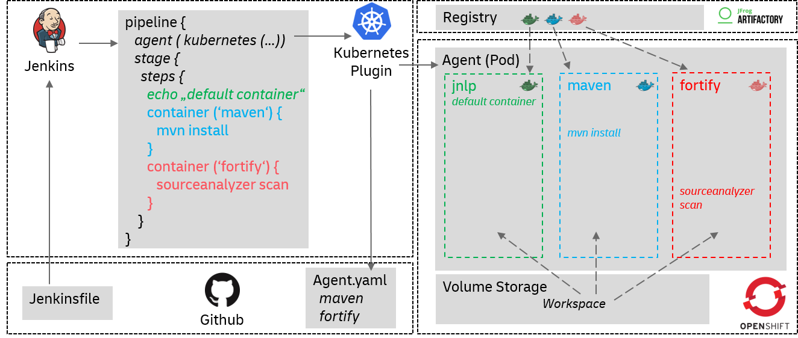

= Kubernetes As Jenkins Agent
:toc:
:keywords: latest

This document can be referenced for Kubernetes as Jenkins agent using YAML file for configuration definition.
In case you are not using a declarative pipeline, please do so.
In case you still don't want to, you can also use our xref:../../vars/README.md[nodecontainer] step.

This page will give an overview how to use Kubernetes (in case of https://devsecops.dhl.com/services/build/jenkins-cloudbees/[IT-S Cloudbees Jenkins] Openshift) to spin up dynamic agents based on containers to run your pipeline.
The following graphic will give you an overview to understand how it works:

== Pre-requisites

As a pre-requisite for using Kubernetes as Jenkins agent, the following needs to be done:

* https://github.com/jenkinsci/kubernetes-plugin/tree/master#kubernetes-plugin-for-jenkins[Kubernetes Plugin] installed and configured
* your pipeline is from job type `multibranch pipeline` or `Github organization`

for use based on the pipeline script.

== Jenkins Agent

The Jenkins `agent` is used to provide initial configuration of the kubernetes pod to be used as a jenkins slave to run the pipeline script.

Below is an example of `agent` from a https://git.dhl.com/SockShop/carts/blob/master/JenkinsfileBuild[`Jenkinsfile`]
It contains the `cloud`(cloud id) and `yamlFile`(yaml config filename) used to configure the jenkins JNLP agent.
The Jenkins Kubernetes agent will initiate a JNLP container within the pod and connect to the Jenkins master directly.
If you use the JNLP container directly and need more resources you can specify `inheritFrom 'jenkins-slave-prg'` in the Jenkins Agent Kubernetes configuration.

[source,groovy]
----
include::../../../carts/JenkinsfileBuild[tags=agent, indent=0]
----

=== YAML Agent Configuration

The YAML file is used to provide the complete configuration the kubernetes pod uses to run the pipeline script.
The kubernetes pod is executed in a shared namespace and the resources are very limited.
Therefore, the YAML file should be minimal.
For example if you have a SplitPipeline you probably have two YAML files like:

* https://git.dhl.com/SockShop/carts/blob/master/agent.yaml[`agent.yaml`]
* https://git.dhl.com/SockShop/carts/blob/master/agent.yaml[`agent-deploy.yaml`]

> Note: You can reuse a YAML file. But, make sure every container is used!

Below is are examples `agent.yaml` one for build/test/package and the other for deployment.
It contains the definition of the `containers` and related `image`s required by the pipeline.
Each container defines its resource limits. These should be as low as possible!

For the below example, the containers that are started in the Kubernetes pod agent are:

* jnlp(default)
* maven
* helm
* fortify
* hadolint
* fnci-cli

All the containers share a common workspace. Therefore, changes made in a container are accessible in all following containers used.
In the above example `/var/lib/jenkins/jobs/${env.BUILD_NUMBER}`, part of which is mentioned in the Kubernetes agent.

[source,groovy]
----
include::../../../carts/JenkinsfileBuild[tags=agent, indent=0]
----

The JenkinsfileDeploy uses the YAML file below. The Kubernetes pod only contains the 'jnlp'(default) and 'helm' container.

[source,yaml]
----
include::../../../carts/agent-deploy.yaml[]
----

____

*IMPORTANT*: This Jenkins Agent runs in a shared Kubernetes namespace with a limited quota. Keep the resource limits as low as possible!!!

If you have trouble to figure out your limits we will happily assist you.

____

== Using the Kubernetes Container service in the pipeline

In order to use the services of the Kubernetes Container defined in the YAML file, the container `name` should be specified and a shell command can be provided to use its services.

Below is an example of container use from a https://git.dhl.com/SockShop/carts/blob/master/JenkinsfileBuild[`Jenkinsfile`]

____

NOTE: A `container` should run as a `script` under every `stage`. Parallel stages can run the same container in parallel without effecting their individual run.

____

[source,groovy]
----
include::../../../carts/JenkinsfileBuild[tags=build, indent=0]
----

== Docker Services

The Kubernetes pod deploys a Jenkins JNLP agent, docker can run within JNLP container itself, most of the docker based commands can run directly on the agent itself.

Below is an example of container use from a https://git.dhl.com/SockShop/carts/blob/master/JenkinsfileBuild[`Jenkinsfile`]

[source,groovy]
----
include::../../../carts/JenkinsfileBuild[tags=docker, indent=0]
----

== Default directories not accessible e.g. Sonarqube

Per default some directories are not accessible because the corresponding environment variables are not set or point to inaccessible directories.
Like the Sonarqube or some Gradle cache directories.

You can overwrite these directories by setting the following environment variables:

[source,groovy]
----
include::../../../carts/JenkinsfileBuild[tags=environment, indent=0]
----
