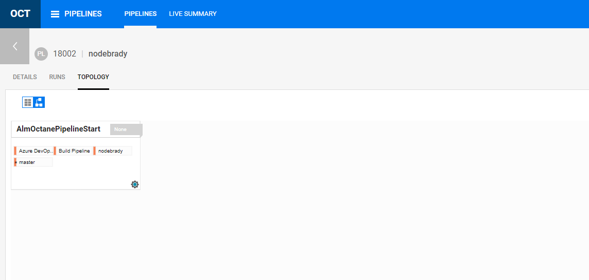

= Micro Focus ALM Octane
:toc:
:keywords: latest

Teams working on complex applications or IT systems often have to manage a corresponding complexity in testing.
Unless every test is automated and included in a single CD pipeline, different sources of test results (single-service pipelines, manual tests) have to be considered in order to decide about actual delivery readiness.

Rather than collecting plain text statements from team members (via email/ticket/wiki), teams can use a test management solution to keep track of (functional) test coverage and test results.
In DPDHL P&P, **Micro Focus ALM Octane** is offered for this purpose.

== Benefits

- installation & maintenance done by 19C2
- enterprise license centrally paid by 19C2
- approval from Group Works Council ("K-IT-A")
- incident & problem management, and support included via mailto:HelpdeskBrief@DeutschePost.de[Helpdesk Brief/Paket]
- no own infrastructure needed
- compliance, updates, service continuity and backup ensured by 19C2
- integrated with P&P LCM for authentication (LCM users are required, new users can be requested via mailto:HelpdeskBrief@DeutschePost.de[Helpdesk Brief/Paket]

== Costs

MF Octane is free to use for anyone working on P&P applications and projects.

== Access

MF Octane is accessible via https://pi.octane.azure.deutschepost.de inside our corporate network, so external users will need a firewall clearance.

> clearance for you or your pipeline are requested via Gerd.Enderes@deutschepost.de

Teams or departments can request their own Shared Space (containing one or several Workspaces) for their content.
Existing LCM Jira projects can be synchronized with ALM Octane so issues can be linked to tests etc.

For further information (German only) see https://lcm.deutschepost.de/confluence1/display/MFO/Allgemeines

== Pipeline integration

Different from other test management solutions available in DPDHL (e.g. Tricentis qTest, Micro Focus ALM, SmartBear Zephyr, Xray for Jira, IBM RQM), ALM Octane can be configured to show and interact with CI/CD pipelines on Jenkins and Azure DevOps.

This section briefly explains selected use cases about connecting your jobs with ALM Octane.
For further details see the
https://admhelp.microfocus.com/octane/en/16.0.100-16.0.400/Online/Content/AdminGuide/article_integrations.htm[comprehensive online documentation by Micro Focus.]

Automation jobs can authenticate to ALM Octane using dedicated API Access tokens.
These can be created by Shared Space admins (e.g. P&P application manager (ADM)) on Shared Space settings page:

When creating a new API access entry, choose appropriate values for

- Name (prefix for generated Client ID)
- Expiration
- Role: Select "CI/CD Integration"
- Workspace: Select the ALM Octane workspace to receive pipeline data and test results

=== Jenkins

==== Pipeline integration via Micro Focus plugin

On https://devsecops.dhl.com/services/build/jenkins-cloudbees/[IT-S Cloudbees Jenkins] the
_Micro Focus Application Automation Tools_ plugin provides general connectivity to ALM Octane.
Due to the persistent nature of the connection (Jenkins will register with ALM Octane and also wait for signals to start new runs) the details have to be included in Jenkins system settings by IT-S maintenance team.
So request your connection to be configured by https://gsd.dhl.com/forms/1072[filing a ticket]:

> Please add a new connection to ALM Octane in Jenkins, with these properties: +
> URL: https://pi.octane.azure.deutschepost.de/ui/?p=<YOUR SHARED SPACE ID AS SEEN IN URL> +
> Client-ID: <CLIENT ID FROM API ACCESS> +
> Client-Secret: <CLIENT SECRET FROM API ACCESS> +
> User: <DPDHL AD USER WHO CAN ACCESS YOUR JENKINS JOBS> +
> Advanced - Parameter: ENCODE_CI_JOB_BASE64:true

Afterwards, starting on your Jenkins job page, you can register it in ALM Octane like follows:
- Select left-hand menu entry "ALM Octane Pipelines"
- From the drop-down, select the URL pointing to your ALM Octane Shared Space (as requested in ticket)
- Hit button "Create Pipeline"
- Enter some display name for your job inside ALM Octane, and select the right Workspace inside your ALM Octane Shared Space
- Hit button "Create"
- Optional: Specify additional hints describing tests inside that pipeline (e.g. which framework, which test environment...)

Now your job can be observed and controlled from ALM Octane Pipelines section.
In order to also collect test results being generated during pipeline runs, you can include snippets like shown below.

For unit-test style results (i.e. JUnit XML file structure):

[source,groovy]
----
    post {
        always {
            echo "Uploading test results to Micro Focus Octane"
            junit '**/build/test-results/test/*.xml'
        }
    }
----

==== BDD style test execution via Micro Focus bdd2octane

For BDD test results (e.g. Cucumber-JVM) a precompile step is needed, in order to provide both execution status and feature file contents for any given run to MF Octane. For better portability, in this tutorial we are using `octane` https://dev.azure.com/sw-zustellung-31b3183/ICTO-3339_SDM/_git/Images?path=/README.md&_a=preview[CDLib container image] (another option would be using the https://github.com/MicroFocus/bdd2octane#there-are-two-ways-to-invoke-this-tool[bdd2octane Maven plugin]).
I.e. the following snippet assumes `docker.artifactory.dhl.com/cdlib/octane:latest` to be declared in your
xref:KubernetesAsJenkinsAgent.adoc[agent.yaml]
with name `octane`:

[source,groovy]
----
    post {
        always {
            echo "Uploading test results to Micro Focus Octane"
            container('octane') {
                sh '/opt/java/openjdk/bin/java -jar /bdd2octane.jar --featureFiles=RELATIVE/PATH/TO/features --reportFiles=RELATIVE/PATH/TO/build/cucumber.xml --framework=cucumber-jvm  --resultFile=octane-cucumber-result.xml'
            }
            publishGherkinResults 'octane-cucumber-result.xml'
        }
    }
----

==== Local unit-test style execution via Micro Focus test-result-collection-tool

Unit-test style results (i.e. JUnit XML file structure) can also be pushed directly to ALM Octane, without using any CI platform plugin.
Instead, a Java CLI tool by Micro Focus is used to connect to the server and publish test results.

In order to avoid local installation of the CLI and some suitable JRE, you can use the CDLib `octane` image mentioned above.
The following snippet shows usage of the test-result-collection-tool in a Jenkins declarative pipeline, again assuming
`octane` to be included on the Jenkins agent pod, and ALM Octane API Access credentials to be available as username/password entry in
xref:ToolAuthentication.adoc[Jenkins credential store]:

[source,groovy]
----
    post {
        always {
            container('octane') {
                withCredentials([usernamePassword(credentialsId: '<YOUR-CREDENTIAL-ID>', usernameVariable: 'CLIENTID', passwordVariable: 'CLIENTSECRET')]) {
                    script {
                        args = [
                                "--user ${CLIENTID}",
                                "--password ${CLIENTSECRET}",
                                "--server https://pi.octane.azure.deutschepost.de",
                                "--shared-space <YOUR-SHARED-SPACE-ID>",
                                "--workspace <YOUR-WORKSPACE-ID>",
                                "--check-result",
                                "PATH/TO/YOUR/build/test-results/test/*.xml"
                            ]
                        sh '/opt/java/openjdk/bin/java -jar /test-result-collection-tool.jar ' + args.join(" ")
                    }
                }
            }
        }
    }
----

Like when creating a pipeline representation in ALM Octane, you can include additional information about those tests, so they can be differentiated and be neatly arranged in ALM Octane list views and overview charts. In a new workspace there are predefined example values, but some ALM Octane Shared Space admin can configure new values to properly reflect the team's setup.
Attributes (`field`) and infrastructure/environment characteristics (`tag`) can be specified by adding CLI arguments before the XML-file glob expression like:

[source,groovy]
----
                                "--field Framework:JUnit",
                                "--field Test_Level:\"Unit Test\"",
                                "--tag \"Job Type:CD Pipeline\"",
----

=== Pipeline integration using GitHub Organization pipelines

**ATTENTION:** Currently, GitHub Organization Pipelines are not supported by the ALM Octane Integration Extension. If integration between ALM Octane and Jenkins is still required, it is possible to use an additional job supported by the ALM Octane Integration Extension.

This job requires a Jenkins file, first downloading the artefacts from the Github Organization project repository and then making the Octane connection.
[source,grrovy]
----
    stage('OCTANE_REPORTING') {
		  steps {
              copyArtifacts projectName: '<GitHub Organization Pipeline Name>', selector: upstream(), target: '<Target Directory>'
              post {
                  always {
                      container('octane') {
                          <SEE ABOVE, DEPENDING ON WHETHER THERE ARE UNIT TESTS OR BDD STYLE TESTS>
                      }
                  }
              }
          }
    }
----

This requires that in the Jenkinsfile of the GitHub Organization Pipelines Repository within the test execution stage the storage of artefacts including the junit.xml with the test results is already implemented.
[source,groovy]
----
    post {
        always {
            junit '**/results/test-results.xml'
            archiveArtifacts '**/results/test-results.xml'
        }
    }
----

== Azure DevOps

Unlike the integration between ALM Octane and Jenkins, the integration between ALM Octane and Azure DevOps is currently only supported in one direction.
The pipeline can only be started in Azure DevOps, not in ALM Octane.
With the ALM Octane Integration Extension, a pipeline run can be transferred from an Azure DevOps pipeline to ALM Octane, transmitting the test results.

The integration between Azure DevOps and ALM Octane requires the following:
* Firewall clearance for ALM Octane URL https://pi.octane.azure.deutschepost.de +
* Node.js installation on the running agent

> In the Azure DevOps project settings, please add a new service connection of type 'ALM Octane' with these properties: +
> Server Url: https://pi.octane.azure.deutschepost.de/ui/?p=<YOUR SHARED SPACE ID AS SEEN IN URL> +
> Instance ID: <AZURE DEVOPS INSTANCE ID*> +
> Client ID: <CLIENT ID FROM API ACCESS> +
> Client Secret: <CLIENT SECRET FROM API ACCESS> +
> Service connection name: <HOW YOU WANT TO NAME THIS SERVICE CONNECTION>

*You can get the instance ID of Azure DevOps by sending a GET Request to <AZURE DEVOPS URL>/?api-version={apiVersion}

====
Then, you can configure your pipeline by adding the Octane Start Task to the CDLIB_CREATE_STAGE as follows:

[source,yaml]
----
include::../../../cdaas/ado/container-job-templates/cdlib-names-create-stage.yaml[indent=0]
----

Afterwards, you can add the Octane End Task to your pipeline end as follows:

[source,yaml]
----
include::../../../cdaas/ado/container-job-templates/octaneend.yaml[indent=0]
----

**NOTICE:** The Start task has to be the first step, while the End task has to be the final step of your pipeline.
Condition always() is needed to ensure that in case of an error in an intermediate step,
the pipeline runs are not only terminated in Azure Devops, but also in ALM Octane where they would be displayed as 'unavailable'.

====

**ATTENTION:** The plugin automatically supports the transfer of SCM data if the project is based on Azure Repos Git repositories. In case the pipeline accesses a cithub.com repository directly, it is possible to specify a connection to it as an input variable in both the Start and End tasks.

[source, yml]
inputs:
  OctaneServiceConnection: '<HOW YOU NAMED YOUR ALM OCTANE SERVICE CONNECTION>'
  WorkspaceList: '<LAST PART OF THE SHARED SPACE ID AS SEEN IN ALM OCTANE URL'
  GithubRepositoryConnection: '<GITHUB REPOSITORY CONNECTION>'

**ATTENTION:** Unlike with Jenkins, it is currently not supported that all individual pipeline stages are displayed in ALM Octane. Only the Octane Start Task is displayed.
Moreover, tests are only supported to be displayed as Automated runs (AR).

=== Local BDD style test execution via Micro Focus bdd2octane

For reporting BDD style results (e.g. Cucumber-JVM) the `octane` Image (https://dev.azure.com/sw-zustellung-31b3183/ICTO-3339_SDM/_git/Images?path=/README.md&_a=preview[Octane container image]) is needed as an agent that can be run on xref:ManagedDevOpsPools.adoc[Managed DevOps Pools].

Then a job is needed that contains a step that executes the bbd2octane.jar.

[source,yaml]
----
include::../../../cdaas/ado/container-job-templates/bdd2octane.yaml[indent=0]
----

**ATTENTION:** Depending on where the cucumber.xml file is stored, additional steps must be taken beforehand, e.g. moving the cucumber.xml file from the Java container to the agent folder and then handing it over to the other agent by publishing it as an artifact in the first job and then downloading the artifact in the second job.

Independently of this, it is useful to upload the files with the test results including the cucumber.xml, octane-cucumber-result.xml, cucumber-html-report, feature files or testrun screenshots as artifacts in Azure DevOps. To do this, the following step must be added to the jobs for each file to be published:

[source,yaml]
- publish: PATH/TO/FILE
  artifact: <HOW THE ARTIFACT WILL BE NAMED IN AZURE DEVOPS>
  displayName: <NAME OF THE STEP>

Unlike when reporting unit test results, when reporting BDD-style tests it is now needed to specify the octane-cucumber-result.xml path as an input variable in the Octane End task:

[source, yml]
inputs:
  OctaneServiceConnection: '<HOW YOU NAMED YOUR ALM OCTANE SERVICE CONNECTION>'
  WorkspaceList: '<LAST PART OF THE SHARED SPACE ID AS SEEN IN ALM OCTANE URL'
  CucumberReportPath: 'PATH/TO/octane-cucumber-result.xml'

If the same test is performed by several pipelines, a BDD scenario (BSC) and an associated BDD specification (BSP) should first be created in Octane. This will automatically generate an Octane revision tag.

This feature file, including the auto generated Octane revison tag, must then be copied into the feature directory as a feature file within the repository. After that, the pipelines can start its run. Test results from all pipelines are now  transferred to the same BDD Scenario. To see the according BDD specification in Octane, first click on the reported Gherkin auto run (GAR), then on the related BDD scenario (BSC) and then on the corresponding BDD specification (BSP).

To distinguish from which pipeline which result is reported from, an environment variable can be set with the pipeline name (see in the following figure in the column 'Environment': phippy, parrot, ...).

To do so, in Octane click on 'Environment Lists' in the Settings and create an environment for each pipeline with its corresponding name.
Next, click on the pipeline and then, in the topology section, click on the cogwheel at the bottom right of the AlmOctanePipelineStartTask step.

There, it is not only possible to specify whether test results are to be reported as BDD scenarios or Gherkin tests, but also to select the previously created environment of the same name:

=== Local unit-test style execution via Micro Focus test-result-collection-tool

Same as with BDD-style tests, for reporting unit-test style results the `octane` Image (https://dev.azure.com/sw-zustellung-31b3183/ICTO-3339_SDM/_git/Images?path=/README.md&_a=preview[Octane container image]) is needed as an agent on xref:ManagedDevOpsPools.adoc[Managed DevOps Pools].

Then a job is needed that contains a step that executes the test-result-collection-tool.jar.
[source,yaml]
----
include::../../../cdaas/ado/container-job-templates/testresultcollectiontool.yaml[indent=0]
----

$(octaneToken) is the <CLIENT SECRET FROM API ACCESS> used to create the ALM Octane Service Connection (see above), which needs to be stored in Azure Key Vault and fetched with the AzureKeyVault task.

$(octaneClientId) is the <CLIENT ID FROM API ACCESS> used to create the ALM Octane Service Connection (see above), which can be added to as a global variable:
[source,yaml]
- name: 'octaneClientId'
  value: '<CLIENT ID FROM API ACCESS>'

**ATTENTION:** As with BDD-style tests, depending on where the junit.xml files are stored, additional steps must be taken beforehand, e.g. moving the junit.xml files from the Java container to the agent folder and then handing it over to the other agent by publishing it as an artifact in the first job and then downloading the artifact in the second job.

Independently of this, it is useful to upload the files with the test results including the junit.xml files as artifacts in Azure DevOps (see above).

=== Local unit-test style and BDD-style execution within the same pipeline

If there are pipelines that sometimes only run unit tests but sometimes also BDD-style tests, it is useful to use a variable to differentiate whether BDD-style tests are present in a pipeline and then call the corresponding Octane End Task either with or without the CucumberReportPath. It makes sense to set the variable in the same job after generating the octane-cucumber-result.xml.
[source,yaml]
- bash: >-
  echo "##vso[task.setvariable variable=<VARIABLE NAME>;isOutput=true]Exists"
  name: <NAME USED TO CALL THE VARIABLE>

Then in the stage where the Octane end task is executed, include the following steps:
[source,yaml]
----
include::../../../cdaas/ado/container-job-templates/octaneend.yaml[indent=0]
----
