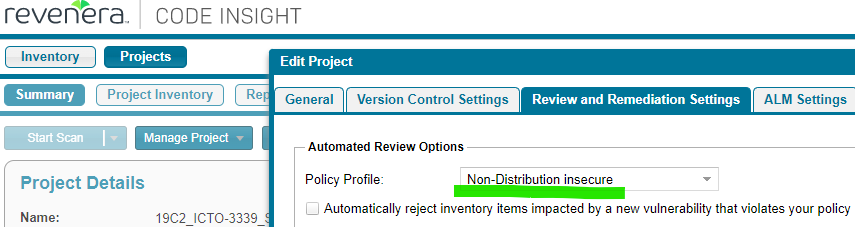

= Open Source License Compliance Scan (OSLC)
:toc:
:keywords: latest

Besides your own code, your application most likely relies on a huge list of dependencies (third-party code).
The majority of those dependencies are issued under a certain https://opensource.org/licenses[open source license], describing the terms of their use.
In some cases the terms of use include restrictions or duties unacceptable to us.
The https://en.wikipedia.org/wiki/Aladdin_Free_Public_License[Aladdin] license for example requires the user to fully provide the whole source code of the application and states that the application must not be sold.
Violating those terms may result in legal action, fees and forcing us to open source our proprietary code.

That's why DPDHL issued a
https://lcm.deutschepost.de/confluence1/display/ITP/Policy+for+Open+Source+Software+Compliance[policy]
describing how to manage this risk and therefore be compliant to our Open Source License rules.
In short, it states that for every release you need to perform a scan to check the risks of the terms.
This can be done via different tools like
https://www.flexerasoftware.com/media/datasheets/datasheet-fci.pdf[FlexNet Code Insight (FNCI)] and requires a manual check of the results.

Within P&P the OSLC policy is interpreted using a risk-based approach in order to reduce the effort and costs where feasible.
Therefore a simple check of your dependencies licenses per release combined with expert audits once in a while is enough.
The check can be done with a plugin for your chosen build tool (Maven, npm...) or with FNCI using its generic agent (which can scan different technologies).

[#fnci-guide]
== FNCI GUIDE

This guide describes how to use FNCI for the different technologies that you might have.

> **HINT:** if available, you can also use one of the build tool plugins as described in the other chapters of this tutorial.

Besides license compliance FNCI will also scan for security vulnerabilities (CVEs) that are publicly known.
In case a license is unknown, unclear or not allowed and in case your dependency has a CVE the scan will automatically break your pipeline.
Then you should go to https://fnci.deutschepost.de/codeinsight[FNCI] and check the findings, to either fix or acknowledge them (in case they are false-positives).

> in case you already use xref:SoftwareCompositionAnalysis.adoc, you can select a scan profile within FNCI that doesn't care about CVEs

[#preconditions]
=== Preconditions

In order for the following steps to work, you need to make sure that:

|===
|Jenkins 

|you are running on https://devsecops.dhl.com/services/build/jenkins-cloudbees/[IT-S Cloudbees Jenkins]
|you are using xref:KubernetesAsJenkinsAgent.adoc[Kubernetes Agents] 
|you are using xref:FlexNetCodeInsight.adoc[P&P FNCI] and have created a project 
|you have stored an FNCI account's access token as Jenkins credentials, e.g. with ID `fnci_myapp`
|the FNCI account has `Analyst` permissions for your FNCI project |the FNCI account has `Analyst` permissions for your FNCI project
|you are using our xref:../CLI.adoc[names create] |
a|you are using our pipeline xref:JenkinsPipelineConfig.adoc[config mechanism] and you have added the following section to your `config.jenkins`:

[source,groovy]
----
include::../../../carts/config.jenkins[tags=oslc,indent=0]
----
|
|===

> **TIP:** here is a guide about how to store credentials in a
xref:ToolAuthentication.adoc[secure manner in Jenkins] and xref:SecretsAzureKeyVault.adoc[Azure Keyvault]

> **CAUTION:** you need to replace `19C2_ICTO-3339_SDM_SockShop`, `184`, `fnci_pup` and `carts` with your FNCI project name (department+ICTO+application), FNCI projectID, Jenkins/Azure Keyvault credentialsId and application part alias.

> **TIP:** the credentials `fnci_pup` are stored centrally on https://devsecops.dhl.com/services/build/jenkins-cloudbees/[IT-S Cloudbees Jenkins], so you can opt to use them instead of your `fnci_myapp` secret

To integrate the scan with FNCI in your pipeline, follow this description.

=== Setup

We use our own https://git.dhl.com/CDLib/FNCI_cli[fnci cli] to perform the scan.
For this you need to add a `fnci` agent to your `agent.yaml`:

[source,yaml]
----
include::../../../payment/agent.yaml[tags=oslc,indent=0]
----

> **TIP:** click the link for xref:KubernetesAsJenkinsAgent.adoc[more information about dynamic agents]

> **IMPORTANT:** https://docs.flexera.com/fnci2018r3/Content/helplibrary/FlexNet_Code_Insight_Plugins.htm[fnci agent
requires around 4 GiB heap memory]

Then add the following section to your `Jenkinsfile`:

[source,groovy]
----
include::../../../payment/JenkinsfileBuild[tags=agent,indent=0]
----

Finally add the fnci scan itself to your `Jenkinsfile`:

[source,groovy]
----
include::../../../payment/JenkinsfileBuild[tags=OSLC,indent=0]
----

> **HINT:** FNCI doesn't provide functionality to scan multiple branches in parallel, so in order for your scan to be reliable, you need to wrap it in a `lock` to avoid multiple jobs running in parallel and conflicting each other

> **IMPORTANT:** If you get read timeout for `getProjectInventory` you can increase the timeout by setting this environment variable `MICRONAUT_HTTP_CLIENT_READ_TIMEOUT="300s"`

After the scan the pipeline will download, unzip and archive the scan report.
Furthermore it will perform a validation of the results and break your build in case a license is unknown or not allowed, or any CVEs are found.

> **HINT:** in case the build breaker prevents you from an important patch in production, you can just remove the last step temporarily

=== Dependency Preparation

FNCI will scan your local folder for everything it can work with.
In most cases you will need to copy the relevant dependencies (and only those!) to your folder, before you execute the scan, otherwise you will miss important dependencies or scan development dependencies.

This can be done, by adding the following snippets to your `Jenkinsfile` right before the scan itself as mentioned above.

In case you are uncertain, just look at our samples below.

==== Maven

[source,groovy]
----
include::../../../frontend/JenkinsfileBuild[tags=oslc,indent=0]
----

==== Gradle

[source,groovy]
----
include::../../../shipping/JenkinsfileBuild[tags=oslc,indent=0]
----

Furthermore you will need to define a `task` inside your `build.gradle`:

[source,groovy]
----
include::../../../shipping/build.gradle[tags=oslc,indent=0]
----

==== NPM / Yarn

NPM and Yarn builds (for JavaScript or TypeScript projects) typically include a lot of "dev-dependencies" for testing and build automation.
While not being part of your product, they are mixed with product dependencies inside your `node_modules` folder.
In order not to blow up your bill of materials, limit your `npm install` / `yarn install` to production dependencies.
If using a workspace which is shared between pipeline stages, you should respect this sequence:

1. Prepare workspace, only with production dependencies: `yarn install --production`
2. Start FNCI scan (rsync will copy the existing workspace for scanning)
3. Continue with other pipeline stages, probably including an "unlimited" `yarn install`

Example:

[source,groovy]
----
include::../../../frontend/JenkinsfileBuild[tags=npm-build,indent=0]
include::../../../frontend/JenkinsfileBuild[tags=oslc,indent=0]
----

=== Exclusions

FNCI will scan the whole pipeline workspace by default, so (after ensuring presence of dependency files, see above) you should exclude files and folders not contributing to your deployable product.
For this purpose, a file named `.fnci-exclude` will be respected if present in the scan root folder.
Carefully configuring excludes will improve scan time, and save you from checking (potentially hundreds of) false-positive findings.

=== Checking and Approving Findings

In case FNCI finds any license violations, CVEs or is unclear about it, you will need to manually check the findings and either fix the issue (e.g. by declaring the real license, updating the dependency or removing it) or approve the finding as it is a false-positive or you accept the risk (not recommended!).

To check the findings go to https://fnci.deutschepost.de/codeinsight/FNCI#projects[FNCI] and select your project:

There you can click on `Not Reviewed` in the `Inventory Review Status` section to see all the findings that need manual intervention.

In this view you can click on the individual findings and see the details like gathered license and found CVEs.

In the above right corner you can then select `x` to disapprove the dependency (not really helpful, talk to your developers about it) or `✓` to approve it (only if you are certain!).

After you have handled every finding, you can perform another scan and in some cases you will have to review the newly found findings again.

In case you also perform a scan with xref:SoftwareCompositionAnalysis.adoc[OWASP Dependency-Check], you would have 2 scanners for library CVEs and would have to manage 2 false-positive suppression lists.
To avoid this you can set up your project inside FNCI to only break for license related findings by using the policy profile `Non-distribution insecure`:

[#oslc-maven-plugin-guide]
== OSLC-Maven-Plugin Guide

The OSLC-Maven-Plugin is an internally developed plugin for maven projects.
For detailed information about the plugin itself visit: https://lcm.deutschepost.de/confluence1/display/TOOL/oslc-maven-plugin[oslc-maven-plugin].

[#prerequisites]
=== Prerequisites

Add the OSLC plugin to your `pom.xml` inside the "plugins" tags:

[source,xml]
----
include::../../../carts/pom.xml[tags=oslc-plugin,indent=0]
----

The plugin is available in the LCM-Artifactory.
Therefore, the LCM-Artifactory needs to be added to the "pluginRepositories" tag with the following snippet.
To load the plugin from the IT-S Artifactory read: .

[source,xml]
----
include::../../../carts/pom.xml[tags=lcm-repo,indent=0]
----

=== Jenkins Setup

Since the OSLC-Maven-Plugin is integrated in the Maven build system, the same container/agent can be used as for building the project.

[source,groovy]
----
include::../../../carts/JenkinsfileBuild[tags=oslc,indent=0]
----

Make sure that you bypass the b2b proxy in case you are running on IT-S (Cloudbees) Jenkins via MAVEN_OPS:

[source,groovy]
----
include::../../../carts/JenkinsfileBuild[tags=environment,indent=0]
----

The OSLC-Maven-Plugin supports some configuration options via command line options.
The filenames of the JSON-report and the HTML-report can be configured with the options tqs.oslc.jsonReportFilename and tqs.oslc.htmlReportFilename.

The option tqs.oslc.projectLicenseFile defines the filepath of an XML-file, that can be used to overwrite license information for specific artifacts.
In this way it is possible to suppress false positives in the scan.
This file is build up as shown below:

You can define a custom prefix for the report filename with the command line option "--report-prefix-oslc-maven-plugin".
The default prefix is "oslc-maven-plugin-report".

[source,xml]
----
<licenseSummary>
    <dependencies>
        <!-- Declaration or Correction for a license of a single artifact -->
        <dependency>
            <groupId>group id of the artifact</groupId>
            <artifactId>artifact id of the artifact</artifactId>
            <licenses>
                <license>
                    <name>Name of the correct license</name>
                    <url>URL to the licensetext of the correct license</url>
                </license>
            </licenses>
        </dependency>
        <!-- Declaration or Correction for licenses of several artifacts using a regex as search criteria-->
            <groupId>RegEx for filtering the group ids of the artifacts</groupId>
            <artifactId>RegEx for filtering the artifact ids of the artifacts</artifactId>
            <matchLicenses>
                <license>
                    <name>RegEx for filtering the license-names of the artifacts</name>
                    <url>RegEx for filtering the license-urls of the artifacts</url>
                    <distribution>RegEx for filtering the distributionchannel of the artifacts</distribution>
                    <comments>RegEx for filtering the comments of the artifacts</comments>
                </license>
            </matchLicenses>
            <licenses>
                <license>
                    <name>Name of the correct license</name>
                    <url>URL to the licensetext of the correct license</url>
                </license>
            </licenses>
        </dependency>
    </dependencies>
</licenseSummary>
----

[#internal-oslc-compliance-validation]
== Internal OSLC Compliance Validation

The internal OSLC compliance validation of CDLib reads a JSON-File containing a list of dependencies and licenses.
This file can be generated by an arbitrary plugin.

For validation CDLib uses a blacklist based on https://isharenew.dhl.com/sites/VLMgmt_pub/lzm_public/SitePages/Open%20Source%20License%20Compliance.aspx[License classification V 1.9.6 (03.11.2021)].
Any not green marked license will cause an incompliant status.

The validation also uses aliases for alternative names or urls of certain licenses.
That means even if the license names are written differently in certain dependencies, the validation can still detect it correctly.

In somecases it is neccessary to overwrite the results of an OSLC-Check, e.g. the plugin detected the wrong licence, or the legal department confirmed that certain packages can be used in this project.
This can be done with an OSLC-whitelist.
This list is provided as a JSON-File with the `--oslc-accepted-list` option in the command like.
It has the following structure:

[source,json]
----
include::../../../shipping/oslcAcceptedList.json[indent=0]
----

The integrated OSLC Compliance Check will assume the given `newLicense` as the license of the given package.
The Compliance Checker will still check the overwritten license.

The `justification` needs to be filled in and can not be left empty.

The `version` can be an empty string to match all version of the package.
Leaving one side of the version parameter empty, will match all version above or below the given version, e.g. "1.4-" will match all version equal or higher 1.4.

[#oslc-gradle-plugin-guide]
=== OSLC-Gradle-Plugin-Guide

The Gradle-Plugin used in our showcases is: https://github.com/jk1/Gradle-License-Report[Gradle-License-Report].
This plugin has to be loaded via the build.gradle file as follows:

[source,xml]
----
include::../../../shipping/build.gradle[tags=gradle-plugin,indent=0]
----

The renderers provide different reports that can be generated.
"InventoryHtmlReportRenderer" will generate human-readable HTML-Report.
"JsonReportRenderer" will generate a JSON-Report.
The constructor of JsonReportRenderer needs the name of the generated report file and a boolean that *must ALWAYS be explicitly set to false*, otherwise the report is not parseable for  CDLib's `Internal OSLC Compliance Validation` so all licenses will be `UNKNOWN`.

The first option defines the name of the report file and the second one defines if multiple licenses per dependencies should be listed.

Sometimes BOMs are missing license information.
To provide the correct information use the `--oslc-accepted-list` option mentioned in <<#internal-oslc-compliance-validation, accepted list>>.

The plugin adds the build goal "generateLicenseReport" to your project.
And this has to be called from your pipeline as seen below.

[source,xml]
----
include::../../../shipping/JenkinsfileBuild[tags=oslc,indent=0]
----

You can define a custom prefix for the report filename with the command line option "--report-prefix-oslc-gradle-plugin".
The default prefix is "oslc-gradle-plugin-report".

[#oslc-npm-plugin-guide]
=== OSLC-NPM-Plugin-Guide

The NPM-Plugin used in our showcases is: https://github.com/RSeidelsohn/license-checker-rseidelsohn[NPM License Checker].
The plugin can be used in your pipeline as follows:

[source,yaml]
----
include::../../../cdaas/ado/container-job-templates/oslc-npm.yaml[indent=0]
----

You can define a custom prefix for the report filename with the cdlib-cli option "--report-prefix-oslc-npm-plugin".
The default prefix is "oslc-npm-plugin-report".

=== GitHub Actions
Within our template repository you can find a working example on how to scan your application for OSLC.
Pipeline: https://git.dhl.com/CDLib/cdaas-template-maven/blob/8b57829877c879b8754c7170252a74febfc0bfcd/.github/workflows/pipeline.yaml#L54
Workflow: https://git.dhl.com/CDLib/cdaas-workflows/blob/main/.github/workflows/oslc-mvn.yaml
