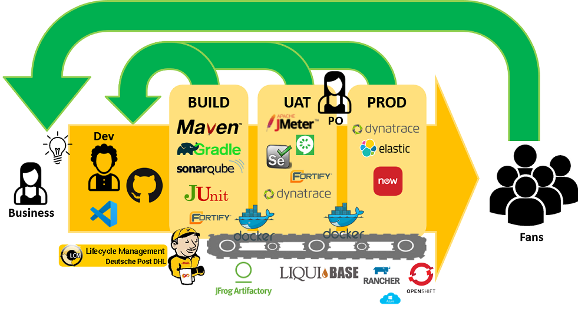
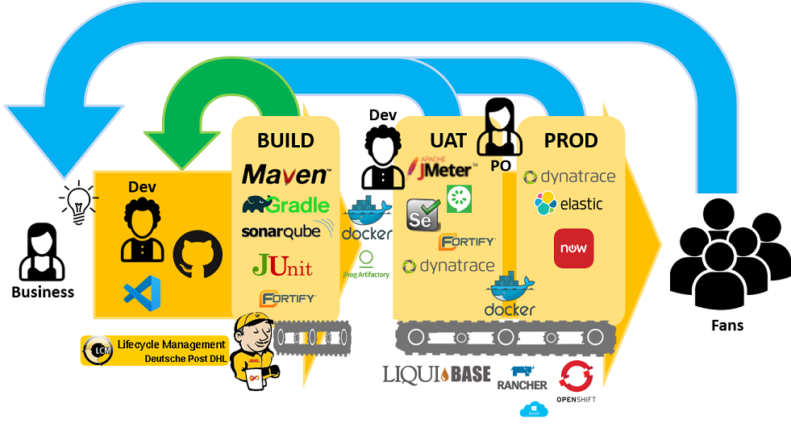

= Pipeline Types
:toc:
:keywords: latest

This tutorial gives an overview over different types of pipelines.
There are different categories you can characterize pipelines by and for each we describe the different types.
However, the overview will never be complete as there are many ways to design a pipeline.

== Process

Depending on your agile maturity you will either follow a process based on Kanban (Lean) or Scrum.

=== Pipeline for Teams using Kanban (Lean)

This pipeline allows for batch size one, so you can release every feature individually and then focus on the next issue.
Every part of your delivery process can be automated and you should be able to deploy multiple times per day.
The following overview should help you to get a high level understanding of the Kanban pipeline type:

 

The default pipeline includes all necessary steps:
* build
* test, e.g. Unittest
* scans, e.g. Sonarqube
* dynamic tests, e.g. Selenium, ZAP
* deployment to all stages, e.g. with helm
* reporting

A sample for this is our Showcase https://dev.azure.com/sw-zustellung-31b3183/ICTO-3339_SDM/_git/phippyandfriends[Phippy and Friends].

=== Split Pipeline for Teams doing Scrum (Agile)

The split pipeline separates the logic of building a service and deploying it.
This is usually needed for teams not ready for batch size one, common to Scrum teams,
that aggregate their changes to bigger releases (for one or multiple sprints) and therefore need to be able to control what they deploy when and where.
In this case your pipeline will consist of 2 Jenkinsfiles, one for the Build and one for the Deployment.
The `JenkinsfileBuild` passes the important parameters to the `JenkinsfileDeploy` (downstream job).
You can trigger the deployment job by hand with the expected parameters.
You can also activate the automated downstream deployment as shown in our template,
as a hybrid - which gets your pipeline close to Kanban-Style, but you still have manual control.

The following overview should help you to get a high level understanding of the split pipeline type:

 

==== Build

The `JenkinsfileBuild` declares:
* build
* test, e.g. Unittest
* scan, e.g. Sonarqube

A sample for this is our Showcase https://git.dhl.com/SockShop/front-end/blob/master/JenkinsfileBuild[SockShop Service `Front-End`].

==== Deploy

The `JenkinsfileDeploy` declares:
* deploy to uat stage, e.g. with Helm
* dynamic tests on uat, e.g. Selenium, ZAP
* deploy to production stage, e.g. with Helm
* reporting

A sample for this is our Showcase https://git.dhl.com/SockShop/front-end/blob/master/JenkinsfileDeploy[SockShop Service `Front-End`].

== Content

Depending on the content of your pipeline, you will also be able to differentiate various types.

=== Application

This is probably the most known type of pipeline, as it is used to build, test and deploy your application.
Depending on your process, it will look like described above.

=== Infrastructure

Nowadays we don't use pipelines to manage infrastructure anymore, but the integrated features from Terraform Cloud as described here: xref:Terraform.adoc[Infrastructure as Code with Terraform]

=== Configuration

Furthermore you can have a pipeline that simply takes care of configuration changes.
In this case you will not need to build or scan anything, but of course you will deploy the configuration to different staging environments and dynamically test the impact of those prior deployment to production.

=== Static

Lastly you can have a pipeline that just deploys static content like html or text and images.