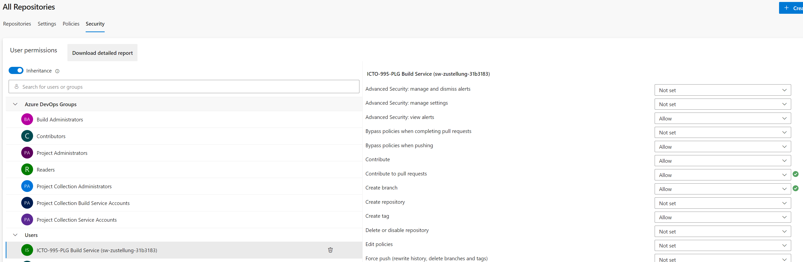
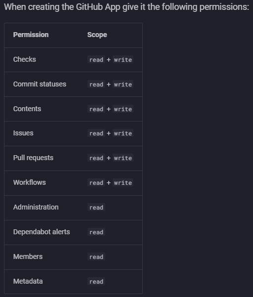

= Renovate
:toc:
:keywords: latest

== The Necessity of Automatic Dependency Updates

=== Introduction

In the realm of software development, dependency updates are critical for maintaining up-to-date, secure, and efficient software. 
However, managing these updates manually is labor-intensive and prone to errors. 
Herein lies the value of automation tools like Renovate Bot.

=== Reducing Manual Effort

Automated tools like Renovate Bot eliminate the need for manual monitoring, compatibility validation, and application of updates. 
This significantly decreases manual effort and potential errors, enhancing efficiency and reliability in the process.

=== Accelerating Bug and CVE Resolution

Updates often provide fixes for bugs and Common Vulnerabilities and Exposures (CVEs). 
Automated tools can detect and apply these updates faster than manual processes, leading to quicker issue resolution.

=== Ensuring Current Support

Automated updates maintain software currency, ensuring ongoing support from providers and mitigating potential security risks associated with outdated versions.

=== Mitigating Dependency Lag

Dependency lag, or the delay between a new release of a dependency and its adoption, presents risks such as exposure to vulnerabilities. 
Automated updates help mitigate this lag, ensuring the use of the latest, most secure versions of dependencies.

=== Guarding Against Supply Chain Attacks

Automated updates play a crucial role in guarding against supply chain attacks, where a component of a software supply chain is compromised. 
By keeping dependencies up-to-date, the likelihood of using a compromised version is significantly reduced.

== Understanding Renovate Bot

=== What is Renovate Bot?

Renovate Bot is an automated tool designed to keep software dependencies up-to-date. 
It helps developers maintain their projects by automatically detecting outdated dependencies, checking for updates, and creating pull requests to update these dependencies. 
This process significantly reduces manual effort, enhances efficiency, and increases the reliability and security of software projects.

=== Where Can I Learn More?

For those looking to dive deeper into Renovate Bot, there are several resources available:

- The official Renovate Bot website: You can visit the official Renovate Bot website at link:https://www.mend.io/renovate/[mend.io] for comprehensive information about the tool, its features, and how it works.

- Documentation: Renovate Bot’s official documentation is a rich resource that provides detailed guides and tutorials on how to use Renovate Bot effectively. You can access it at link:https://docs.renovatebot.com/[docs.renovatebot.com].

- GitHub: Renovate Bot is open source and its codebase is hosted on GitHub. This platform allows you to explore the code, contribute to the project, and engage with the Renovate community. Visit the Renovate Bot GitHub page at link:https://github.com/renovatebot/renovate[github.com/renovatebot/renovate].

== Getting started with Renovate

=== How to run Renovate?
Generally there are two ways to run renovate, using the official Mend Renovate App (which is only accessible on GitHub.com and not on GitHub Enterprise or Azure DevOps) or self-hosting. 
So for most Teams, there is really only one option. We will host Renovate ourselves and also make it maintain itself.
There will be differences depending on where you run your pipelines, so we will cover both Azure DevOps and GitHub Actions.

=== Prerequisites

**Azure Devops**

You will need:

* xref:ManagedDevOpsPools.adoc[Managed DevOps Pool Agent with Docker], to execute renovate

* https://lcm.deutschepost.de/confluence1/pages/viewpage.action?pageId=72196138[Azure DevOps project] or https://devsecops.dhl.com/services/build/github/get-started#organization-creation[GitHub Organization], to host a new repo for renovate's config

* repos to scan for dependencies

* credentials, that you will need to log into your dependency repositories https://artifactory.dhl.com/ui/packages[IT-S Artifactory]

* in case of Azure DevOps allow your pipeline user to create PRs by `Protect access to repositories in YAML pipelines: off` (in your project settings under pipeline settings) and grant the pipeline user permissions on all your repos

**GitHub Actions**

You will need:

* link:https://devsecops.dhl.com/services/build/github-actions/get-started#use-its-managed-runners[IT-S managed runners] or link:https://devsecops.dhl.com/services/build/github-actions/get-started#use-your-own-runners[self-hosted ones] to run renovate

* https://devsecops.dhl.com/services/build/github/get-started#organization-creation[GitHub Organization], to host a new repo for renovate's config

* repos to scan for dependencies

* credentials, that you will need to log into your dependency repositories https://artifactory.dhl.com/ui/packages[IT-S Artifactory]

* in case of GitHub Actions create a GitHub App to authorize with:

Other values like Homepage URL, User authorization callback URL and webhooks can be disabled or filled with dummy values.

Generate and download a new private key for the app, adding the contents of the downloaded .pem file to Secrets (repository settings) with the name private_key and app ID as a secret with name app_id.
You will also need to install the app on your organization and grant it access to the repositories you want to scan under https://git.dhl.com/settings/apps/<your-app-name>/installations.

link:https://www.mend.io/renovate/[mend.io]

=== The Image
**Azure Devops**

We will use Renovate from the official image instead of the CLI tool so we can let it maintain itself.
For that, you will need to create a https://dev.azure.com/sw-zustellung-31b3183/ICTO-3339_SDM/_git/renovate?path=/Dockerfile[`Dockerfile`] which uses the https://github.com/renovatebot/renovate/releases[newest version of Renovate]:

[source,dockerfile]
----
include::../../../renovate/Dockerfile[indent=0]
----
`HINT: Use the full version of the image, to have all additional tools`

`HINT: Use a pinned version with a digest so that the renovate bot can update its own images`

**GitHub Actions**

No image is needed, as we will use the official Renovate GitHub Action.

== The Pipeline Script
**Azure Devops**

Now we need to configure the renovate execution via pipeline.
You can use our https://dev.azure.com/sw-zustellung-31b3183/ICTO-3339_SDM/_git/renovate?path=/scheduled-renovate-bot-pipeline.yaml[sample pipeline] and adapt it to your needs:

[source,yaml]
----
include::../../../renovate/scheduled-renovate-bot-pipeline.yaml[indent=0]
----

Let's have a look at what is happening here:

It is generally recommended to have renovate run at least weekly or depending on the release frequency of your dependencies, your tech-stack and own release frequency even more frequently. Because of this, we first need to define a cron job in our azure-pipelines.yml.

Next, define a pool with the agent(s) you are going to use. 
Make sure that the Agent has access to Docker or another means to run Containers. 

Then download all secrets you need from your Azure KeyVault.

Before we can run renovate, we need to log into our registry and build the image.

We run it with several environment variables with `-e` to pass the PAT, the credentials for our dependency source platforms, and the log level.
Additionally, we copy the config.js via a volume with `-v`, to instruct Renovate on how to behave.

**GitHub Actions**

For GitHub Actions, we will use the official https://github.com/renovatebot/github-action[Renovate GitHub Action].
You can use our https://git.dhl.com/CDLib/Renovate/blob/master/.github/workflows/renovate.yml[sample pipeline] and adapt it to your needs.

[source, yaml]
----
on:
  schedule:
    - cron: '0 2 * * 4'
  workflow_dispatch:
jobs:
    renovate:
      runs-on: arc-small-container
      steps:
        - name: Get GitHub App token
          id: get_token
          uses: actions/create-github-app-token@5d869da34e18e7287c1daad50e0b8ea0f506ce69 # v1
          with:
            private-key: ${{ secrets.private_key }}
            app-id: ${{ secrets.app_id }}
            owner: ${{ github.repository_owner }}
            repositories: 'Renovate,CDLib'

        - name: Checkout
          uses: actions/checkout@b4ffde65f46336ab88eb53be808477a3936bae11 # v4

        - name: Self-hosted Renovate
          uses: renovatebot/github-action@e02bf7b1c996027e55e910400653576a8293246c # v41.0.3
          with:
            configurationFile: config.js
            token: '${{steps.get_token.outputs.token}}'
            renovate-image: docker.artifactory.dhl.com/renovatebot/renovate
          env:
            LOG_LEVEL: 'debug'
            RENOVATE_SERVICEACCOUNT_ARTIFACTORY_TOKEN: ${{ secrets.ARTIFACTORY_TOKEN }}
            RENOVATE_SERVICEPASSWORD_ARTIFACTORY_USERNAME: ${{ secrets.ARTIFACTORY_USERNAME }}
            GITHUB_COM_TOKEN: ${{ secrets.TOKEN_GITHUB_COM }}
----

For running Renovate we first need to define a schedule via a cron job in our workflow file.

We need to define the job and the runner we are going to use. Here we use the `arc-small-container` runner, which is a Runner hosted by IT-S. The `-container` part will make sure to give you an agent with Docker installed.

Then we need to get the GitHub App token to authorize with. We use the `create-github-app-token` action to get the token from our GitHub App, because the tokens are only valid for an hour.

For this we use the official https://github.com/actions/create-github-app-token[create-github-app-token action], which will create a token for us to use in the next step.

The action needs the private-key and app-id, which we set as secrets earlier. We also need to define the owner and repositories, which we want to scan. These values can either be hardcoded or set dynamically.

Following we need to checkout the repository, so that we can use the config.js file.

Then we run the https://github.com/renovatebot/github-action[renovatebot/github-action] with the configurationFile, token, and renovate-image. The configurationFile is the config.js file, which we will use to configure Renovate. The token is the token we got from the GitHub App. The renovate-image is the image we want to use to run Renovate. We use the official Renovate image from the IT-S Artifactory.

In the env section, we set the LOG_LEVEL to debug, so we can see more logs. We also set the credentials for the dependency sources and optionally the GitHub.com token(not GitHub Enterprise) if we want to see patchnotes and update GitHub Actions as secrets.

== global config: config.js
**Azure Devops**

The config.js is Renovates global config and defines how it behaves in general, so it must be placed in the central renovate repo. 
You can find our configuration https://dev.azure.com/sw-zustellung-31b3183/ICTO-3339_SDM/_git/renovate?path=%2Fconfig.js&version=GBmaster[here] and take a look at all options you have https://docs.renovatebot.com/self-hosted-configuration/[here].
For this short introduction, this snippet will work:

[source,javascript]
----
include::../../../renovate/config.js[indent=0]
----

`HINT: For more configuration options look through the https://docs.renovatebot.com/self-hosted-configuration/[offical documentation]`

`HINT: For more Information on the datasources and how to connect them refer to the https://docs.renovatebot.com/modules/datasource/[official documentation]`

**GitHub Actions**

An adapted config.js for GitHub Actions can be found https://git.dhl.com/CDLib/Renovate/blob/master/config.js[here].

Notable changes are the `platform` and `endpoint`, which differ from ADO:

[source,javascript]
----
module.exports = {
    platform : "github",
    endpoint: 'https://git.dhl.com/api/v3/'
}
----

== repository config: renovate.json5

The `renovate.json5` is a configuration file, which configures the behavior of renovate bot per repository.
We recommend defining a `default.json` config file in the central renovate repository from which the other configs pull.
You can also define this file in a repository named `renovate-config`, which is then used as a submodule in all repositories via `extends`.

`HINT: You must put the repository config into the default (mostly main/master)-branch of the repository, even if renovate bot later runs on another branch or renovate will not recognize it`

**Azure Devops**

=== The default config (central repository)
[source,json]
----
{
  "$schema": "https://docs.renovatebot.com/renovate-schema.json",
  "osvVulnerabilityAlerts": true,
  "updateLockFiles": true,
  "rebaseWhen": "behind-base-branch",
  "prHourlyLimit": 0,
  "extends": [
    "config:recommended",
    ":semanticPrefixFixDepsChoreOthers",
    "group:monorepos",
    "group:recommended",
    "replacements:all",
    "workarounds:all",
    "security:openssf-scorecard",
    "workarounds:javaLTSVersions",
    "default:pinDigestsDisabled"
    ],
  "ignoreDeps": [],
  "packageRules": [
    {
      "description": "Trigger breaking release for major updates",
      "matchUpdateTypes": ["major"],
      "semanticCommitType": "feat",
      "commitMessageSuffix": "BREAKING CHANGE: Major update"
    },
    {
      "description": "Automatically merge minor updates without notifying anyone",
      "matchUpdateTypes": ["minor", "patch", "digest"],
      "automerge": true,
      "automergeType": "branch"
    }
  ],
  "baseBranches": ["master"]
}
----

**GitHub Actions**

For GitHub Actions, you can use the same config as in Azure DevOps, but you might want to set options for the dependencyDashboard and take a look at the recommended presets that you can use with `extends`.
Our default configuration can be found https://git.dhl.com/CDLib/Renovate/blob/master/default.json[here].

=== The repository config (specific repository)
**Azure Devops**

Then in the specific repositories you can extend from this default config like this in a `renovate.json5` file in the root of the repository:

[source]
----
{
  "$schema": "https://docs.renovatebot.com/renovate-schema.json",
  "extends": ["local>project/renovate_repo"]
}
----
Here, you can also extend and add options on top of the default config.

**GitHub Actions**

For GitHub Actions, you can use the same config as in Azure DevOps, but you need to adjust the `extends` path to the repository where the default config is stored.
An example with a custom regex manager, which can handle micronaut can be found https://git.dhl.com/CDLib/CDlib/blob/master/renovate.json5[here].

== Auto-update renovate itself
**Azure Devops**

For the local config (renovate.json5) in the repository that houses renovate itself, there is a bit more to do, as we want renovate to update itself:

[source,json]
----
include::../../../renovate/renovate.json5[indent=0]
----

**GitHub Actions**

For GitHub Actions, we don't need to do anything special, as the GitHub Action will maintain itself and the underlying image, as long as you supply a github.com PAT.

For more configuration options for the repository config, take a look at the https://docs.renovatebot.com/configuration-options/[official documentation]
