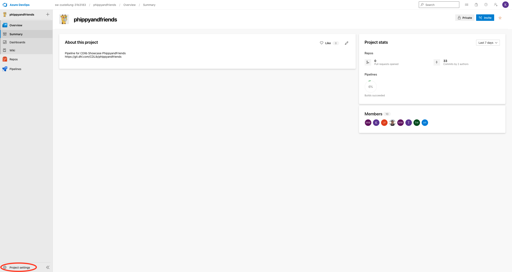
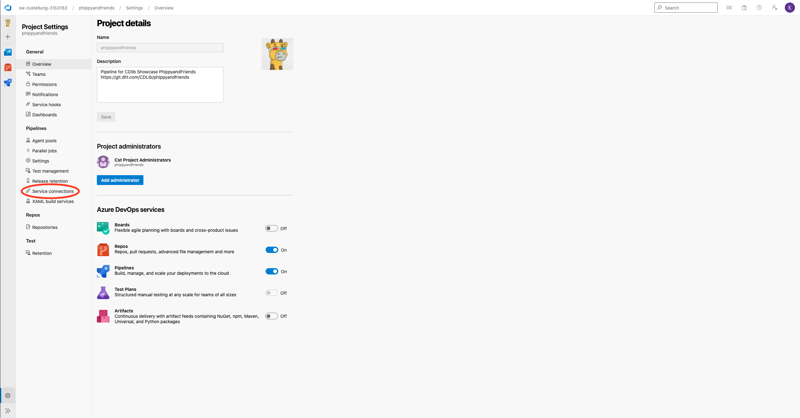
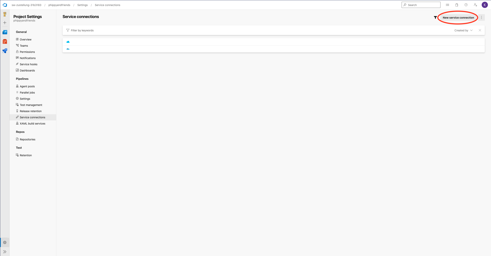
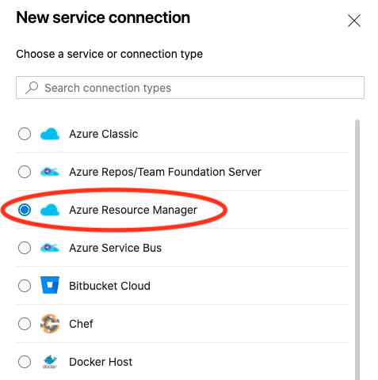
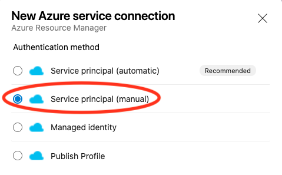

= Usage of secrets via Azure Key Vault
:toc:
:keywords: latest

== Prerequisites

* A DP DHL Active Directory account with access to Azure Portal, corresponding subscription and relevant Azure DevOps workspace
* Service principal with key and access to Azure subscription and relevant Azure DevOps workspace
* To add a secret to Azure Key Vault you need a jumphost with the following requirements:
** Is resident in the same Azure Resource Group
** Has Podman installed
** Has access to docker.artifactory.dhl.com

=== Jumphost VM on Azure to store secrets

As Azure Key Vault can't be accessed via Azure Portal or from clients outside of the corresponding Azure Resource Group, a jumphost VM within the same Azure Resource Group as the Azure Key Vault needs to be setup and used. How to create a VM in Azure can be found https://lcm.deutschepost.de/confluence1/pages/viewpage.action?pageId=168707536[here].

____

*Hint1*: A jumphost is only required to store secrets in Azure Key Vault (or read them manually). If you only want to read secrets from within Azure DevOps Pipeline, this step is not required.

____

== Add secret to Azure Key Vault

. ssh to jumphost VM:
`ssh -i &lt;PATH/TO/SSHKEY&gt; user@&lt;VM-IP&gt;`
. Start azure cli container: `sudo podman run --rm -it docker.artifactory.dhl.com/cdlib/helm:latest /bin/bash`
. Within container login to Azure and store secret in Azure Key Vault:

----
$ az login -t 28e748f8-ed1e-4f6f-bd59-788e78989250
$ az account set --subscription <SUBSCRIPTION>
$ az keyvault secret set --vault-name <KEYVAULT-NAME> --name '<SECRET-NAME>' --value '<SECRET-VALUE>'
$ az keyvault secret list --vault-name <KEYVAULT-NAME>

----

== Use secrets from Azure Key Vault within Azure DevOps Pipeline

=== Configure service connection to access Azure Key Vault

Within your project in https://dev.azure.com/sw-zustellung-31b3183[Azure DevOps] navigate to:
 * Project settings (left bottom corner)
 
 * Service connections
 
 * New service connection (top right corner)
 
 * Azure Resource Manager -&gt; Next (bottom right corner)
 
 * Service principal (manual) -&gt; Next (bottom right corner)
  

Now fill in all requested fields, e.g. your Azure subscription and service principal.

____

*Guideline*:

Environment - Azure Cloud

Scope Level - Subscription

Credential - Service principal key

____

=== GUI pipeline configuration

. Within your pipeline add a new task, search for "Azure Key Vault" and add the task in front of your build steps.
. Navigate to the task and fill in all fields properly.
. As Azure subscription please choose the prior configured "Azure service connection".
. Now all Key Vaults within your Azure subscription should be visible. Choose the Key Vault with your prior created secret.
With the secrets filter you can choose, which secrets should be used in Azure DevOps Pipeline.

=== YAML pipeline configuration

----
steps:
- task: AzureKeyVault@1
  displayName: 'Azure Key Vault: NAME'
  inputs:
    azureSubscription: '<SERVICE-CONNECTION>'
    KeyVaultName: '<KEYVAULT-NAME>'
    RunAsPreJob: true
----