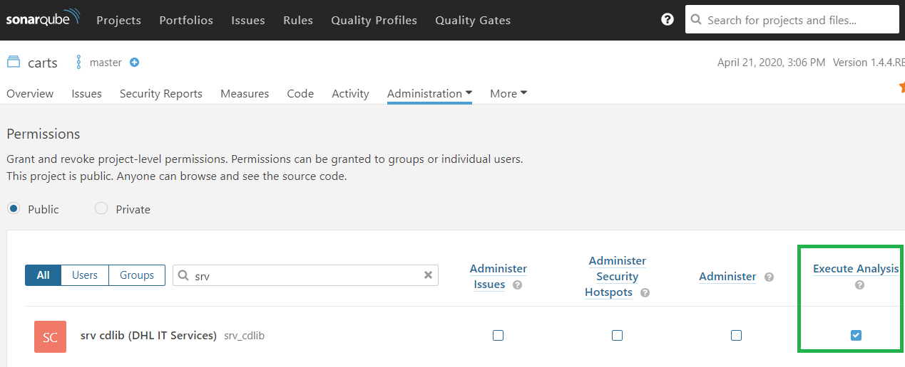
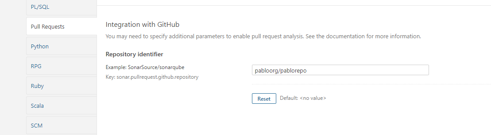
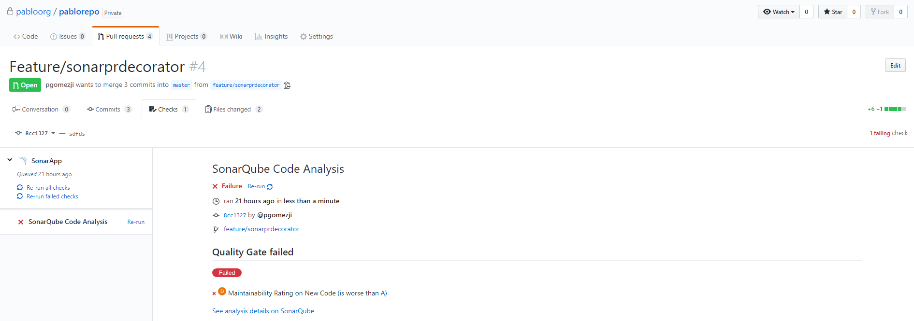

= Static Code Analysis With Sonarqube
:toc:
:keywords: latest

image:img/sonarqube.png[sonarqube]

Checking your code for maintainability is crucial to make sure that you, but also everyone else ever involved with your code, will be able to understand and adapt or enhance it in the future.
Furthermore, this scan will check, whether you have sufficient test coverage (mainly on unit level) for your code, giving you a sense of security for your next release.

To really leverage the power of your pipeline, you should activate the quality gate for your projects, which ensures, that your pipeline breaks in case your changes don't match the quality target.

> **Pro Tip**: Use https://www.sonarlint.org/[Sonarqube linter] inside your IDE to check for improvements even before commit.

== General Preconditions

In order for the following steps to work, you need to make sure that:

. you are using https://devsecops.dhl.com/services/test/sonarqube/[IT-S Sonarqube] and have created a project
. you have xref:ToolAuthentication.adoc[set up a service account to access sonarqube] from your pipeline
. the service account has the `execute analysis` permission for the sonarqube project
 
. you perform a xref:UnitTest.adoc[unit test] before this scan on the same agent (or you stash and unstash the results)
. manually scan your master branch, otherwise the pipeline will fail because TQS-plugin cannot create a report for feature-branches in case master branch hasn't been scanned before
. you have defined a file `sonar-project.properties`, like that:

[source,properties]
----
include::../../../frontend/sonar-project.properties[indent=0]
----

> https://docs.sonarqube.org/latest/analysis/analysis-parameters/[learn more about the parameters]

In the following chapters we will explain how to integrate the SonarQube scan inside your pipeline with https://devsecops.dhl.com/services/build/jenkins-cloudbees[Jenkins] and xref:AzureDevOps.adoc[Azure DevOps].

To learn more about Sonarqube and read the FAQ check out the https://lcm.deutschepost.de/confluence1/display/TOOL/SonarQube[documentation provided by TQS].

== Jenkins
In order for the following steps to work, you need to make sure that:

. you are running on https://devsecops.dhl.com/services/build/jenkins-cloudbees/[IT-S Cloudbees Jenkins] or any other Jenkins capable of running Kubernetes Agents
. you are using xref:KubernetesAsJenkinsAgent.adoc[Kubernetes Agents]
. in case you are not using https://devsecops.dhl.com/services/build/jenkins-cloudbees/[IT-S Cloudbees Jenkins], you have configured the relevant sonarqube server as an installation
. you have stored the xref:ToolAuthentication.adoc[service account token] as a credential in your Jenkins folder
. you are using a multibranch pipeline

=== CLI (for non-java)
We use the https://github.com/SonarSource/sonar-scanner-cli[Sonar Scanner CLI] to perform the scan for non-java applications.
For this you need to add a `sonar-scanner` agent to your `agent.yaml`:

[source,yaml]
----
include::../../../frontend/JenkinsfileBuild[tags=sonar, indent=0]
----

Then add the following section to your `Jenkinsfile`:

[source,groovy]
----
include::../../../frontend/JenkinsfileBuild[tags=sonarqube, indent=0]
----

> **HINT**: in case you want to use https://devsecops.dhl.com/services/test/sonarqube/[IT-S Sonarqube], use `installationName: 'Central Sonar'`

To visualize and check the code coverage in Sonarqube, you need a test coverage report after performing your xref:UnitTest.adoc[unit test].

=== maven-plugin (for java)
For java applications you could also use the CLI, but it requires quite a lot parameters, since it cannot re-use the configuration from the `pom.xml`.
Since we weren't able to figure out which parameters are needed to run it with SonarQube 9.x, we decided to switch to the maven-plugin (should be the same for gradle).

To be able to reach Sonarqube, make sure the used instance is part of your `https.nonProxyHosts` within your `MAVEN_OPTS`:
[source,groovy]
----
include::../../../carts/JenkinsfileBuild[tags=environment, indent=0]
----

Then you can add the stage to perform the scan itself to your jenkinsfile:
[source,groovy]
----
include::../../../carts/JenkinsfileBuild[tags=sonarqube, indent=0]
----

For this you need to add a `maven` agent to your `agent.yaml`, which you probably already have for your maven build:
[source,yaml]
----
include::../../../carts/JenkinsfileBuild[tags=maven, indent=0]
----

Also you need to configure the maven properties inside your `pom.xml`:
[source,xml]
----
include::../../../carts/pom.xml[indent=0]
----

Lastly you need to configure the sonarqube scan inside your `settings.xml`:
[source,xml]
----
include::../../../carts/settings.xml[indent=0]
----

=== Samples

We are using this configuration in our Showcase *Sockshop*.

* with LCM-Sonarqube
** for Javascript via CLI
*** https://git.dhl.com/SockShop/front-end/blob/master/JenkinsfileBuild[Jenkinsfile]
*** https://git.dhl.com/SockShop/front-end/blob/master/sonar-project.properties[sonar-project.properties]
** for Java via Maven-Plugin
*** https://git.dhl.com/SockShop/carts/blob/master/JenkinsfileBuild[Jenkinsfile]
*** https://git.dhl.com/SockShop/carts/blob/master/agent.yaml[agent.yaml]
*** https://git.dhl.com/SockShop/carts/blob/master/sonar-project.properties[sonar-project.properties]
* with IT-S Sonarqube for Golang via CLI
** https://git.dhl.com/SockShop/catalogue/blob/master/JenkinsfileBuild[Jenkinsfile]
** https://git.dhl.com/SockShop/catalogue/blob/master/agent.yaml[agent.yaml]
** https://git.dhl.com/SockShop/catalogue/blob/master/sonar-project.properties[sonar-project.properties]

== Azure DevOps Pipelines
We use the https://github.com/SonarSource/sonar-scanner-cli[Sonar Scanner CLI] to perform the scan.
Of course, there are many ways how to integrate it, but this generic approach works in every CI/CD tool and for most build tools and is therefore the most efficient one.

=== Sonarqube Configuration with Properties
First of all we need to add another property to our `sonar-project.properties` file: `sonar.host.url=https://sonarqube1.lcm.deutschepost.de//`.
You can see the complete property file here:

[source,yaml]
----
include::../../../phippyandfriends/nodebrady/sonar-project.properties[indent=0]
----

> Dotnet doesn't support the sonar-project.properties nor the cli scan, check out our hacky approach https://dev.azure.com/sw-zustellung-31b3183/ICTO-3339_SDM/_git/phippyandfriends?path=/parrot/Dockerfile&version=GBmaster&_a=contents[here]

=== Adding the template to your pipeline
Next up we can add the scan to our `SCAN` stage as a separate job based on a template that we will explain later.
The execution of the job is done inside a container based on the https://hub.docker.com/r/sonarsource/sonar-scanner-cli[official container image] running on a xref:ManagedDevOpsPools.adoc[Managed DevOps Pool].

[source,yaml]
----
include::../../../phippyandfriends/nodebrady/nodebrady.yaml[tags=sonarqube, indent=0]
----

=== Understanding the template
Our template should work out of the box, so you don't need to know what happens.
In case you are curious, or you need to adapt it, we explain it now.

[source,yaml]
----
include::../../../cdaas/ado/container-job-templates/codequality-npm.yaml[indent=0]
----

. First we checkout the code of the app.
. Then we fetch the sonarqube token from xref:SecretsAzureKeyVault.adoc[Azure Keyvault].
. Then we download the stashed coverage report from our xref:UnitTest.adoc[unittest].
. Before we can execute the CLI we need to start the container - learn more about our xref:ManagedDevOpsPools.adoc[agents here]
. Now we start the CLI, providing it with all necessary parameters, like the link to the properties file and our variables from the beginning. The LCM team asked us to re-run the scan in case sonarqube is not available or there is a connection issue.
. Lastly we publish the generated report zip as an artifact.

== GitHub Actions

Within our template repository you can find a working example on how to scan your application with IT-S Sonarqube.
Sonar Config: https://git.dhl.com/CDLib/cdaas-template-maven/blob/9a4670ea12f3fa2f3e2b84f3c39b372051d33d04/pom.xml#L18
Pipeline: https://git.dhl.com/CDLib/cdaas-template-maven/blob/9a4670ea12f3fa2f3e2b84f3c39b372051d33d04/.github/workflows/pipeline.yaml#L27
Workflow: https://git.dhl.com/CDLib/cdaas-workflows/blob/main/.github/workflows/sonar-mvn.yaml

== Quality Gate
The best scan won't do you any good, if you don't look at its results.
Therefore, you should activate a quality gate for all your projects, so https://devsecops.dhl.com/services/test/sonarqube/[Sonarqube] will tell you, when you are below the quality targets.
You can do this rather easily per project, by clicking on `administration` and then selecting `quality gate`.
You'll find a selection of different quality gates and of course you are free to pick one you like or even define your own, we recommend using the builtin "Sonar way".

== GitHub Pull Requests decorators
Another interesting integration of https://devsecops.dhl.com/services/test/sonarqube/[Sonarqube] is with https://devsecops.dhl.com/services/build/github/get-started[GitHub].
This integration allows us to scan each branch separately and scan each Pull Request and get the results in the Checks tab in the Pull Request.
We can even configure our repository so a Pull Request cannot be approved if the new code does not fulfill the https://docs.github.com/en/enterprise-server@3.2/pull-requests/collaborating-with-pull-requests/collaborating-on-repositories-with-code-quality-features/about-status-checks[quality gate].

If you want to use that feature you just need to follow the following steps:

. Go to https://git.dhl.com/github-apps/sonarapp, click on the configure button and select the GitHub organization where you want to install the application.
. Sonarqube configuration:
.. **RECOMMENDED**: Configure everything in the pipeline like in the examples described.
.. Alternative:
... Go to your SonarQube project in https://sonarqube.dhl.com then click on Administration -> General Settings -> Pull Requests
... Make sure that GitHub is selected as Provider In the Repository identifier field enter your full repository name including organization.I.e. myorganization/myrepo.

> **NOTE:** **Don't enter the URL of your repository, just the organization name and the repository name separated by slash**.

After that, scan your PR (don't forget to add the parameters described above) and you will see the scan results in the Checks tab in your PR in GitHub UI

> **Note: If you click in Re-run check, that won't re-run the Sonar scan.**
