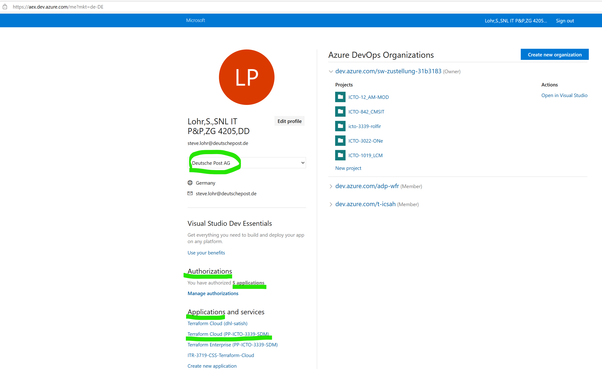
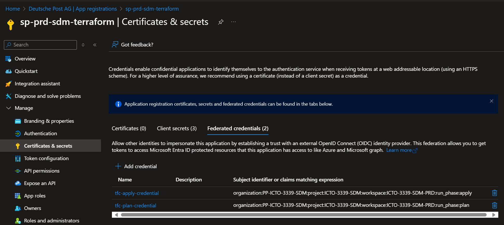
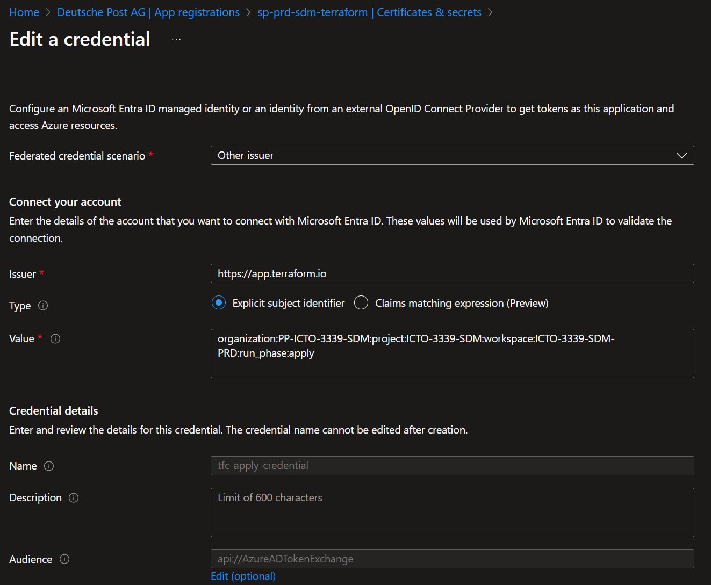

= Terraform
:toc:
:keywords: latest

https://www.terraform.io/[Terraform] is an orchestration tool for managing infrastructure as code (IaC), meaning it declaratively defines a required environment in code, specifically the Terraform language.
It allows users to safely and predictably create, change, and improve infrastructure within a version control system and all its merits.
We use it to define, deploy, test, and destroy our development, testing and production environments.

> **DISCLAIMER**: This documentation focuses on our recommended use case for using Terraform.
For a more general introduction to Terraform, syntax, and file structure, refer to the official Terraform documentation https://developer.hashicorp.com/terraform/docs[here].

== Infrastructure as Code
Infrastructure as Code (IaC) treats infrastructure like an application, using code to define, test, and deploy it.
This automation eliminates manual hardware configuration and the use of interactive tools.
Generally, IaC tools can use either automation scripts that lead towards an environments desired state (imperative) or code that directly describes this desired end state (declarative).
Terraform, as mentioned above, uses the latter.

=== Why should I use IaC?
The argument for using IaC is similar to using automation over manual processes:

- Reliability: Standard automation performs the same operation every time without failure (unless influenced by external factors) and without supervision.
This is useful for disaster recovery and keeping environments in sync.
- Cost Savings: Reduced manual effort and failures from reliable automated procedures, which can also be tested automatically.
Shared code fragments in our example repository.
- Speed: Faster execution of the provisioning process through orchestration.
- Security: Consistent and verified IaC definitions deliver the same result on every execution.
Version control helps track changes and versions of infrastructure deployments.

=== Why Terraform?
Each cloud provider has its own IaC solution (e.g., AWS CloudFormation, Azure Resource Manager, Google Cloud Deployment Manager).
However, these tools' IaC definitions are not cross-compatible.
To remain cloud provider-independent, we use a provider-agnostic tool like Terraform.
Terraform interacts with various infrastructure providers to create environments as per IaC definitions.

== State Management
State in Terraform is a declarative description of all your deployed infrastructure at your chosen cloud provider.
More on that https://developer.hashicorp.com/terraform/language/state[here].
One of the key benefits of Hashicorp's Terraform Cloud offering is that they safe that state for you, find a comparison to other approaches to manage state below.

=== Remote State (Terraform Cloud)
- State data is stored in a managed remote backend.
- All infrastructure can be deployed from one repo / terraform folder.
- Shared among team members, ensuring consistency.
- Supports state locking to prevent concurrent operations.
- Provides encryption and secure access controls.
- Offers xref:GitOps.adoc[GitOps] like deployments for infrastructure, with constant repository monitoring, state drift detection and more.

=== Remote State (Blob Storage)
- State data is stored in a remote backend.
- Chicken and egg problem, needs separate repo and or setup of the used blob storage.
- Sharing among team members requires managing access to the storage account in Azure.
- Supports state locking.
- Provides encryption and secure access controls.
- Still requires a pipeline or manual deployment of the infrastructure.

=== Local State
- Risk of loosing state as it is stored in a local file (`terraform.tfstate`).
- Each user must ensure they have the latest state before running Terraform.
- Risk of conflicts when multiple users work simultaneously.
- Still requires a pipeline or manual deployment of the infrastructure.

== Terraform Cloud - Our recommendation
Terraform Cloud is a managed service provided by HashiCorp that offers collaboration, governance, and automation features for Terraform users.
It allows teams to manage infrastructure as code with shared state, remote operations, and policy enforcement.

We recommend using Terraform Cloud as it significantly simplifies managing infrastructure in and across teams, compared to blob storage, and of course local state - which really should only be used for local environments and experiments.
Terraform Cloud also pairs very well with a xref:GitOps.adoc[GitOps] approach to deployments, which is our current recommendation on deployment strategies.

> **DISCLAIMER**: We can only support what we use ourselves, therefore configurations that are not using Terraform Cloud are not part of this guide.

=== Prerequesites & Considerations
Order Terraform Cloud via an ITS Solutions representative (e. g. Kersten Lange), as of now it is not yet possible to order it via RequestIT, a good starting point is https://devsecops.dhl.com/services/deploy-release/terraform/[here] and the https://dpdhl.sharepoint.com/sites/SPCS/custom/product.html?p=Terraform%20Cloud[Secure Public Cloud Services link] on that page.

Once provided you can set up a VCS connection to integrate with your code repo.
We recommend using IT-S GitHub as a VCS provider.

If you insist on using Azure Devops, please make sure that you are always in the right tenant "Deutsche Post AG" when performing the setup.
This can be achieved by using an incognito browser session.
Then first log into https://aex.dev.azure.com/me?mkt=de-DE and make sure that you select the tenant "Deutsche Post AG".
After that, you can log into Terraform Cloud and set up the Azure Devops connection.
After adding the connection details, you will land on an authorization page - make sure that after your name the correct tenant "Deutsche Post AG" is shown.
You can check that the connection is correct by looking at https://aex.dev.azure.com/me?mkt=de-DE, it should show 1 application and 1 authorization for your Terraform organization.

=== Brief Overview & Recommended Setup
Terraform Cloud is divided into three hierarchically nested levels:
1. Organisations (i.e. in our case "PP-ICTO-3339-SDM")
  - Teams, users, authentication, SSO, private agents and version control system provider settings (i.e. AzureDevops Repos via Oauth Token) are all created or setup here.
  - Private agents are necessary for certain deployments (such as writing in a keyvault or adding containers to a storage account) in our private cloud, due to the heavy access restrictions based on subnet access.
  - SSO can be setup with AD, in our case this needed help from the ITS though.
2. Projects (i.e. "ICTO-3339_SDM" and the team "SDM" with access to that workspace)
  - Containing Workspaces and allows more granular Team-access and variable settings, across workspaces.
3. Workspaces (i.e. "ICTO-3339_SDM-prd", "ICTO-3339_SDM-npi")
  - Contains Runs, Variables and States, this is Terraform code gets runs for your environments, we recommend one workspace per environment.
  - We recommend doing using the version control workflow setting for a given workspace, as this allows for commits in the chosen repo to automatically start a Terraform run.
This pattern matches the xref:GitOps.adoc[GitOps] deployment strategy that we recommend for software as well.
This should of course only be done with proper default branch protection and PR's in place.
More fine-grained VCS repository settings are also possible (path, branch, tag, subdirectories, auto-plan or -apply).

> **OFFICIAL DOCS:**: Here you can find https://developer.hashicorp.com/terraform/tutorials/cloud-get-started/cloud-sign-up[more in depth information] and an https://developer.hashicorp.com/terraform/tutorials/cloud-get-started/cloud-sign-up[introductory guide].

=== Authentication
Terraform cloud needs to authenticate against the Azure API to be able to perform operations.
You could create a client secret of your service principal and store it as a variable inside Terraform cloud, but than you need to update it every 12 months.
Alternatively, we suggest to use Federated Credentials that you add to your service principal, so instead of giving Terraform Cloud a secret passcode to a party, you add it to the guest list.
This requires a variable in the Terraform code and the trust relationship to be established beforehand by entering the federated credentials for TFC in Azure Portal:

[source,yaml]
----
variable "tfc_azure_dynamic_credentials" {
  description = "Object containing Azure dynamic credentials configuration"
  type = object({
    default = object({
      client_id_file_path = string
      oidc_token_file_path = string
    })
    aliases = map(object({
      client_id_file_path = string
      oidc_token_file_path = string
    }))
  })
}
----
You can read more about the workings of federated credentials https://learn.microsoft.com/en-us/graph/api/resources/federatedidentitycredentials-overview[in Microsoft documentation] and for the https://developer.hashicorp.com/terraform/cloud-docs/workspaces/dynamic-provider-credentials/azure-configuration[Terraform Cloud implementation specifically at Hashicorp]. 

=== Terraform (Cloud) example configuration
We offer https://dev.azure.com/sw-zustellung-31b3183/ICTO-3339_SDM/_git/cdaas-template-gitops?path=%2F&version=GBprod&_a=contents[example repository] with Terraform code that can be used with Terraform Cloud to achieve a xref:GitOps.adoc[GitOps] approach.

==== Repository Structure
We use a mono repository approach with two branches: NPI (Non-Productive Infrastructure) and PROD (Production) where PROD is the default branch.
Both branches utilise a shared directory structure to ensure seamless promotion of changes from NPI to PROD.
More on that in our xref:GitOps.adoc[GitOps] documentation.
The repository contains three folders:
1. The `flux` folder contains the cluster configuration with the deployed software (Gitops)
2. The pipeline folder contains the necessary build pipeline configurations
3. The terraform folder contains the infrastructure configuration.

==== Terraform Code Structure
Within the `terraform` directory, we opted for a simplified structure with just .tf files per resource, over using https://developer.hashicorp.com/terraform/language/modules/develop[Terraform's module] feature.
In the past, when we were using modules, we found ourselves thinly mapping the official AKS resources without significant changes, leading to unnecessary maintenance, whenever the official resources changed.
Hence, we arrived at this version, to the user slightly more verbose, without modules, but significantly easier structure - to maintain and to copy from.
This also has the benefit of making customisations easier.

These files serve as an example that can be copied and adapted to the end users need.
A brief description of the purpose of each file follows:
.terraform directory
[cols="1,1,1"]
|===
| **file** | **description** |
| aks.tf | Deploys an Azure Kubernetes Cluster for `Arbeitsbereich 2.0 |
| common.tf | Deploys or fetches resources that are used across the other files, such as data retrieved from azure or resource groups |
| external-secrets-operator.tf | Deploys a secret management for the cluster, related to xref:GitOps.adoc[GitOps] |
| flux-extension.tf | Deploys a cluster extension enabling xref:GitOps.adoc[GitOps] |
| keyvault.tf | Deploys an Azure keyvault |
| managed-devops-pools.tf | Deploys Microsoft managed agents to run build pipelines include::ManagedDevOpsPools.adoc[see our documentation on that] for more |
| tf.auto.tfvars | Contains all the variable values used for deployment across all files |
| variables.tf | Contains all the variable definitions used for deployment across all files |
| versions.tf | Contains all terraform related information, such as versions, as well as used https://developer.hashicorp.com/terraform/language/providers[Terraform Providers] and service principals (AKS has its own, due to P&P policies) |
| vm.tf | Deploys a virtual machine, mainly used for debugging or as jumphost |
|===

> **WARNING:**: Due to the previously mentioned mone repository structure, we strongly recommend to name the tf.auto.tfvars according to your environment, i.e. prd.auto.tfvars on the production branch and npi.auto.tfvars on the non-productive branch, to avoid accidentally merging development values into the productive environment.

For brevity, we only include the `vm.tf` and `tf.auto.tfvars` here directly:  
**vm**
[source,yaml]
----
include::../../../cdaas-template-gitops/terraform/vm.tf[indent=0]
----
**tfvars**
[source,yaml]
----
include::../../../cdaas-template-gitops/terraform/tf.auto.tfvars[indent=0]
----

> **RECOMMENDATION:**: This repo is taken from our cdaas offering, a one-click solution to setup a new project with everything they need: from azure subscription, basic infrastructure to firewall rules, build pipelines and gitops deployment strategy - all to get product development started months faster than it is common in p&p.
