= Tool Authentication via Technical Users
:toc:
:keywords: latest

Within your pipeline you'll need to integrate many different tools to perform various tasks.
Since you mustn't use your personal credentials this guide helps you to get a technical user and explains how-to use it to authenticate at the different tools mentioned.

== Getting a technical user

Since we have different tool providers within DPDHL, there are 3 different ways to get such a technical user, depending on the tool you want to use.

=== Azure DevOps
Azure DevOps is connected to Azure Cloud and therefore you can use service principals to access it, e.g. to clone a repo externally or connecting self-hosted agents.
Be aware that those users cannot be used within the user interface but only with az-cli or the API.

==== Get a service principal
In case you are not yet part of the Azure Active Directory of our T-Systems managed cloud platform, first of all you need to request an invitation to it via https://fastlaneprod.service-now.com/sp?id=sc_cat_item&sys_id=573f2080db68e910ec8b0bf5f3961928&sysparm_category=1cd4ed751b3fd5501bb3d8f99a4bcbbe.

To get a service principal you need to request it here, make sure you are the owner to be able to create secrets: https://fastlaneprod.service-now.com/sp?id=sc_cat_item&sys_id=4732c8ab1bfbfd102a08ddb6bb4bcb67&sysparm_category=1cd4ed751b3fd5501bb3d8f99a4bcbbe

==== Authorize the service principal
Sent an email to azure-devops-support@mms-support.de to request authorization of the service principal to our organization based on the name `sp-prod-%itsystem%-ado`.

Permissions on your project(s) will be given by you or your project admin team directly.

==== Authenticate using the service principal
As mentioned before you cannot log in to the UI of dev.azure.com with the service principal.
You can also not create a normal personal access token (PAT) for it.
However, you can create a short term oauth token for it, that can be used as a drop-in replacement of the PAT, with the following steps.
This will require you to figure out the clientid of your service principal and to create a secret for it via Azure Portal.

[source,bash]
----
#log into Azure Portal as service principal
az login --service-principal --allow-no-subscriptions --username [YOUR_APP_ID] --password [YOUR_CLIENT_SECRET] --tenant 28e748f8-ed1e-4f6f-bd59-788e78989250
#this is already enough to use az-devops-cli, e. g.
az repos list --org https://dev.azure.com/sw-zustellung-31b3183 --project ICTO-3339_SDM
#to create a PAT replacement use this command
az account get-access-token --scope "499b84ac-1321-427f-aa17-267ca6975798/.default"
#this will respond with a short living token, as you can see from the expiresOn attribute
{
  "accessToken": "ey...",
  "expiresOn": "2023-06-23 07:46:55.000000",
  "subscription": "85ef5205-df63-48b4-af4a-fb93d8e04e45",
  "tenant": "28e748f8-ed1e-4f6f-bd59-788e78989250",
  "tokenType": "Bearer"
}
#now you can use this accessToken, e. g. to clone your repo
git clone https://ey...@dev.azure.com/sw-zustellung-31b3183/ICTO-3339_SDM/_git/phippyandfriends
Cloning into 'phippyandfriends'...
remote: Azure Repos
remote: Found 21708 objects to send. (260 ms)
Receiving objects: 100% (21708/21708), 14.56 MiB | 23.73 MiB/s, done.
Resolving deltas: 100% (14351/14351), done.
----

You could use this approach to connect your self-hosted agents in case they are static.
Dynamic agents would require some kind of automation to always ensure a valid access token.

=== LCM

LCM uses its own user management based on Atlassian Crowd.

To get a technical user for Atlassian Crowd, you need to open a ticket for helpdeskbrief@deutschepost.de with subject "LCM Crowd technischer Nutzer anlegen".

> Please use a username that matches your IT-System/workspace (xyz) with the following schema: `xyz_pipeline_bot`

To assign the necessary permissions, you (or your ADM) can use the https://lcm.deutschepost.de/landingpage/user/workspace/permissions/workspaces[LCM self-service portal].
First pick the workspace you want your technical user to have access to.
If you want to request access to your own source code or binary repositories, then you need to pick your own workspace.
In case you cannot find it, you may need to https://lcm.deutschepost.de/confluence1/display/HILFE/Auftragsformular+LCM[request a new workspace].

If you only want to use the xref:IntegratedChangeManagement.adoc[Integrated Change Management] you don't need an own workspace since all changes are managed centrally inside workspace `SMCHM` and `SMCHMONB` (for --test).
Your user needs the correct role for your commercial reference, which is based on your company (example below in case your application is run by T-Systems - don't mix it up with the infrastructure provider).

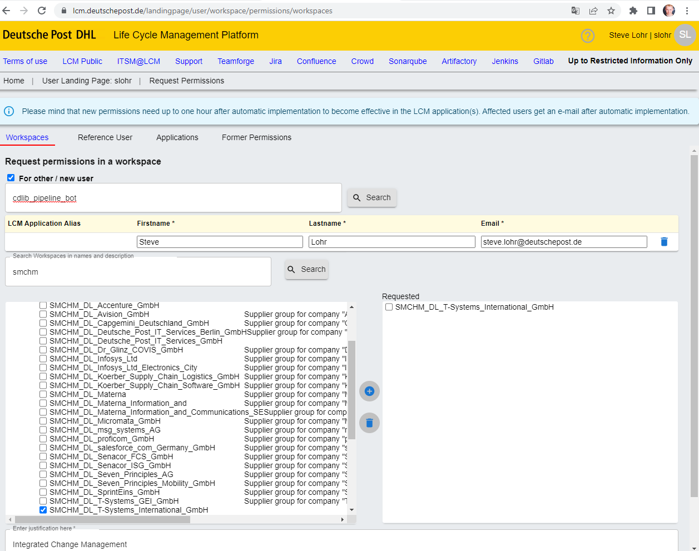

In case your company is not in the list, just contact anna.nehp@deutschepost.de.

Besides access permissions (don't forget to also request permission for `SMCHMONB` to be able to use flag --test) your user also needs permissions to access the specific LCM applications.
You can request this via the same process on a different tab as shown below:

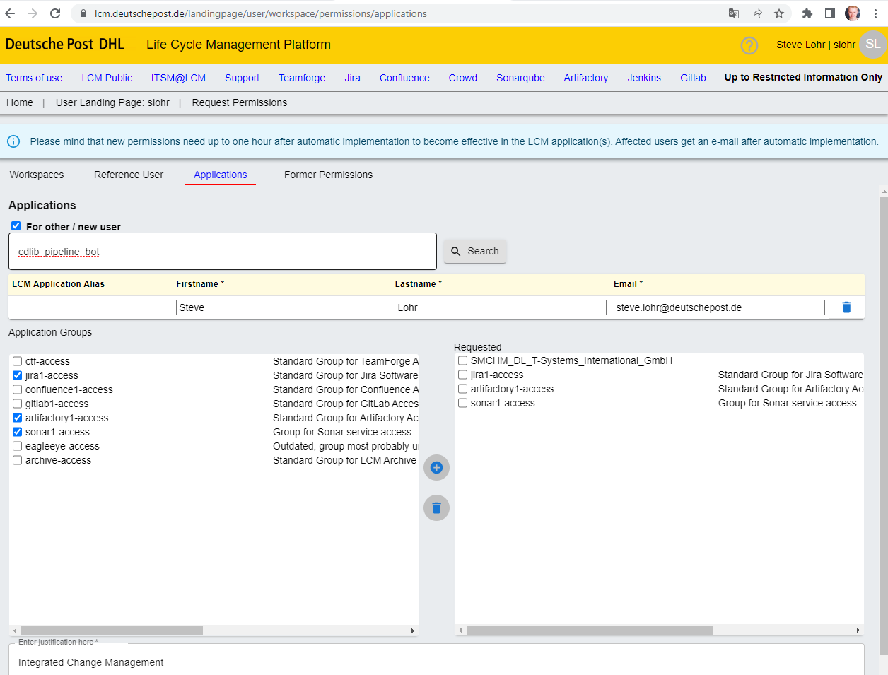

As a last resort (no access for you and ADM, or unsure) you can request a service account via Email in german.

----
An: Helpdesk Brief <HelpdeskBrief@DeutschePost.de>
Betreff: LCM Crowd Anlage Technischer Nutzer für XYZ

Hallo HDB,
 
bitte ein Ticket für LCM Crowd einstellen.
 
Bitte legt einen technischen Nutzer für den Workspace XYZ mit Namen "XYZ_pipeline_bot" an.

----

[#_it_s_tools]
=== IT-S Tools

IT-S Tools are connected to active directory.
A technical user for authentication is called `service account` at IT-S and can be ordered via https://gsd.dhl.com/forms/1016[RequestIT].

> this is also the user needed for integrated webapproval via Sharepoint

Scroll down and enter your details like shown below.

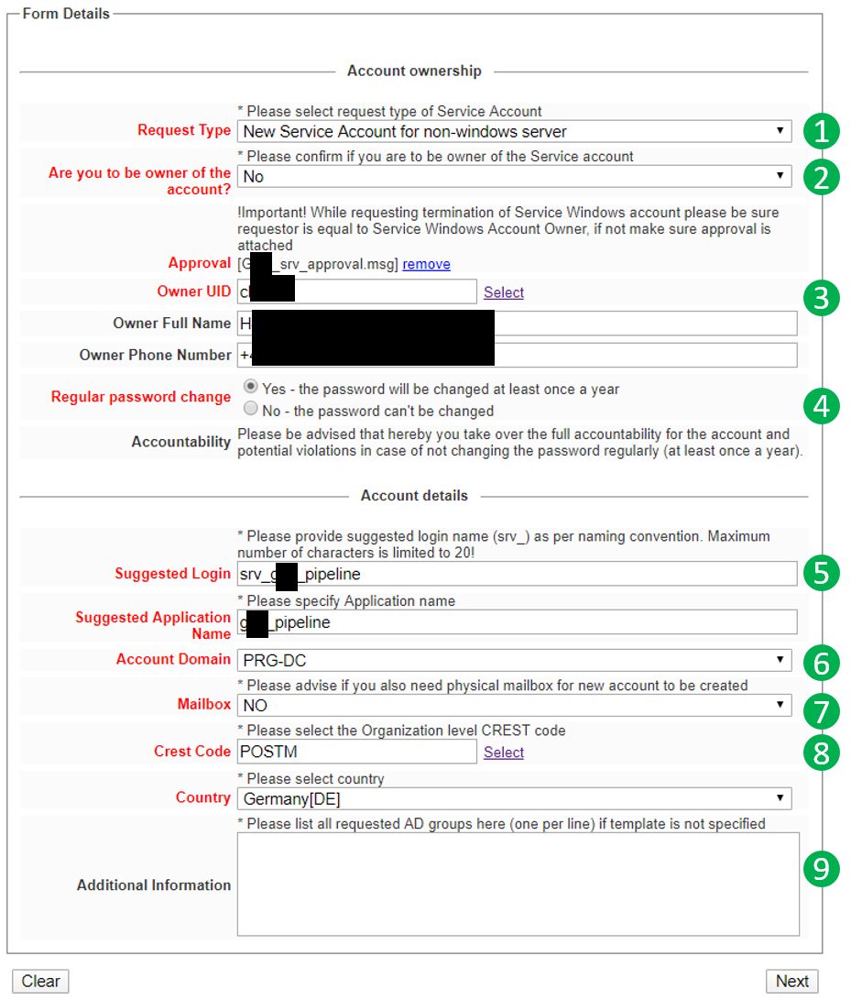

. select `new` account
. depending on whether you are the owner or not, select `yes` or `no` - owner must be somebody from DPDHL, like product owner or team facilitator (aka. Scrum master)
. in case you are not the owner, just click `select` and search for the owner via name or email - don't forget to upload a .msg file with the email from the owner requesting or approving it
. in case you want to skip the yearly password renewal, you'll need a security clearance - just renew the password  via https://citrix.dhl.com
. if your product (or IT-System) is called `ABC`, use an account name like `srv_abc_pipeline` and an application name `abc_pipeline` (maximum length for account and application name is *15*)
. doesn't really matter, but usually the IT-S tools run in PRG-DC, so maybe it is faster this way
. you may need a mailbox to receive email notifications about password retention or invitations to Azure AD, we suggest using a teams channel mail
. we are always unsure about the CREST code - when in doubt use the suggested one, should be fine for P&amp;P at least
. Optional: if your user should be mirrored to Azure AD/Entra ID for e.g. usage in IT-S Github. Write the following text into `Additional Information`:
    _Please sync this user to Azure AD/Microsoft Entra ID. Take INC51666635 as a reference_
. The email address for authentication  of the user should be something like abc.pipeline@dhl.com


After clicking `next`, you'll see the verification screen and then you can `submit` the request.

You (and in case you are not the owner) should get an email notification about your request.
Just in case you don't, save the `ServiceNow` ID somewhere, so you are able to track the request.

== Storing credentials in a safe manner

=== Jenkins

Jenkins provides a credential store allowing you to manage different types of secrets.
You can see this section in your folder on the left menu under `Credentials`.

____

you can also define credentials on job level, reducing the accessibility just to this entity

____

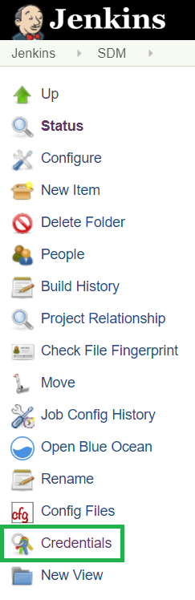

After you clicked on `credentials` and then `folder` you are able to `add credentials`.
Usually you will use username and password, or just secret texts or maybe there is a Jenkins plugin providing a special type of credential, that you can pick from the dropdown.

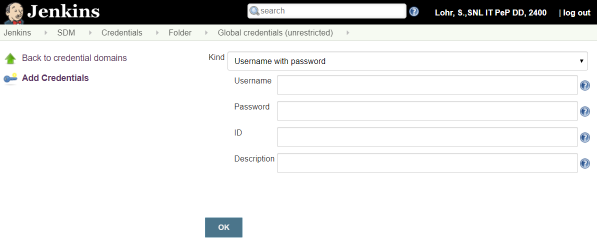

You can use the credentials then in your pipeline with the following code:

----
withCredentials([string(credentialsId: config.sonar.userCredentialsId, variable: 'SONARQUBE_TOKEN')]) {
    sh """
        ./gradlew jacocoTestReport sonarqube -Dsonar.host.url=${config.sonar.hostUrl} -Dsonar.login=${env.SONARQUBE_TOKEN} -Dsonar.projectKey=${config.sonar.projectKey}
    """
}
----

____

more about credentials inside pipelines can be found at https://jenkins.io/doc/book/pipeline/jenkinsfile/#handling-credentials[jenkins.io]

____

=== Azure Pipelines

Azure Pipelines provides functionality to store secrets, but our security concept doesn't allow it.
Therefore you need to xref:SecretsAzureKeyVault.adoc[use Azure Keyvault for it].

== Authentication for different tools

Depending on the tool you can either use the username and password of the <<_getting_a_technical_user,technical user>> or a token generated for it.
Tokens are better since they don't expire like passwords, so you don't need to change them in every single place, like you would with a password - especially tricky, if your pipelines poll quite often and you lock yourself out directly in the moment of setting a new password, due to too many failed logins.

____

don't store the configuration with the token inside Github - use the <<_storing_credentials_in_a_safe_manner,credential store>> instead

____

=== IT-S Github

Since IT-S Github is connected to Azure AD (AAD/Microsoft Entra ID), you cannot use above mentioned user as is, but first need to sync it from local AD.
This can be requested via GSN and you can use the ticket INC51666635 as a reference.
Make sure to select `MDS` as impacted service and assign the ticket to group `Global CAM`.

In case you have no permissions within GSN you can also create a ticket with SD.DPAG@t-systems.com per email:
```
Hallo zusammen,

bitte erstellt ein Ticket bei ServiceNow mit dem folgenden Inhalt:

service: MDS
assigned group: Global CAM
description: srv_<<IT-Systemname>>_pipeline Account sync into AzueAD (AAD)
reference ticket: INC51666635

please sync my service account srv_<<IT-Systemname>>_pipeline to Azure AD according to https://dpdhl.sharepoint.com/sites/DEnablement/DWS/IAM/BUIT/Policies%20%20Standards/Service%20Account%20Process%20and%20Policy.aspx

Thanks and best regards
```

Within a few days your user will appear in portal.azure.com and a new password will be provided via mail, that you can use to login at git.dhl.com.
Ensure that you are connecting from a trusted network (office or cVPN, Zscaler is not supported at the moment and results in an error message when logging in).

==== Create a token

The token can be generated in the section `settings` &gt; `developer settings` &gt; `personal access tokens` by clicking `generate a new token`.

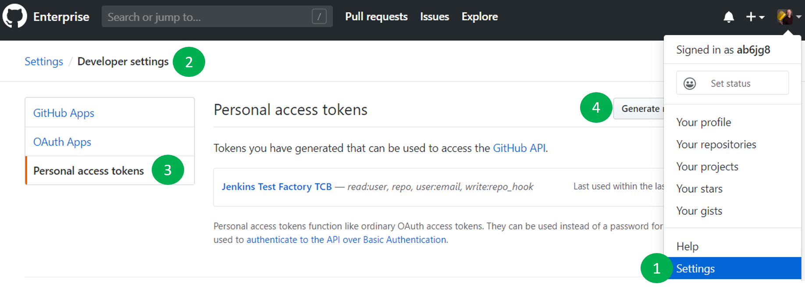

[#_artifactory]
=== Artifactory

For Artifactory you can use an Identity Token to authenticate.

____

*HINT:* be aware that this is only working for the instance you are using, but there are multiple artifactory instances at IT-S - to generate a token working in all instances, the https://git.dhl.com/DSSArtifactory-10097/token-management[artifactory team provides this guide]

____

The token can be generated in the section `Welcome, &lt;username&gt;` &gt; `Edit Profile`:
- Unlock the `Authentication Settings` with your password
- Click the `Generate Identity Token` button

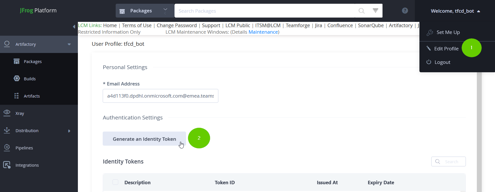

____

*HINT:* in case you cannot see the "edit profile" button, this is a bug, just https://gsd.dhl.com/forms/1072[open a ticket for artifactory] and the team can fix it

____

=== Sonarqube

For Sonarqube you can use a token to authenticate.
The token can be generated when you click on your `profile icon` &gt; `my account` &gt; `security` and there click on `generate new token`.

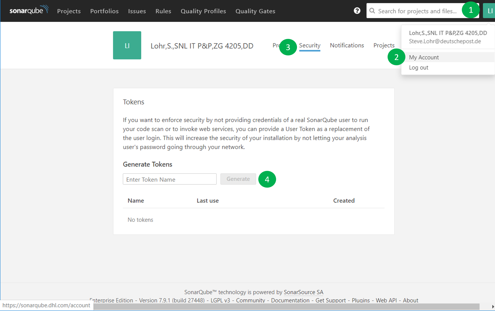

=== FlexNet Code Insight (FNCI)

FNCI is used to xref:OpenSourceLicenseComplianceScan.adoc[scan for OSLC].
The account is created by xref:mailto:miroslaw.freitag@deutschepost.de.

=== Fortify

. as a Fortify Engineer log into Fortify SSC
. Navigate to “Administration” -&gt; “Users” -&gt; “Token management”
. Click on “New” and select the Token Type as “CI Token” (Expiration date cannot be beyond one year)
. Save the token and copy the decoded token to be stored inside the key store to be used inside the pipeline

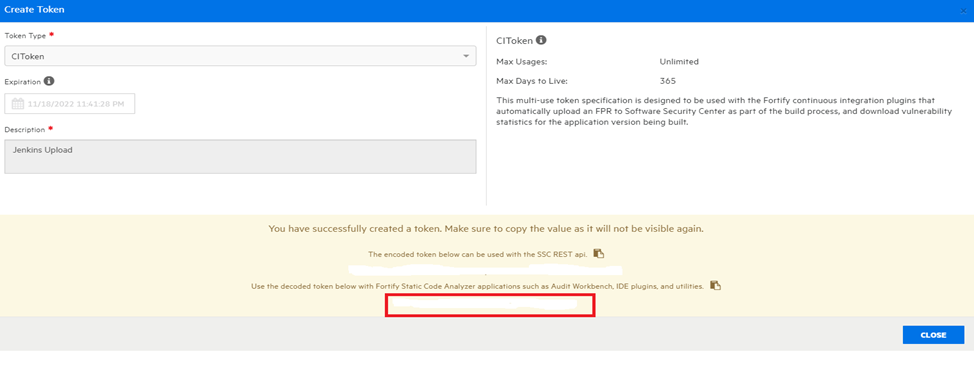

=== Jira

Jira is used for our Change Management process.
We use a Personal Access Token (Bearer token) to authenticate.

The token can be generated in the section `Profile` &gt; `Personal Access Tokens`:

- Login to `https://lcm.deutschepost.de/jira1/`
- Click on your Avatar on the top right and then on `Profile`

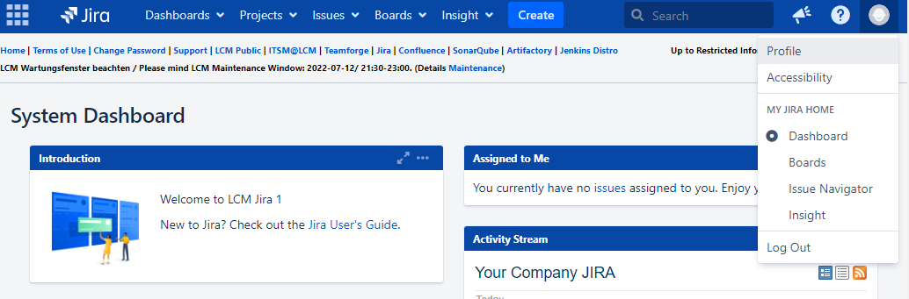

- Select `Personal Access Tokens` in the menu on the left and click the `Create` button

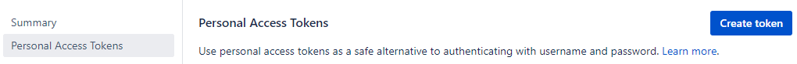

- Set a name and expiry date for your token

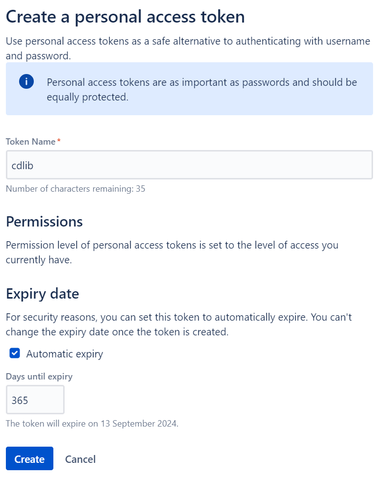

- Copy your created token to be used with `cdlib change create --token &lt;yourToken&gt;...`

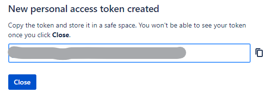
