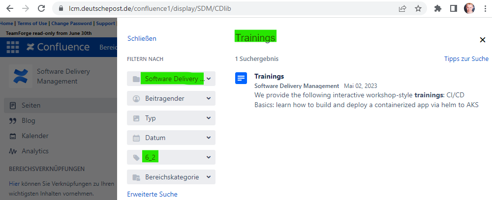

= Archive
:keywords: latest

We continuously update or documentation and sync it based on our git branch `master`.
In some cases you may not be able to use the latest CDlib version, but an older one (especially relevant for major releases), for that case we keep older releases of CDlib in our archive.

You can either browse the older releases manually by opening the specific version and subpages or you can use the overall confluence search by first clicking on the search bar (works everywhere in Confluence, not just in our project):

Then you filter the search results for `Bereich` (Software Delivery Management), `Stichwort` (with the release you are looking for, e.g. 6_2 for Version 6.2 of CDlib) and enter the search string (in belows example: Trainings):

