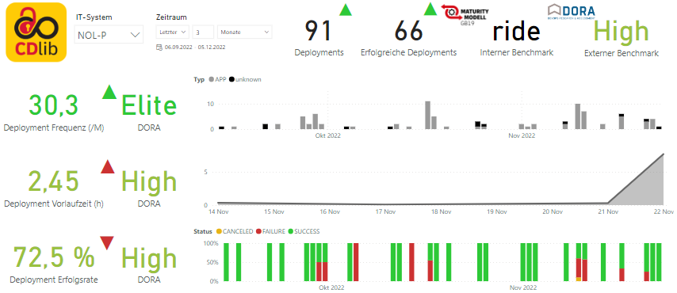
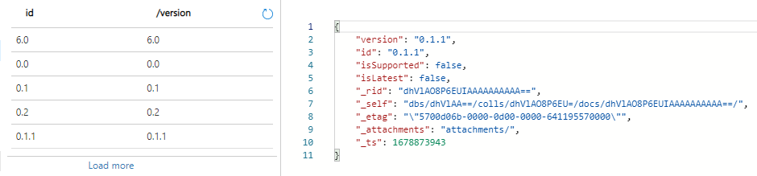

= Dashboard
:toc:
:keywords: latest

Based on the data gathered via xref:../release/Tutorials/IntegratedChangeManagement.adoc[Integrated Change Management] we provide https://app.powerbi.com/links/iMj2l6NxxY?ctid=cd99fef8-1cd3-4a2a-9bdf-15531181d65e&pbi_source=linkShare[dashboards via PowerBI], that can be consumed by every member of DPDHL.

Besides CDlib usage statistics and a DORA overview, you can also see the DORA dashboard for your (and all the other) IT-System.

____

hover over the metrics to learn how they are calculated and colored

____

== Behind the curtain

This section is only relevant for Lieferhelden that want to configure the reporting and have the necessary permissions and tools.

=== Setting up the CosmosDBs

You can create the Private Endpoint only after the Cosmos DB has been set up.
We use periodic backup because we want the ability to use Azure Synapse late.

==== NPI

|===
|Parameter |Value 

|name |cdlib-dashboard-npi 
|capacity |serverless 
|location |west europe 
|private endpoint location |npi_euw_SDM-NPI_dev_dashboard/pub01 
|backup method |periodic 
|backup interval |1440 
|backup retention |2 
|backup storage redundancy |Locally-redundant backup storage 
|===

==== PROD

|===
|Parameter |Value 

|name |cdlib-dashboard 
|capacity |serverless 
|location |west europe 
|private endpoint location |prd_euw_SDM_prod_dashboard/pub01 
|backup method |periodic 
|backup interval |1440 
|backup retention |30 
|backup storage redundancy |Geo-redundant backup storage 
|===

=== Restoring data from backup

https://learn.microsoft.com/en-us/azure/cosmos-db/configure-periodic-backup-restore#request-restore

=== Accessing raw data via PowerBi Desktop/CosmosDB Data Explorer

To access the CosmosDB raw data, you need to connect to the private endpoint, which requires local DNS doctoring.

Get the current IPs of the private endpoint (NPI or PROD) via:
`CsmosDB` -&gt; `Networking` -&gt; `Private Access` -&gt; `Private Endpoint` -&gt; `DNS`

It should look like this, but maybe the IPs will change:

----
NPI
10.175.17.100 cdlib-dashboard-npi.documents.azure.com
10.175.17.101 cdlib-dashboard-npi-westeurope.documents.azure.com

PROD
10.187.37.92 cdlib-dashboard.documents.azure.com
10.187.37.93 cdlib-dashboard-westeurope.documents.azure.com

----

Look up your individual current IP resolution via Zscaler via nslookup:

____

ATTENTION: they will change after every reconnect/reboot!

____

----
ab6jg8@DEDRDWN8142363:~$ nslookup 10.175.17.100.ip.deutschepost.de
Server:         160.58.94.177
Address:        160.58.94.177#53

Non-authoritative answer:
Name:   10.175.17.100.ip.deutschepost.de
Address: 100.64.1.94

----

With priviledged access, open notepad and edit your `c:\Windows\System32\Drivers\etc\hosts` by adding the following:

____

ATTENTION: the IPs below must be looked up individually!

____

----
100.64.1.94 cdlib-dashboard-npi.documents.azure.com
100.64.1.95 cdlib-dashboard-npi-westeurope.documents.azure.com

100.64.1.120 cdlib-dashboard.documents.azure.com
100.64.1.121 cdlib-dashboard-westeurope.documents.azure.com
----

To connect to the CosmosDB via PowerBI, use the URI stated at the CosmosDB overview, e.g. `https://cdlib-dashboard-npi.documents.azure.com:443/` and the `PRIMARY READ-ONLY KEY` provided at the access key tab.

=== Managing Information about the support status of CDLib

The CosmosDB can also be used to configure the support status of the CDLib.
The status entry contains two booleans:

* isSupported: When this flag is set, change tickets can be preauthorized by CDLib
* isLatest: When this flag is not set, it indicates that a new version of CDLib is available

If one of the flags is not set, CDLib will print a log message in the pipeline and leave a comment at the change ticket,
to state the support status of the used CDLib version.

When creating an entry in CosmosDB the entry also needs to contain two keys named "id" and "/version".
These keys are the version of CDLib to configure as string.

CDLib reads the entry corresponding to its version.
If there is no entry for the specified version, the hierarchical next version is used, e.g. version 6.0.2 would read the
entry for version 6.0, when there is no entry for version 6.0.2.

