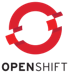

= Showcases
:keywords: latest

If you want to see how we build pipelines (incl. our custom steps), have a look at our showcase implementations.
We use them for our tutorials and as integration tests for the custom steps:

|===
|Name |Repositories |Description |Build Tools |CI-Tool |Cloud 

|Phippy and Friends |https://dev.azure.com/sw-zustellung-31b3183/ICTO-3339_SDM/_git/phippyandfriends |Based on the Azure DevOps Showcase https://github.com/Azure/phippyandfriends[Phippy and Friends] | (KEDA and GitOps)  (MDP and GitOps)  (KEDA and non-GitOps) |  | 
|Sock Shop |https://git.dhl.com/SockShop |Based on the original https://microservices-demo.github.io/[Weaveworks Sock Shop] |    |image:../release/Tutorials/img/jenkins.png[] |
|===