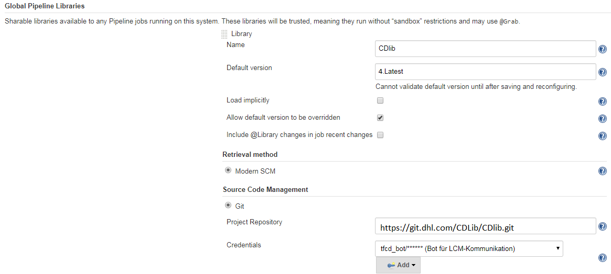

# Jenkins Shared Library
This Shared Library extends the Jenkins Pipeline with useful steps for using `GSN`
and other utilities. If you want to learn more about, why you should use a Shared Library, watch [this video](https://www.youtube.com/watch?v=FXoW3HP1ebk).

## Pipeline Steps
The following list consists of [steps we provide](vars/README.md):
- withCdlibCliNamesCreate
- nodeContainer
- GSN
  - approveChangeRequest
  - beforeProd
  - implementationKO
  - implementationOK
  - PIRAndClose

## Configuration
The CDlib is provided via git and can be configured on Jenkins globally and on folder-level. 
Globally configured libraries are trusted, therefore there is no script-approval for security relevant methods, whereas a library on folder level isn't.
When you configure a library globally and locally (folder-level) with the same name,  the folder-library will be used - this will be logged with `Only using first definition of library CDlib`. 

The following screenshot shows how-to configure the CDlib globally within `Manage Jenkins -> Configure System`:

 

If you want to specify a specific version for a pipeline you can check `Allow default version to be overridden` and 
load the library with for example `@Library('CDlib@6.latest') _` in your script. 
A version is the name of a tag, branch or the commit ID (revision). 

## Requirements 
### Jenkins
In order to use the `CDlib` you will need a Jenkins server.
We recommend using https://devsecops.dhl.com/services/build/jenkins-cloudbees/[IT-S Cloudbees Jenkins].

### Firewall Clearance
To reach our git repository your Jenkins must have firewall clearance for `git.dhl.com (165.72.27.198)` with `https 443`. More details for `LCM` can be found [here](https://lcm.deutschepost.de/sf/sfmain/do/go/wiki14171).

### Plugin Dependencies
The following plugins are needed to use our steps.
Some of the are completely optional and some are only necessary for certain steps.
- Config File Provider Plugin
- Credentials Binding Plugin
- Git Client Plugin
- HTTP Request Plugin
- Lockable Resources Plugin
- Mailer Plugin
- Pipeline
- Pipeline Utility Steps
- Pipeline: Basic Steps
- Pipeline: Input Step
- Pipeline: Job
- Pipeline: Milestone Step
- Pipeline: Shared Groovy Libraries
- [Security Scan Plugin (Fortify)](https://lcm.deutschepost.de/sf/go/wiki15743)
- SonarQube Plugin
- SSH Agent Plugin
- Timestamper
- xUnit Plugin
- Azure Credentials

#### Optional Plugins
- BlueOcean
- OWASP Dependency-Check Plugin
